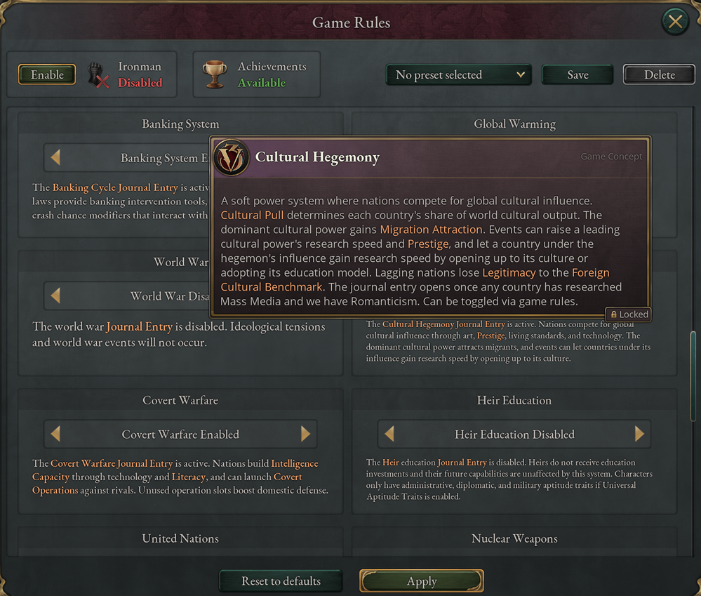

# Introduction

Vic3TimelineExtended carries Victoria 3 past its 1936 end date, through the
twentieth century and into a speculative future; a campaign now runs to 2136. It
adds seven eras of technology, new goods and buildings, over a hundred laws, and
a set of systems that run alongside the base game: a banking cycle with monetary
policy, a construction market, climate change, decolonization, nuclear weapons,
a United Nations, a space race, cultural and covert competition between powers,
and social movements. Most of these systems have their own journal entry, and
most can be switched off with a game rule.

The mod adds one button to the sidebar, under Map List. It opens the Timeline
Extended window, which has a tab each for the space race, your colonial empire
and your Grand Monuments: the same panels as their journal entries, in one
place. The button shows while at least one of those three systems is switched
on.

This guide explains what each system does and how to play it. It assumes you
know the base game: pops, interest groups, laws, markets, construction and
diplomatic plays are not explained here except where the mod changes them.

## How to use this guide

Each chapter covers one area of the game and can be read on its own. Start with
the chapters for the systems you meet first. In an 1836 start the construction
market changes how building works from the first day ([Economy and
construction](03-economy.md)), and the banking cycle begins once you have
researched Stock Exchange and have an Urban Center of level 5 or more ([Banking
and monetary policy](04-banking.md)). Most later systems unlock with technology,
so you can read about them as they approach.

Numbers in this guide are there to help you plan: thresholds, tiers, durations
and caps. They are rounded, and they can change between versions of the mod. The
game's tooltips show the exact values for your country, and many of the mod's
journal entries and panels break their numbers down line by line when you hover
over them.

The Markdown source of this guide is kept in the mod's repository, and the
[chapters](https://github.com/jakeOmega/Vic3TimelineExtended/tree/main/docs/player_guide)
can be read there as web pages.

## Setting up a game

Two things need attention before your first campaign: where the mod sits in your
load order, and which of its game rules you want.

### Installing the mod

Subscribe to the mod on the Steam Workshop, or copy it into your Victoria 3
`mod` folder, then enable it in a playset in the launcher. The mod overrides the
base game's ideologies, a number of its production methods, the state-region map
files and several interface panels, so other mods that change those will
conflict with it. Put Vic3TimelineExtended last in the load order so its
versions win. Mods that only add content usually work alongside it.

Start a new campaign with the mod enabled. Don't add it to, or remove it from, a
game already in progress. In multiplayer, every player needs the same version of
the mod.

### Game rules

The mod adds sixteen game rules to the game setup screen. Each one turns a
system on or off, and a few offer a reduced version of the system. You choose
them when you start a campaign, and outside Ironman you can change them later.

Turning a system off hides its journal entry and stops its events, but the
technologies, laws and buildings connected to it stay in the game and keep their
ordinary effects. With the Banking System off, for example, the financial
regulation laws still change Urban Center output, investment, innovation and
government dividends; only their effects on the banking cycle go.

The mod is balanced with its default systems on, and switching one off removes
its costs along with its benefits. A choice whose drawback lives in a disabled
system loses that drawback: a financial regulation law that trades faster growth
for a more volatile banking cycle is simply better with the Banking System off.
Expect some laws, technologies and policies to become obvious picks when you
turn a default system off.

| Rule | Default | Settings and what they control | Chapter |
|---|---|---|---|
| Banking System | Enabled | *Enabled*: the banking cycle with the full monetary-policy layer (policy rate, inflation, exchange rate, currency pegs and shared currencies). *Simplified*: the banking cycle only; you still borrow at your own interest rate but can't set it. *Disabled*: no banking cycle. | [Banking and monetary policy](04-banking.md) |
| Free Market Construction | Enabled | *Enabled*: construction is a good bought on the market, and buildings use some as maintenance. *Without Retooling Costs*: as Enabled, but switching production methods doesn't raise that maintenance. *Without Maintenance*: construction is still a market good, but buildings don't consume it. *Disabled*: base-game construction sectors. | [Economy and construction](03-economy.md) |
| Global Warming | Enabled | Greenhouse emissions, rising temperatures, climate events and climate policies. | [Climate and pollution](14-climate.md) |
| United Nations | Enabled | Founding and joining the UN, its votes, resolutions and agencies. | [The United Nations](09-united-nations.md) |
| Nuclear Weapons | Enabled | Nuclear programs, arsenals, doctrine, crises, strikes and the nuclear taboo. | [Nuclear weapons](13-nuclear.md) |
| Space Race | Enabled | The space race milestones and their events. | [The space race](15-space.md) |
| Decolonization | Enabled | Colonial stability, the decolonization journal entry and its events. | [Colonial empires and decolonization](11-decolonization.md) |
| Cultural Hegemony | Enabled | The competition for global cultural influence. | [Cultural hegemony and covert warfare](10-influence.md) |
| Covert Warfare | Enabled | Intelligence agencies and covert operations against other countries. | [Cultural hegemony and covert warfare](10-influence.md) |
| Social Movements | Enabled | The five social-movement journal entries (civil rights, human augmentation, digital rights, mental health and post-scarcity) and their events. Feminism, LGBTQ+, religious, anti-war, transhumanist and environmental events fire either way. | [Social movements](06-social-movements.md) |
| Internal Resettlement | Enabled | *Enabled*: the Settlement Authority and government resettlement programs. *AI Voluntary Only*: AI countries run only voluntary programs. *Disabled*: no resettlement. | [States and population](07-states.md) |
| Grand Monuments | Enabled | Grand Monuments, their dedications, the Monuments journal entry and contested monuments. | [The extended timeline](02-timeline.md#grand-monuments) |
| World War | Disabled | A journal entry for great powers that tracks ideological tension into a world war and its aftermath. | [Military and war](12-military.md) |
| Heir Education | Disabled | Educating your heir, and administrative, diplomatic and military aptitude traits for rulers and heirs. | [Government, laws and characters](05-politics.md) |
| Universal Aptitude Traits | Disabled | Gives aptitude traits to every adult character, with or without Heir Education. | [Government, laws and characters](05-politics.md) |
| Custom Religion Allowed | Not allowed | A journal entry that lets you design a religion of your own. | [Government, laws and characters](05-politics.md) |

## How the guide is organized

The chapters follow the game's own areas rather than the order systems appear.

| Chapter | Covers |
|---|---|
| [The extended timeline](02-timeline.md) | The seven new eras, their technologies, new goods and buildings, company buildings, wonders and megaprojects. |
| [Economy and construction](03-economy.md) | The construction market, construction costs, living-standard expectations, Bulk Transportation, the Strategic Reserve and wartime demand for munitions. |
| [Banking and monetary policy](04-banking.md) | The banking cycle, crashes and contagion, the policy rate, inflation, exchange rates and international monetary arrangements. |
| [Government, laws and characters](05-politics.md) | New laws and law groups, ministries, political movements and parties, elections, heir education, custom religions and state collapse. |
| [Social movements](06-social-movements.md) | The movement journal entries, from civil rights to post-scarcity, and the movements carried by events. |
| [States and population](07-states.md) | Migration crowding, dynamic homelands, cultural acceptance, tourism, world city rankings and internal resettlement. |
| [Diplomacy](08-diplomacy.md) | New treaty articles, diplomatic play escalation, irredentism and reunification, power blocs and formable countries. |
| [The United Nations](09-united-nations.md) | Founding the UN, its authority, the Security Council, votes, resolutions, conventions and missions. |
| [Cultural hegemony and covert warfare](10-influence.md) | Soft power and intelligence operations. |
| [Colonial empires and decolonization](11-decolonization.md) | Colonial stability, independence and what follows it. |
| [Military and war](12-military.md) | Combined arms, new units and ships, military bases and the World War journal entry. |
| [Nuclear weapons](13-nuclear.md) | Building a bomb, doctrine and posture, crises, strikes, the nuclear taboo and disarmament. |
| [Climate and pollution](14-climate.md) | Emissions, warming, climate policy and state pollution. |
| [The space race](15-space.md) | The milestones from suborbital flight to colonizing the solar system. |
| [Quick reference](16-reference.md) | When each system appears, the journal entries at a glance, and a glossary. |
| [Appendix: social movement details](17-appendix-social-movements.md) | The numbers and event lists behind the social movements chapter. |
| [Appendix: events](18-appendix-events.md) | The event lists behind the chapters, from resettlement to the space race, with when each event fires and what its options do. |
| [Appendix: reference lists](19-appendix-reference-lists.md) | The longer lists the chapters summarize: wonders, banking tools, government types, combat units, ships, ship modifications, mobilization options and military base production methods. |

## Reporting problems

A mod this size has bugs. Report them on the Steam Workshop page or, better, on
the [issue tracker](https://github.com/jakeOmega/Vic3TimelineExtended/issues).
The most useful report says what you did, what you expected and what happened,
and attaches a save and the game's `debug.log` and `error.log` (in the `logs`
folder under `Documents/Paradox Interactive/Victoria 3`). If a mechanic is
confusing even when it works as intended, that is worth reporting too.

Three systems have had the least play-testing: the monetary-policy layer of the
banking system, the United Nations, and nuclear deterrence and crises. This guide describes what their scripts are written to
do. Where the game behaves differently, either the game or the guide is wrong,
and a report helps fix whichever it is.
