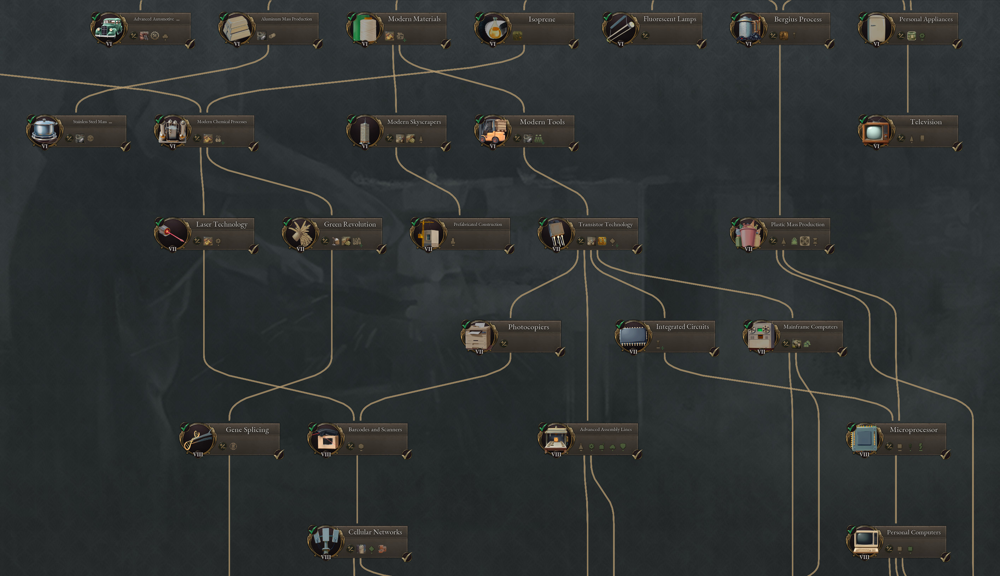
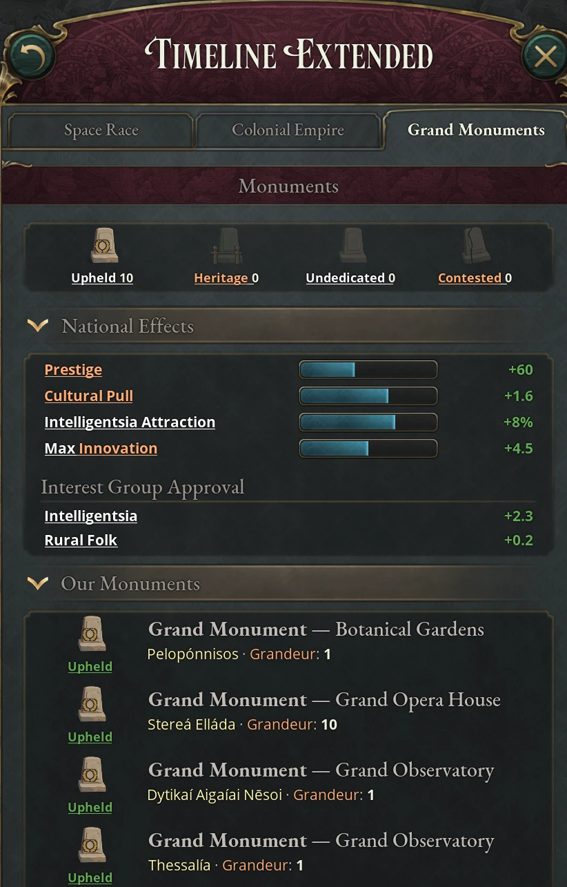

# The extended timeline

The base game ends in 1936 after five eras of technology. This mod moves the end
date to 2136 and adds seven more eras, numbered 6 to 12, with 171 new
technologies. The base game has 179, so the technology tree roughly doubles. The
new eras bring twelve new goods, dozens of new buildings and production methods,
a flagship building for every company, 37 wonders and seven megaprojects. None
of this is behind a game rule: the eras and everything they unlock are always
in the game, even when you switch off the systems that some of their
technologies start. The one exception is the International Space Station
wonder, which needs a Moon landing from the space race. The repeatable [Grand
Monument](#grand-monuments) has a game rule of its own.

## Eras six to twelve

The technology tree continues past the base game's fifth era. Eras 6 to 9 follow
the twentieth century, and eras 10 to 12 run from the present into the future.
The game shows eras only by number; the periods below are the ones the mod's
technologies were chosen to fit, so treat them as a rough guide.

| Era | Rough period | Research cost per technology | Technologies | Broad theme |
|---|---|---|---|---|
| 6 | 1919–1945 | 20,000 | 38 | Synthetics, appliances, aviation, radar, rockets and the atomic bomb |
| 7 | 1946–1967 | 65,000 | 29 | Transistors, nuclear power, jets, the Green Revolution, missiles and satellites |
| 8 | 1968–1987 | 115,000 | 21 | Computer networks, robotics, containerization, pharmaceuticals, stealth |
| 9 | 1988–2012 | 210,000 | 28 | The internet, renewable energy, biotechnology, globalization, drones and cyber defense |
| 10 | the present to about 2030 | 450,000 | 17 | Machine learning, electric vehicles, reusable rockets, hypersonic and cyber weapons |
| 11 | about 2030–2060 | 800,000 | 20 | Advanced materials, fusion power, deep-sea and asteroid mining, genetic engineering, augmentation |
| 12 | after 2060 | 2,000,000 | 18 | General AI, nanofabrication, megaprojects in orbit, antimatter, mind uploading, post-scarcity |

### Research costs in the new eras

Each technology costs its era's base research cost, before the usual modifiers.
The base game's last era costs 17,500 per technology; era 6 is only a small step
up at 20,000, but era 7 more than triples it, and an era 12 technology costs a
hundred times as much as an era 6 one. The base game's surcharge for researching
ahead of unresearched technologies in the same tree still applies, and it grows
with the number of eras between them.

Your innovation has to grow to match. Many of the new technologies raise the
weekly innovation cap by 10 to 100 each, adding between 250 and 1,000 per era
through era 11. Five [wonders](#wonders) raise it further, and new University
production methods (National Labs, Academic Computing and AI Assisted Research)
raise the innovation each university produces.

### What each new era brings

Era 6 opens synthetic industry and the consumer economy. Bergius Process and
Isoprene unlock Synthetic Fuel Works and Synthetic Rubber Works, Personal
Appliances unlocks Consumer Appliance Industries, Commercial Aviation the
Airport, and Public Works Programs the Hydro Plant. Nine of the era's
technologies each open a new kind of mine, such as Modern Tools (Manganese
Mine). Radar, Rocketry, Nuclear Weapons, Combined Arms, Keynesian Economics (the
Fiat Money law), Intergovernmental Organizations and Decolonization are here
too.

Era 7 is the postwar boom. Transistor Technology unlocks the Electronic
Components and Semiconductor Industry, Nuclear Energy the Nuclear Plant, and
Green Revolution modernizes farms and plantations (Modern Farming, Mechanized
Farm) and unlocks the Artificial Sweeteners Plant. Guided Missiles unlocks the
Space Program building, and Space Exploration, Satellite Communications and
Intercontinental Ballistic Missiles follow. Plastic Mass Production, Modern
Urban Planning, Pollution Control and the Civil Rights Movement round out the
era.

Era 8 brings computers and automation. Computer Networks unlocks the Software
Industry and Network Infrastructure, Industrial Robotics the Robotics Industry,
and Modern Pharmaceuticals the Rational Drug Design method for Pharmaceutical
Industries ([Pharmaceutical Industries and
Drugs](#pharmaceutical-industries-and-drugs)). Containerization,
Fiber Optics, Cellular Networks, Microprocessor, Gene Splicing, Stealth
Technology and Video Games are also here.

Era 9 is the internet age. World Wide Web opens the internet laws, Clean Energy
Technologies unlocks the Renewable Energy Plant, Hydraulic Fracturing adds
fracking to oil rigs, and Biotechnology brings GMO plantations and two synthetic
plants. Globalization, Social Media, E-Commerce, Cybersecurity, Missile Defense
Systems and Network Centric Warfare are also in this era.

Era 10 is the present day: Machine Learning, Generative AI, Additive
Manufacturing, Electric Vehicles, Internet of Things, Reusable Rocketry,
Hypersonic Weapons, Cyber Warfare, Universal Basic Income and Mental Health
Awareness.

Era 11 is the near future. Modern Material Science unlocks the Advanced Material
Fabricator, Abyssal Plain Mining the Deep-Sea Mine, Asteroid Mining the
Extraplanetary Base, and Fusion Power the Fusion Plant. Genetic Engineering
unlocks the Carbon Conversion Works and Integrated Biorefinery, Lab-Grown Food
the Cultured Meat Plant and Cultured Produce Facility, and Synthetic Biology
adds bioengineered production methods such as Designed Crops. Brain-Computer
Interfaces and Human Augmentation bring augmentation laws.

Era 12 is the far future. Artificial General Intelligence adds AI-managed
production methods to many industries, and Molecular Assemblers, Programmable
Matter and Orbital Manufacturing add a final tier to many more. Space Elevator,
Space-Based Solar Power, Orbital Weapon Platforms, Antimatter Production, Mind
Backups, Molecular Assemblers and Telepathic Communities each unlock a
[megaproject](#megaprojects). Space Colonization, Biological Immortality and
Post-Scarcity Economy are among the last technologies in the tree.

Some of the mod's buildings arrive earlier, with base-game technologies: the
Aerospace Industry with Military Aviation, the Highway with Paved Roads, and the
Tourism Industry with Romanticism.

### Global technological development

The further the world's leading powers advance, the faster everyone else
catches up. Once a year, every country checks a list of 54 mid-century and later
technologies, from Television and Cryptography to Space Colonization. Each one
that any great power (or a country ranked above that) has researched adds a
bonus to technology spread, the trickle of innovation that pulls you toward
technologies others already have. The bonuses add up, and the later the
technology, the more it is worth: the earliest tier adds a small step, and the
last tier (Artificial Intelligence, Space Colonization and their peers) adds ten
times as much. Only great powers count, so a technology first reached by a
minor country does not move the world's pace until a great power follows.

The bonus appears on your country as the Global Technological Development
modifier, and every country gets the same one, recognized or not. It is a
catch-up mechanism, not a research boost for the leaders. A backward country
gains the most from it, because spread only works on technologies you lack. The
leaders gain little, since spread only ever feeds technologies someone has
already researched. So the further ahead the great powers pull, the harder it is
for a country to stay far behind them. The tooltip on the modifier shows your
current figure. It sits alongside the usual sources of spread (literacy, laws
and power bloc principles) and is separate from
[agricultural diffusion](#agricultural-diffusion), which grants arable land
rather than research.

### Agricultural diffusion

Five farming technologies spread around the world once someone invents them:
Nitrogen Fixation (a base-game technology), Modern Chemical Processes, Green
Revolution, Gene Splicing and Biotechnology. The first country to research one
gets an event naming it the pioneer, a permanent bonus to arable land, and a
decaying +5% prestige and authority bonus that lasts 20 years. Two weeks later
every other recognized country gets an event and the same arable-land bonus,
whether or not it has the technology. Each diffusion bonus is half the
technology's own arable-land bonus: +15% for Nitrogen Fixation, Modern Chemical
Processes and Gene Splicing, +25% for Biotechnology and +60% for Green
Revolution. It stacks with the technology's bonus once you research it.
Countries that appear later, through release or formation, receive the bonuses
already in the world.

### Why some technologies lower education access

Four technologies take 10 points off education access in every state: Public
Works Programs and Computing Machines in era 6, Digital Education in era 9 and
Brain-Computer Interfaces in era 11. Literacy drifts toward education access, so
with nothing else changed each one lowers the level your literacy settles at by
10 points, and literacy follows down over the next years. All four together take
40 points off.

This is deliberate. Each of these technologies raises the standard for what
counts as literate: working with computers, networks and digital systems asks
more of a person than reading a newspaper, so the same schooling reaches a
smaller share of the population. The technology tooltip shows the penalty. It
also keeps education relevant in the late game, because the gain has to be kept
up as the bar rises.

Each of the four also raises the Schools institution's maximum investment by one
level. Funding schools and the laws that raise education access are how a
country holds its literacy against the drop.

### Technologies that open the mod's systems

Several of the new technologies first bring a system from another chapter into
view. Each system also needs its game rule, and some have further conditions.

| Technology | Era | What it opens | Chapter |
|---|---|---|---|
| Intergovernmental Organizations | 6 | The United Nations journal entry; the Power Bloc Headquarters and the Peace Palace | [The United Nations](09-united-nations.md) |
| Decolonization | 6 | The colonial empire journal entry | [Colonial empires and decolonization](11-decolonization.md) |
| Nuclear Weapons | 6 | The nuclear program | [Nuclear weapons](13-nuclear.md) |
| Rocketry | 6 | The first space race milestone, for great and major powers | [The space race](15-space.md) |
| Combined Arms | 6 | The Gathering Storm, the world war journal entry, for great powers | [Military and war](12-military.md) |
| Civil Rights Movement | 7 | The civil rights journal entry | [Social movements](06-social-movements.md) |
| Automated Surveillance or Cybersecurity | 9 | The digital rights journal entry | [Social movements](06-social-movements.md) |
| Mental Health Awareness | 10 | The mental health journal entry | [Social movements](06-social-movements.md) |
| Universal Basic Income | 10 | The post-scarcity journal entry | [Social movements](06-social-movements.md) |
| Brain-Computer Interfaces or Human Augmentation | 11 | The human augmentation journal entry | [Social movements](06-social-movements.md) |

Some society technologies also start occasional narrative events (Second Wave
Feminism, Contraceptive Pill, Social Media and others), covered in [Social
movements](06-social-movements.md).

## New goods

The new industries trade in twelve goods the base game doesn't have, and the mod
renames twelve base-game goods to fit a longer timeline.

### Goods the mod adds

| Good | Category | Made by | Used for |
|---|---|---|---|
| Consumer Appliances | Luxury | Consumer Appliance Industries | The pops' Convenience need; inputs for some high-tech buildings |
| Electronic Components | Industrial | Electronic Components and Semiconductor Industry | The most widely used modern input: over a hundred buildings take it in their later production methods |
| Industrial Robotics | Industrial | Robotics Industry | Automation production methods in factories and mines |
| Software | Luxury | Software Industry | The Convenience need; digital and automation production methods |
| Digital Access | Luxury, local | Network Infrastructure | The Convenience need and many modern production methods; like Personal Transportation it is only available in the state that produces it |
| Launch Capacity | Industrial | Aerospace Industry (with rocket production methods), Space Elevator, Antimatter Engine | Space programs, satellites, orbital production methods and megaprojects |
| Advanced Materials | Industrial | Advanced Material Fabricator, Nanofabrication Center | Late-game production methods and megaproject construction; base price 4,000, the most expensive good in the game |
| Construction Services | Industrial | Construction Sector | The construction market ([Economy and construction](03-economy.md)) |
| Tourism | Luxury | Tourism Industry, National Park and others | The pops' Tourism need |
| Tech-Critical Metals | Industrial | Nickel and Cobalt, Lithium, Rare Earth Metals and Platinum Group Metals Mines; also the Deep-Sea Mine and Extraplanetary Base | Electronics, robotics, modern power plants and other high-tech production methods |
| Motor Ships | Industrial | Shipyards, from Advanced Submarine Technology | Later production methods for ports, fishing wharves and whaling stations |
| Magnetic Drive Ships | Industrial | Shipyards, from Modern Material Science | The last tier of the same production methods |

The Convenience and Tourism needs, which wealthier pops fill with these goods,
are covered in [Pop consumption at high
wealth](03-economy.md#pop-consumption-at-high-wealth).

### Renamed base-game goods

Several base-game goods now stand for a broader family of materials. They are
the same goods underneath, so base-game buildings still make and use them.

| Base-game name | Name in this mod |
|---|---|
| Coal | Energy and Carbon Minerals |
| Iron | Structural Metals |
| Lead | Conductive and Base Metals |
| Sulfur | Chemical and Industrial Minerals |
| Fertilizer | Chemicals |
| Glass | Glass and Plastics |
| Opium | Drugs |
| Telephones | Wired Telecommunication Gear |
| Radios | Wireless Telecommunication Gear |
| Fine Art | Art and Entertainment |
| Transportation | Personal Transportation |
| Merchant Marine | Bulk Transportation |

Chemicals is the base game's fertilizer. Farms and plantations still take it,
and dozens of modern industrial production methods now take it too. Bulk
Transportation is explained in [Bulk Transportation and
freight](03-economy.md#bulk-transportation-and-freight). Four buildings are
renamed to match: Fertilizer Plants are Chemical Plants, Electrics Industries
are Wired Telecommunications Industries, Synthetics Plants are Synthetic Dyes
Industries, and the Arts Academy is Creative Industry.

## New buildings and production methods

The mod adds new buildings in families that follow the goods above, and extends
most base-game buildings with production methods for the new eras.

### New mines and extraction

Fourteen new mines work deposits of specific minerals. Ten of them produce one
of the renamed resource goods, adding supply to existing chains; the other four
produce the new Tech-Critical Metals. Resource deposits are covered in [New
mineral deposits](03-economy.md#new-mineral-deposits).

| Mine | Produces |
|---|---|
| Manganese, Chromium, Bauxite, Specialty Alloy Metal | Structural Metals |
| Copper, Precious and Minor Base Metal | Conductive and Base Metals |
| Nickel and Cobalt, Lithium, Rare Earth Metals, Platinum Group Metals | Tech-Critical Metals |
| Graphite | Energy and Carbon Minerals |
| Phosphate, Potash, Industrial Mineral and Salt | Chemical and Industrial Minerals |

Two late buildings mine several goods at once. The Deep-Sea Mine (Abyssal Plain
Mining) can be built in any coastal state and has no level cap. The
Extraplanetary Base (Asteroid Mining) costs 20,000 construction per level. It
mines metals and minerals, and after Space Colonization it can switch to the
Resort Colony production method, which produces art and tourism instead.

### New industries

| Family | Buildings |
|---|---|
| Synthetics | The base game's Synthetics Plants split into twelve buildings, one per product: Synthetic Dyes Industries, Synthetic Clothes Industries, Synthetic Fuel Works, Synthetic Rubber Works, Pharmaceutical Industries, Carbon Conversion Works, Phenolic Resin Panels Plant, Artificial Sweeteners Plant, Cultured Meat Plant, Cultured Produce Facility, Beverage Concentrates Plant and Integrated Biorefinery. |
| Electrics | The base game's Electrics Industries split into Wired Telecommunications Industries, Wireless Telecommunications Industries and Consumer Appliance Industries. |
| High technology | Electronic Components and Semiconductor Industry, Robotics Industry, Software Industry, Network Infrastructure, Advanced Material Fabricator, Aerospace Industry. |
| Power | Hydro Plant, Nuclear Plant, Renewable Energy Plant and Fusion Plant, alongside the base game's Power Plants. |
| Transport | Airport and Highway, both producing Personal and Bulk Transportation. |
| Leisure | Tourism Industry and National Park ([States and population](07-states.md)). |
| Government | Space Program ([The space race](15-space.md)), which counts as a monument like the wonders below; State Youth Centers, which need Pro-Natalist Subsidies, State-Sponsored Family Planning, Communal Child-Rearing, State Eugenics Program or Mandatory Augmentation; and Military Base ([Military and war](12-military.md)). |

### Pharmaceutical Industries and Drugs

Pharmaceutical Industries make Drugs, the base game's opium, so they compete
with opium plantations. The building comes with the base game's Pharmaceuticals
technology and costs 800 construction per level, four times as much as a
plantation. You can't build it while your country bans Drugs.

Once a UN member researches Antibiotic Mass Production, the Assembly can raise
the [Single Convention on Narcotic Drugs](09-united-nations.md#un-conventions-and-agencies).
At ×1 UN enforcement, parties gain 5% Pharmaceutical Industries throughput and
3% prestige, while their Opium Plantations lose 15% throughput. These terms
scale with UN enforcement.

| Method | Unlocked by | Drugs per level | Inputs per level |
|---|---|---|---|
| Alkaloid Extraction | Pharmaceuticals | 30 | 15 Chemicals, 10 Glass and Plastics, 10 Sugar |
| Synthetic Drug Chemistry | Antibiotics | 75 | 20 Chemicals, 10 Energy and Carbon Minerals, 10 Glass and Plastics |
| Antibiotic Fermentation | Antibiotic Mass Production | 135 | 20 Chemicals, 20 Sugar, 15 Electricity, 15 Glass and Plastics |
| Rational Drug Design | Modern Pharmaceuticals | 190 | 20 Chemicals, 20 Electronic Components, 10 Electricity, 10 Chemical and Industrial Minerals |
| Biologics and mRNA | mRNA Therapeutics | 265 | 30 Electricity, 20 Electronic Components, 20 Chemicals, 20 Sugar |
| Precision Medicine | Personalized Medicine | 345 | 30 Electricity, 15 Software, 15 Electronic Components, 15 Chemicals |

The figures are for a fully staffed level. Every method employs 2,000
engineers per level; Alkaloid Extraction employs 7,000 workers in all and every
later method 5,500.

Alkaloid Extraction earns about a quarter as much per worker as an opium
plantation. It covers its wages only where Drugs sell well above their base
price, so opium plantations stay the cheaper source of Drugs until Antibiotics.
Synthetic Drug Chemistry earns about as much per worker as the best plantation
method, and Antibiotic Fermentation about twice as much. An opium plantation's
Mechanized Farm makes 55 Drugs per level; a coffee or tea plantation's, whose
goods have the same base price, makes 75.

The base game's journal entry The Opium Trade is not offered after 23 January
1912, and an entry still open on that date fails. Field Hospitals take Drugs as
upkeep, so they need Drugs for sale in your market.

### Later production methods for existing buildings

Most base-game buildings gain production methods through the new eras, so a
building you built in 1850 keeps upgrading. Mines move on to Continuous Miners,
Smart Miners and Laser Excavation Technology; grain farms to Modern Farming,
Automated Harvesters and Planters and Designed Crops; plantations to Mechanized
Farm and GMO Plantation; and automation groups end in AI-managed methods such as
AI Managed Fab. A few polluting buildings get pollution-control groups ([State
pollution](14-climate.md#state-pollution)), and many get a hidden maintenance
group used by the construction market ([Construction maintenance and
retooling](03-economy.md#construction-maintenance-and-retooling)).

## Company flagship buildings

The mod gives every company a unique flagship building: the Krupp Essen Works,
the Standard Oil Refinery, the Ford Rouge Plant, and so on.

A flagship building works like this:

- You can build it only while you have the company, and only while the company's
prosperity bonus is active, because that bonus supplies its level cap of one.
- Only the government can build it, at 5,000 construction.
- You can have each flagship in only one state.
- Most are highly profitable at base prices, and each gives its state modifiers
that fit the company, such as extra Highway levels and migration pull from the
Volkswagen Autostadt.
- If you lose the company, the building is demolished.
- Once it stands, you can privatize it to its own company. A building the
company owns gets the company's throughput bonus, which is often worth having
on a flagship.

The mod also adds extension buildings and prosperity bonuses to many base-game
companies, and fifteen new prestige goods, from Luxury Automobiles to Heavy-Lift
Launch Systems.

### Companies added by the mod

The mod adds 93 company types. 82 are flavored companies, mostly real firms of
the twentieth and twenty-first centuries (Volkswagen, Intel, SpaceX, Pfizer,
Saudi Aramco and many more) plus a few fictional far-future ones such as
Tessier-Ashpool S.A. The other eleven are generic companies for the new sectors:
Entertainment, Power, Electronics, Aerospace, Software, Advanced Materials,
Biotechnology, Infrastructure, Megastructure, Synthetic Fuels & Rubber and
Synthetic Dyes & Fibers.

The mod's flavored companies are not tied to a country. The base game's usually
require you to hold the company's home state, but the mod's need only a
technology and industrial conditions, such as a high production rank or being
the leading producer of their good. Japan can found Saudi Aramco and the United
States can found Volkswagen if they meet those conditions. Generic companies
need a large enough building of their industry.

### Biotechnology companies

Biotechnology companies need the Corporate Genetic Licensing law ([Economic law
groups](05-politics.md#economic-law-groups)), which Biotechnology unlocks. Under
it you can found the generic Biotechnology company and eight flavored ones. Each
flavored company also needs its technology and a building of its industry at
level 5 (level 10 for the Rosen Association), and most need a high production
or wealth rank:

| Company | Unlocked by | Also requires | Prosperity bonus |
|---|---|---|---|
| Genentech | Biotechnology | Pharmaceutical Industries, top 5 in Drugs production, top 10 in GDP per capita | +15% Pharmaceutical Industries throughput, +5% innovation |
| Monsanto | Biotechnology | Chemical Plants, top 3 in Grain production | +15% Maize Farms and Cotton Plantations throughput, +5% Chemical Plants throughput |
| Novo Nordisk | Biotechnology | Pharmaceutical Industries, top 15 in GDP per capita | −5% mortality, +15% Integrated Biorefinery throughput, −10% Generated Pollution |
| Ajinomoto | Biotechnology | Artificial Sweeteners Plant, top 5 in Groceries production | +10% Food Industries and +15% Artificial Sweeteners Plant throughput |
| Biocon | Biotechnology | Pharmaceutical Industries, top 10 in Drugs production | +10% Technology Spread, −5% mortality |
| BGI Group | Biotechnology | Pharmaceutical Industries, 75% literacy, top 10 in GDP | +5% innovation, +10% University throughput |
| BioNTech | mRNA Therapeutics | Pharmaceutical Industries, top 5 in Drugs production, top 15 in GDP per capita | −5% mortality, +10% Pharmaceutical Industries throughput, +5% Society Research Speed |
| Rosen Association | Genetic Engineering | Integrated Biorefinery at level 10, top 5 in GDP | +3% Workforce Ratio, +15% Cultured Meat Plant throughput |

Monsanto, Ajinomoto and Biocon ask for a production rank but no wealth rank,
so a large but poor economy can found them. Each has a flagship building like
every other company. The Novo Nordisk Kalundborg
Plant cuts Generated Pollution in its state by up to 15% ([State
pollution](14-climate.md#state-pollution)), and the Rosen Association
Headquarters raises its state's Workforce Ratio by up to 5%.

## Wonders

The mod adds 37 wonders: landmarks of the twentieth and twenty-first centuries.
Each costs 5,000 construction, has one level, and exists once in the world.
Wonders, like the base game's monuments and the Space Program, count as
monuments: each one raises Tourism Industry throughput in its state by 25% and
adds 3 cultural pull ([Where cultural pull comes
from](10-influence.md#where-cultural-pull-comes-from)).

Most wonders can only be built in one state, the landmark's real location, so
only that state's owner can build them: the Golden Gate Bridge in California,
the Burj Khalifa on the Trucial Coast, the Three Gorges Dam in Western Hubei and
26 more. [Wonder list](19-appendix-reference-lists.md#wonder-list) gives each
one's state and the technology that unlocks it.

Each wonder employs 10,000 workers, and its effects scale with how fully it is
staffed. The effects are modest and themed: the dams add 10 to 20 Hydro Plant
levels to their state and 25% Hydro Plant throughput, towers and trade landmarks
raise trade advantage or Urban Center, Trade Center or service throughput,
religious landmarks please the Devout, and several give flat prestige.

Eight science and diplomacy wonders can be built in any state, so the first
country to meet their conditions and finish one claims it:

| Wonder | Unlocked by | Also requires | Main effect |
|---|---|---|---|
| Peace Palace | Intergovernmental Organizations | Ministry of Foreign Affairs at level 3 | Foreign affairs ministry impact, prestige, +0.5 UN Authority Target |
| Palais des Nations | (no technology) | Major power or better, Ministry of Foreign Affairs at level 5 | Foreign affairs ministry impact, prestige, Government Administration throughput, +0.5 UN Authority Target |
| International Space Station | Satellite Communications | Major power or better, a completed Moon landing ([The space race](15-space.md)) | +200 innovation cap, university throughput, education |
| LIGO Observatory | Fiber Optics | Great power | +100 innovation cap, university throughput |
| Large Hadron Collider | World Wide Web | Ministry of Science at level 3 | +200 innovation cap, +50% university throughput |
| Svalbard Global Seed Vault | Biotechnology | Ministry of the Environment at level 3 | Agriculture throughput, prestige |
| Continental Union Headquarters | Globalization | Major power or better, Ministry of Foreign Affairs at level 3 | Foreign affairs ministry impact, +100 prestige |
| ITER Fusion Reactor | Fusion Power | Major power or better, Ministry of Science at level 3 | +150 innovation cap, Nuclear Plant throughput |

The Continental Union Headquarters is the exception to "one in the world": each
continent can have one, built on the builder's home continent. The United
Nations Headquarters and the Power Bloc Headquarters are government buildings,
not wonders, and don't count as monuments; see [Founding the United
Nations](09-united-nations.md#founding-the-united-nations) and [Other power bloc
changes](08-diplomacy.md#other-power-bloc-changes).

## Megaprojects

Megaprojects are the far-future wonders of era 12, too large to build with
construction points alone. Instead you feed a construction site vast quantities
of goods and specialists for one to four years.

### How megaproject construction works

Every megaproject follows the same two-phase pattern.

1. Build the construction site. It costs only 400 construction and the government
builds it.
2. Choose its pace with its production method: Paused, 4 years, 2 years or 1 year.
Faster paces consume more goods per week. The site employs 50,000 to 100,000
engineers and academics (the Orbital Battlestation's also takes officers), and
it uses Advanced Materials, Electronic Components and other high-tech goods,
plus Launch Capacity for the Space Elevator, Orbital Solar Collector and Orbital
Battlestation.
3. Progress builds monthly in proportion to how fully the site is staffed. It
stops completely in any month the site is short of an input good, so a supply
gap stalls the whole project. Hover over the site to see its progress.
4. When progress reaches 100%, the site disappears and the megaproject gains a
level (or appears at level 1). To add another level, build a new site in the
same state.

<!-- screenshot: a Space Elevator Construction Site's building panel with the pace production methods and the progress modifier visible -->

The finished buildings run on inputs of their own, most employ several thousand
specialists per level, and their effects scale with how fully they are staffed.

### The seven megaprojects

| Megaproject | Technology | Levels | What it does |
|---|---|---|---|
| Space Elevator | Space Elevator | 20 | Produces a million Launch Capacity per level and adds space race progress. Can only be built in states near the equator: most of tropical Africa, northern South America and Panama, southern India and Ceylon, Southeast Asia, the Pacific islands and a few others. |
| Orbital Solar Collector | Space-Based Solar Power | 10 | Each level opens three slots for Solar Power Receivers, ordinary buildings you build in any state; each receiver level produces a million electricity. |
| Orbital Battlestation | Orbital Weapon Platforms | 5 | Raises unit offense, defense, morale recovery and morale damage by 5% per level and improves defense against nuclear strikes. |
| Antimatter Containment Facility | Antimatter Production | 10 | Each level opens five slots, shared between Antimatter Engines (Launch Capacity, faster army and fleet movement, space race progress) and Antimatter Warhead Plants (nuclear strike success, unit offense). Each level of either uses one slot. |
| Mind Upload Nexus | Mind Backups | 5 | Produces software, services, tourism and art, and raises research speed by 5% per level. |
| Nanofabrication Center | Molecular Assemblers | 10 | Produces Advanced Materials and lowers space race risk. |
| Consciousness Network | Telepathic Communities | 10 | Adds bureaucracy, innovation, infrastructure, tax capacity and education access. Its Network Mode is Open Network (research, innovation, influence, prestige, standard of living) or Social Control Network (authority, government approval, lower turmoil and radicalism). Social Control Network needs Secret Police, Single-Party State, Autocracy, Mandatory Augmentation or Intrusive Surveillance System, and those laws rule out Open Network. |

Each type of megaproject you complete adds 3 cultural pull ([Where cultural pull
comes from](10-influence.md#where-cultural-pull-comes-from)). The Space
Elevator, Orbital Solar Collector, Orbital Battlestation and Antimatter
Containment Facility have their own events during construction and after
completion. The military and nuclear effects are covered in [Military and
war](12-military.md) and [Nuclear weapons](13-nuclear.md).

## Grand monuments

The Grand Monument is a building you can raise in any state from the start of
the game. A government raises one to what it stands for: its crown, its
republic, its revolution, its leader, its faith or the nation. Each level costs
10,000 construction and needs only maintenance and a small caretaker staff. A
monument's level is its **grandeur**, and it has no cap. The Grand Monuments
game rule can switch the system off.

Everything a monument gives grows with grandeur in steps. The first step takes 5
grandeur and each further step takes twice as much as the one before, so steps
complete at 5, 15, 35, 75, 155 and so on. Inside a step every level counts.
Legitimacy and cultural pull take steps of 10. National effects count all your
monuments' grandeur together, so twenty small monuments give the same national
effects as one tall one; local effects count each monument on its own.

<!-- screenshot: the Monuments panel with Contested lit in the overview and a contested monument's row with its three buttons -->

### The Monuments journal entry

The Monuments journal entry appears when you own a Grand Monument. After your
last monument is gone, it stays until the fading approval and legitimacy it
shows have run out.

The same panels appear on the Grand Monuments tab of the Timeline Extended
window, which the button under the sidebar's Map List opens, and a change made
in one shows in the other. The tab is grayed until the journal entry is active, and it
ends with an Open Journal Entry button.

The overview at the top is always shown. It has an icon for each status a
monument can hold, with the number of your monuments in that status beneath:
Upheld (a gold wreath on the stone), Heritage (a railing in front), Undedicated
(the bare stone) and Contested (cracked, and its word red while any monument is
contested). An icon is dimmed while no monument holds its status. Hover an icon
for what the status means; Heritage and Contested are also terms you can hover.
While a finished level would cause [vanity backlash](#vanity-backlash), a red
Hard Times appears under the icons; hover it for why.

Three sections follow:

| Section | Starts | Shows |
|---|---|---|
| National Effects | Open | A row for each national effect in force: Prestige, Legitimacy, Cultural Pull and each dedication's own effect, such as Authority or Max Innovation. Each row's bar shows how far the step now being filled has come. Hover the row for the full effect, the grandeur behind it and where its next step completes. Below them, Interest Group Approval lists each group with a total, and Fading Legitimacy shows what remains from pulling monuments down (The Old Order Torn Down) and from levels finished in hard times (Palaces amid Hardship). |
| Our Monuments | Open | A row for each monument: its status as an icon with the word beneath, its form and dedication, and its state and grandeur. A monument shows Unsettled for a moment after a change of government, until the month's check decides whether it still fits. A contested row names its Old Supporters and the group it is Resented By, with Pull Down, Rededicate and Keep as Heritage under it. |
| How Grand Monuments Work | Collapsed | The explanations: grandeur and steps, what counts where, contested monuments, and hard times. |

Every monument, whatever it honors, gives:

- +25 prestige for each step of standing grandeur, counting every monument that
  is not contested.
- +25% Tourism Industry throughput in its state for each step of its own
  grandeur, so its first five levels match one of the base game's monuments.
- +1 cultural pull for each step of standing grandeur (steps of 10), up to +5.

### Monument dedications

When a level of an undedicated monument finishes, a dedication ceremony asks
what it honors. The choice is permanent, and the ceremony's tooltips list each
dedication's effects. An undedicated monument gives only the prestige, tourism
and cultural pull above; the ceremony asks again at its next level.

| Dedication | Requires | Approves / objects | National, per step | In its state, per step |
|---|---|---|---|---|
| To the Crown | A crowned head of state | Landowners / Intelligentsia | +2 legitimacy | +10% loyalists from movements |
| To the Republic | A republic | Intelligentsia / Landowners | +2 legitimacy | +10% loyalists from movements |
| To the Revolution | Single-Party State or Council Republic | Trade Unions / Industrialists | +2 legitimacy | +10% loyalists from movements |
| To the Leader | Autocracy or Single-Party State, not crowned | The ruler's own group / the strongest group outside the government | +2 legitimacy, +25 authority | +10% loyalists from movements |
| Grand Shrine | No State Atheism | Devout | +5% Devout attraction | +10% conversion |
| To the Nation | | Petty Bourgeoisie | | +10% loyalists from movements |
| War Memorial | | Armed Forces | 3% less war support lost to casualties | +5% conscription rate |
| Grand Opera House | Romanticism | Intelligentsia | +5% Intelligentsia attraction | +10% Creative Industry throughput |
| Botanical Gardens | Romanticism | Rural Folk | | 5,000 less pollution |
| Grand Observatory | Empiricism | Intelligentsia | +3 innovation cap | Faster literacy growth |
| Great Exhibition Hall | Marketing Research, no Industry Banned | Industrialists | +5% Industrialists attraction | +10% migration pull |
| Grand Stadium | Television Broadcasting | Trade Unions | | 10% lower turmoil effects |

Legitimacy counts the grandeur of all your monuments to the Crown, the Republic,
the Revolution and the Leader together, in steps of 10, and only while each
still fits. Each interest group's approval counts the grandeur of the monuments
it approves of, minus those it objects to, and moves by 1 per step either way.
No number of monuments can buy a group outright: each group has one total.

### Monument forms

A monument to the Crown, the Republic, the Revolution, the Leader or the nation,
or a War Memorial, can take the form of your primary cultures' classical
heritage: a forum and triumphal column for a Romance-speaking country, a hall of
dynasties for a Chinese, Japanese or Korean one, an Aksumite stele for an
Amharic or Tigrinya one, and so on through the classical languages that language
reform can revive. A Grand Shrine takes the form of your state religion's great
building: a basilica, a great mosque, a great temple, a pagoda. When more than
one form fits, an event asks which; the AI keeps the most specific form without
being asked. The form changes the monument's name and look, not what it does.
If you have revived the matching language under a state-led language reform,
the monument's row says its dedication is carved in it.

### Contested monuments

A monument to the Crown, the Republic, the Revolution, the Leader or a faith can
outlive what it honors. It becomes **contested** when its crown, republic or
revolution falls, when its leader stops ruling for any reason, when the country
adopts State Atheism or changes its state religion, or when another country
takes its state. A contested monument keeps its tourism and its effect in the
state, but gives no prestige, legitimacy or approval, and the group that objected
to its message resents it every month it stands undecided.

When it happens, a notice lets you decide for all of them at once or one at a
time. You can also decide later from the monument's row under Our Monuments in
the journal entry.

| Choice | What happens |
|---|---|
| Pull Down | The monument and all its grandeur are gone. The new government gains legitimacy that fades over about five years. The group that objected to the old message approves and the group that raised it resents it, both fading. |
| Rededicate | Costs 5,000 per level. The monument is rebuilt at half its level, rounded up, and the ceremony dedicates it again under your current laws. Its old supporters resent it a little. |
| Keep as Heritage | The monument stays and its prestige returns, but under this government it lends no legitimacy and gives no approval. The group that objected resents it, less each year. |

Pulling down many monuments at once gives what pulling down one of their
combined grandeur would: each reward and resentment comes from a single total
that fades month by month. If what a contested or heritage monument honors
comes back, for example when the monarchy is restored, it counts in full again.
Pulling it down is the only permanent choice. A shrine in a state that another
country takes becomes heritage at once and cannot be pulled down. After a civil
war the winner inherits the monuments the loser raised, and they are contested
only if its laws no longer fit them. Demolishing a contested monument from its
building panel counts as pulling it down.

### Vanity backlash

Finishing a monument level while the country is in default, in famine or in
recession angers people: 5% of the state's pops turn radical, and legitimacy
falls by 3 for each such level, fading over about two years. While this would
happen, the journal entry shows a red Hard Times under its overview, so you can
pause construction first.

### Monument anniversaries

Every dedication has an anniversary event that can fire once a monument of that
dedication reaches level 3 and still fits. Each offers a choice between two
benefits, usually for two interest groups, and the only cost is money. A
contested or heritage monument holds no anniversaries.

The AI raises monuments mainly as a great or major power, in a state with a
Tourism Industry, or when its legitimacy is low, and never while at war or in
hard times. It decides its contested monuments within a few months: small ones
and those under a revolutionary government tend to come down, tall ones are kept
as heritage, and it rededicates only with money in the treasury.
