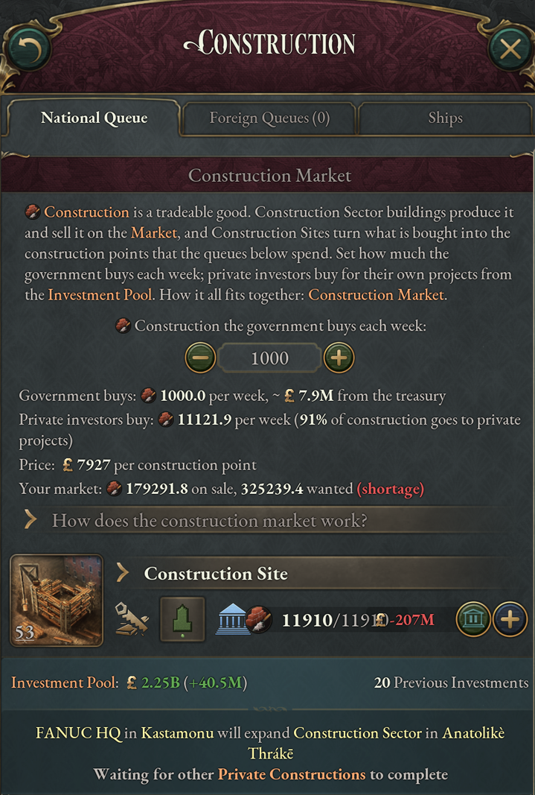
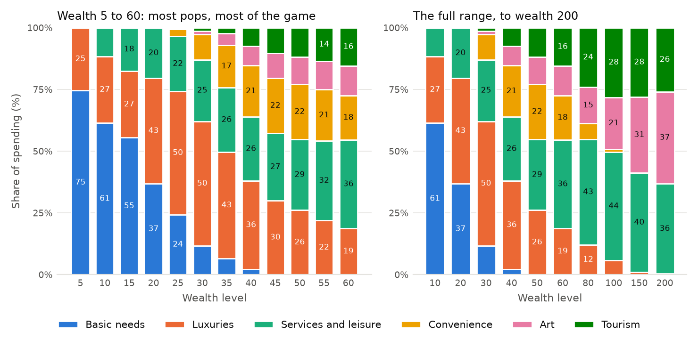
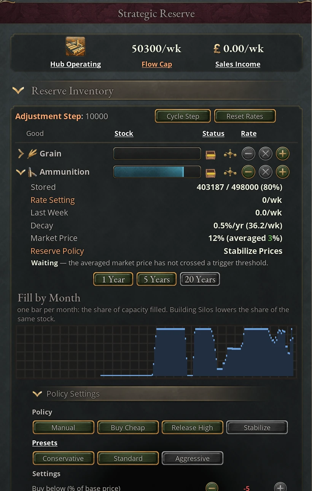

# Economy and construction

This chapter covers how the mod changes the way your economy builds, consumes
and stores. The largest change is the construction market: construction is a
good that Construction Sectors sell and that your government and investors buy,
and most industry uses a little of it as upkeep. It runs from the first day of
the game under the Free Market Construction game rule, which also offers four
alternative settings. The rest of the chapter covers what construction costs in rich
countries, how living-standard expectations adapt, what wealthy pops buy, the
Bulk Transportation good, the Strategic Reserve journal entry, wartime demand
for ammunition and the mod's new mineral deposits.

## The construction market

In the base game, each Construction Sector adds construction points straight to
a national pool. Under Free Market Construction, the default setting of the game
rule of the same name, construction is a tradeable good instead. Construction
Sectors sell it on the market like any factory, your government and your
investors buy it every week, and what they buy becomes the points your two
construction queues spend. The system is based on TOGFan's
[Free Market Construction](https://steamcommunity.com/sharedfiles/filedetails/?id=3257202613)
mod, which is worth a look on its own if you want only this mechanic.

### From Construction Sector to construction queue

Each week, construction moves through four steps.

1. Construction Sectors produce the good, which your market lists as
Construction Services (base price £1,000). In a market game the sector is
ordinary heavy industry: investors build it when it pays, and your government
can build it too. Barracks under the Engineering and Logistics power bloc
principle add a little.
2. The government buys the number of points you set in the construction panel,
paid from the treasury.
3. Investors buy for private projects on their own, paid from the investment
pool. Each week they spend a 24th of the pool. That settles at about the pool's
weekly income, more when the pool has built up and less when it runs low, and
they keep spending when the income stops.
4. Construction Sites turn the purchased good into construction points. They
appear on their own in every state where construction is under way, and in your
capital when nothing is under way anywhere else. Nobody builds them.

Each purchase is capped at what its queue can use that week: at most one week's
maximum progress for each level in the queue. The share of points that goes to
private projects is recalculated every week from the two purchases, and your
economic-system law no longer sets it.

When all buyers together want more construction than is on sale, the price
rises, as it does for any good in Victoria 3. You still get all the construction
you buy, for as long as the shortage lasts; each point just costs more, so the
treasury pays more for its weekly purchase and investors' money buys fewer
points. Think of the higher price as supply stretching in the short run. Every
country in your market buys from the same supply, and construction is imported
and exported like other goods.

Each level of a Construction Sector produces more with better production
methods:

| Production method | Weekly construction per level |
|---|---|
| Wooden Buildings | 1 |
| Iron-Frame Buildings | 2 |
| Steel-Frame Buildings | 3.5 |
| Arc-Welded Buildings | 5 |
| Reinforced Concrete Buildings | 6 |
| Advanced Construction | 10 |
| Nanomaterial Buildings | 16 |

### Construction maintenance and retooling

Most industry, transport, power and service buildings use some construction
each week as maintenance, per level, at a rate that depends on the kind of
building:

| Rate per level | Buildings |
|---|---|
| 0.05 | Trade Centers, Arts Academies, State Youth Centers, Software Industries, the modern mines (bauxite, chromium, copper, graphite, lithium and the like) and the coal, iron, lead, sulfur and gold mines once they run a mechanized pump |
| 0.1 | Factories of every kind, military industry, synthetic and biotechnology plants, Shipyards, Skyscrapers, Tourism Industries |
| 0.15 | Railways, Highways, Airports, Ports, Network Infrastructure, Power Plants, Hydro Plants, Renewable Energy Plants, Oil Rigs |
| 0.2 | Nuclear Plants, Fusion Plants, Deep-Sea Mines, Extraplanetary Bases |

Farms, plantations and urban centers pay none. The coal, iron, lead, sulfur and
gold mines pay none while they run picks and shovels or the atmospheric engine
pump, and start paying when their equipment changes to a condensing engine pump
or anything later; going back to the old equipment stops the upkeep. A few
company buildings also use construction in their production. This upkeep competes with your queues for the same supply, so a
growing economy needs a growing construction sector, and a country built around
railways and power pays more than one built around trade.

When a building switches production method it gets the Production Method
Retooling modifier, which raises its construction use by +1,000% right after the
switch, falling steadily to nothing over five years (260 weeks); the building
shows when the modifier expires. Just after switching methods, a 20-level
factory goes from 2 construction a week to 22, before cost scaling.

That adds up. Over the five years the 20-level factory buys 10 extra
construction a week on average, about £10,000 a week at base prices, so the
switch costs around £2.6 million: 2,600 construction, or about what it takes to
build all 20 levels of the cheapest kind of building (100 construction a level)
from scratch. You pay it, or the building's owners do. Switch production methods
when the new one earns that back, not on a whim.

A building that has no finished level yet can switch for free: the mod removes
the retooling modifier from it, once a week and whenever it changes method. Set
a new building's production methods while it is still under construction. A
building that is only adding levels already has finished ones, so it pays.

### Reading the construction panel

The Construction Market section sits at the top of the construction panel's
National Queue tab.

| Line | What it shows |
|---|---|
| Fixed Quantity / Fixed Budget | Whether you set the government purchase as a number of points or as weekly spending. The lit button is the mode in force; click the other to switch. |
| Purchase control | The government purchase you have set. Fixed Quantity: click for ±1, Shift+Click ±10, Ctrl+Click ±100, Alt+Click ±1,000; right-click on the plus adds 10,000. Fixed Budget: click for ±£1,000, Shift+Click ±£10,000, Ctrl+Click ±£100,000, Alt+Click ±£1,000,000; right-click on the plus adds £10,000,000. In both, right-click on the minus sets 0. |
| Government buys | Points bought this week and the approximate treasury cost. "Capped at what the queue can use" appears when your setting is higher than the queue can take. |
| Your budget buys | Fixed Budget only: how many points a week your budget buys at today's price, which is where the government purchase is heading. |
| Still moving toward it | Fixed Budget only, and only while the purchase has not yet reached what your budget buys: the share of the remaining gap that closes this week. Its tooltip explains why the purchase moves in steps. |
| Private investors buy | Points investors bought this week and the share of construction going to private projects. |
| Price | What one construction point costs now: the market price, raised in rich countries by Construction Cost Scaling. |
| Your market | Construction on sale (including imports) against construction wanted (every buyer, including maintenance and exports). A red "shortage" marks demand above supply: the price rises, but you still get all the construction you buy. |

### Fixed quantity or fixed budget

The two buttons above the purchase control set what you fix and what follows the
price.

| Mode | You set | What follows the price | Use it for |
|---|---|---|---|
| Fixed Quantity (default) | Points the government buys each week | The treasury cost, at once | A set build rate, such as finishing a queue by a date or rebuilding after a war |
| Fixed Budget | What the government spends each week | The points it buys, over a few weeks | A set cost: spending stays near your figure while the price moves |

Under Fixed Budget, the purchase moves each week toward what the budget buys at
that week's price. A raise closes at most half of the remaining gap a week, so
it gets most of the way in three or four weeks. A cut takes hold faster, often
within a week or two. The delay on a raise is deliberate. The government's
purchase moves the price, so a purchase that jumped straight to what the budget
buys would push the price up, buy less the next week, let the price fall, and
swing back and forth. How far the price moves depends on your purchase next to
the market. A small purchase in a large market barely moves it, and a large one
in a thin market, or one that lifts a very low price, takes longer. While the
purchase is still moving, the panel shows how much of the gap closes that week.
Setting the budget to 0 stops government buying at once.

Switching keeps the purchase in force. Fixed Budget starts at what your current
purchase costs, to the nearest £1,000, and Fixed Quantity starts at the number
of points your budget is buying. In both modes only what the queue can use is
bought, so with a short queue a Fixed Budget spends less than you set.

### Free Market Construction settings

The game rule has five settings, fixed when you start the campaign.

| Setting | Construction good | Maintenance | Retooling | Private share of construction |
|---|---|---|---|---|
| Enabled (default) | Traded on the market | By building type | +1,000%, fading over five years | Follows the two purchases |
| Without AI Retooling Costs | Traded on the market | By building type | None for AI countries; normal costs for players | Follows the two purchases |
| Without Retooling Costs | Traded on the market | By building type | None | Follows the two purchases |
| Without Maintenance | Traded on the market; a few company buildings still use it in production | None | None | Follows the two purchases |
| Disabled | None | None | None | Set by your economic-system law |

Without AI Retooling Costs keeps normal maintenance for every country, but
removes the retooling surcharge from AI countries after a production-method
change, with a weekly cleanup for any lingering penalty. Every human player
still pays it, including in multiplayer. AI subjects are exempt even when their
overlord is a player. If you take control of an AI country, future changes pay
normal retooling costs; penalties already removed stay removed.

With the rule disabled, construction works as in the base game, but the
Construction Site takes the Construction Sector's place. The government builds,
expands and downsizes Construction Sites like any government building, and each
level provides 1 to 16 points a week by production method, the same tiers as the
table above. The government pays their wages, and they buy materials for each
point your queues spend. Construction Sites are built from the state view.
Every country also gets Base Construction, 5 points a week, so a country without
any sites can still build its first one. The construction panel
shows a Direct Construction section with your construction per week and the
private share, which the economic-system law sets: 25% under Traditionalism, 50%
under Interventionism, Agrarianism, Extraction Economy and Industry Banned, 75%
under Laissez-Faire, 35% under Cooperative Ownership and 10% under Command
Economy.

### Running the construction market

- Your government purchase starts at 0 in a new game. Set it in your first week,
or the government queue builds nothing.
- Only what the queue can use is bought, so a purchase set above your queue
wastes nothing. With a long queue, though, a high setting buys all of it: that
is expensive for your budget, and a government buying heavily pushes up the
price for every buyer in your market, investors included. Set the purchase to
what you can afford rather than to the maximum, or switch to Fixed Budget and
set the weekly spending directly. To stop government construction
while private building carries on, set it to 0; the sector keeps selling to
investors.
- Watch the market line. A standing shortage keeps the price high, which means
you need more Construction Sector levels or a better production method. Cheap wood, iron and steel make
construction cheaper, because the sector buys them.
- A high price makes Construction Sectors profitable, and investors then build
them on their own.
- Spread production-method switches out. Every switch adds five years of
retooling upkeep, heaviest in the first months, and switching a whole industry
at once can take the construction your queues were counting on.
- Don't downsize Construction Sites at all. They can be downsized only because
the Disabled setting uses them as an ordinary government building. Under the
market settings the game places and removes them as needed, and if you downsize
the last one, construction stops for about two weeks until a new one appears in
your capital.

AI countries choose their own purchase each week, always as a fixed quantity.
They spend roughly their net income, more when their gold reserves are full and
less when they carry debt. They cut back when a war or banking stress meets thin
reserves, and buy at least 10 points a week while their government queue has
anything in it.

## Construction costs in rich countries

Two mechanics make construction dearer as a country grows rich, and both work in
every setting of the Free Market Construction rule.

### Construction Cost Scaling

Once a year, the game compares your GDP per capita with a fixed curve. Above £1
per person per year, the Development Cost Scaling modifier raises the
construction each point requires. The increase rises in a straight line to
+1,000% at a GDP per capita of £100, about 10 percentage points for every £1. It
applies to every use of construction: the points your queues spend and the
maintenance your buildings pay. It combines by multiplication with other
construction-cost modifiers, so another modifier that cuts construction costs by
20% still cuts 20% in a rich country. With Free Market Construction disabled,
the same scaling raises the cost of the materials your construction uses
instead.

This is a catch-up mechanic: a rich country needs more construction for each
building and each level of upkeep, while a poor country builds cheaply.

### Excess private construction

This only matters for extremely rich countries, and you will rarely meet it
before the late game. The private construction queue holds at most 1,000
buildings, so a huge investment pool can run out of projects to spend on; this
modifier lets each project absorb more construction instead. You generally won't
see it until your weekly investment pool income is in the billions.

Once a year, the game checks whether investors have more than 500 levels
waiting in the private queue while the investment pool takes in more than it
spends. If so, you get Excess Private Construction. Each project can then absorb
more construction a week, so the pool can spend its money, at a cost in
construction efficiency that grows with the modifier, up to −90% at its cap; the
tooltip lists the two effects as Max Weekly Construction Progress and State
Construction Efficiency. It starts small, at no more than +10 Max Weekly
Construction Progress, and each year moves by at most about a fifth toward what
the pool needs.

The modifier stays as long as it is needed: while 500 projects at normal speed
still couldn't spend the pool's income and the private queue isn't empty. A pool
that shrinks because the modifier is working doesn't end it. Once the need is
gone, the modifier is removed outright, and the efficiency penalty goes with it.
If it is needed again within five years, it comes back at its old strength or at
what the pool now needs, whichever is less, so a short banking panic doesn't
reset it. After longer it starts small again.

If the modifier passes +1,000 while the investment pool holds more than your
yearly GDP, Overinvestment follows and most pops stop paying into the pool. It
lasts until the pool is back down to a year's GDP, and meanwhile Excess Private
Construction holds its strength, neither growing nor shrinking. Investors keep
spending the pool on the private queue throughout, a 24th of it a week or as
much as the queue can absorb, whichever is less.

## Adaptive standard-of-living expectations

In the base game, pops expect a standard of living set by their stratum,
literacy and laws, and pops below that expectation turn radical over time. The
mod drops the literacy part and adds Adaptive SoL Expectations: an extra
expectation that follows your country's actual average SoL, with a delay. It
aims at a level 10 SoL below your average SoL, moved up or down by some
technologies and laws, and each month it closes part of the gap: about half of
it in ten years and three-quarters in twenty. It only ever adds to the base-game
expectation. While your SoL is too low for that level to reach the base-game
expectation, expectations stay at the base-game level.

So the direction of your economy matters as much as its level. After a sudden
rise in SoL, expectations lag behind for years, pops live better than they
expect, and fewer turn radical. After a sudden fall, expectations stay high for
years and pops sit below them, which feeds radicals long after the shock itself.
Slow, steady growth is the calmest path. You see the adjustment as three country
modifiers: Lower, Middle and Upper Class Expectations Shift.

Technologies, laws and literacy move expectations further:

- The society technologies Egalitarianism, Labor Movement, Socialism, Political
Agitation and Mass Propaganda each raise the level expectations settle at by 0.5
SoL. They replace the literacy-based increase those technologies give in the
base game. Several of the mod's later technologies and laws raise or lower it
too, and Industry Banned lowers it by 1.
- Voting laws raise the expectations of the classes that hold power under them:
Autocracy, Landed Voting and Wealth Voting raise the upper class, Universal
Suffrage the lower class. Regulatory Bodies and Workers' Protections raise the
lower class.
- Poor Laws, Wage Subsidies and Old Age Pension keep expectations at least 1, 2
or 3 SoL above the base-game level, however long hard times last. Universal
Basic Income raises that floor to 10 SoL and the Post-Scarcity Economy to 15.
- Literate populations compare themselves with the rest of the world. Each
month the gap between the world's average standard of living (weighted by
population) and your country's average moves every stratum's expectations: for
each point your average trails the world's, a fully literate population expects
about 0.2 SoL more, and for each point it leads, 0.2 less. Literacy scales the
effect, so an illiterate population doesn't compare at all. A country 10 points
below the world average with 80% literacy expects 1.6 SoL more than it
otherwise would, because its people know others live better; one 10 points
above it expects 1.6 less, which makes a rich, educated country easier to keep
content. This comparison is added after the floors above, so it can take
expectations below the base-game level.

## Pop consumption at high wealth

Pops in the base game stop at wealth 99; in the mod they can reach wealth 200.
Four new needs appear as pops grow rich:

| Need | Starts at wealth | Goods that meet it |
|---|---|---|
| Convenience | 20 | Services, Consumer Appliances, Digital Access, Software |
| Healthcare | 16 | Drugs |
| Art | 25 | Art and Entertainment, some Services |
| Tourism | 25 | Tourism, some Personal Transportation |

Healthcare takes about 3% of what a pop spends from wealth 29 to 50. Past
wealth 50 it grows by the same amount at each level, so a richer pop buys more
Drugs but they take a falling share of its spending. These Drugs come on top of
the Drugs pops buy for Intoxicants ([Pharmaceutical Industries and
Drugs](02-timeline.md#pharmaceutical-industries-and-drugs)). The other needs,
and Services, grow steeply with wealth. By wealth 60, services and
leisure, Convenience, Art and Tourism take about four fifths of what a pop
spends, and by wealth 100 nearly all of it. Luxuries peak at a little under half
of spending around wealth 30 and then fade.

Tourism as an industry is covered in [State tourism](08-states.md#state-tourism), and the new goods in
[The extended timeline](02-timeline.md), which also lists the base-game goods
the mod renames. In the table above, Personal Transportation is the base game's
Transportation and Art and Entertainment its Fine Art. Chemicals, in the
Strategic Reserve below, is its Fertilizer.

## Bulk Transportation and freight

The base game's Merchant Marine good is renamed Bulk Transportation, and it now
stands for freight of every kind, by rail, road, sea and air.

It is produced by transport infrastructure:

- Ports, as in the base game, and their later methods: Container Ports, Global
Ports and Magnetic Drive Ports.
- Railways, on their train methods and on their Centralized Traffic Control,
Containerized Cargo, Automated Loading and Unloading and Autonomous Trains
methods. In a power bloc with tier III or higher of the Transportation
Infrastructure principle, each railway switches its steam, electric or diesel
trains to a stronger version on its own, which carries 20–28% more freight and
adds more infrastructure. That switch costs no retooling.
- Highways, on every method.
- Airports, including their Spaceport method.
- Company buildings such as trading houses, logistics hubs, docks, shipyards
and canal companies.

It is consumed across the industrial economy:

- Trade Centers, as in the base game.
- Construction Sectors from Iron-Frame Buildings onward.
- The rail-transport and tanker-car methods of logging camps, mines,
plantations and oil rigs, and the refrigerated rail car and flash-freezing
methods of fishing wharves, whaling stations and ranches.
- Later mining methods, such as dragline excavators and geophysical surveys, and
the deeper oil-well methods.
- Many late-game factory and retail methods, from advanced assembly lines and
AI-managed production to e-commerce, department stores and shopping malls.

An agrarian economy barely touches it. An industrial one needs railways, ports
and highways to keep up, and a Bulk Transportation shortage raises costs across
construction, mining and industry at once.

## The Strategic Reserve

The Strategic Reserve journal entry lets you stockpile strategic goods in your
capital, buying them when they are cheap and releasing them when prices rise or
supply fails. It is shown once you research Logistics and becomes active once
you have a Strategic Reserve Hub. Build one, or take the decision Establish a
Strategic Reserve, which places the hub in your capital at once with no
construction cost. No game rule controls it.

### Reserve hub and silos

Two buildings make up the reserve, both unlocked by Logistics.

| Building | Where | Construction cost | Adds | Staff |
|---|---|---|---|---|
| Strategic Reserve Hub | Capital only; one per country, at one level | Very low | 5,000 storage for each good; each good may move 1,000 units a week | 5,000 |
| Strategic Reserve Silo | Any state, any number of levels | High | Per level: 1,000 storage for each good; +100 to each good's weekly limit | 500 per level |

The hub is the reserve: it holds the controls and does the buying and selling.
It can't be expanded past its single level, downsized or demolished. Silos are
how a reserve grows: they only add room and flow, and do nothing without a
hub. The hub trades only when it is fully staffed. Below full occupancy the
panel marks the hub Understaffed and every good Blocked, and the hub neither
trades nor replaces what decays.

### Reserve goods and decay

The reserve holds eight goods. Stock decays every week at a yearly rate that
technology lowers.

| Good | Available from | Decay per year at first | After all technologies |
|---|---|---|---|
| Grain | Always | 25% | 0% |
| Small Arms | Always | 1.5% | 0.7% |
| Artillery | Always | 1% | 0.4% |
| Ammunition | Percussion Cap | 2% | 0.5% |
| Oil | Fractional Distillation | 0.5% | 0.05% |
| Chemicals | Intensive Agriculture | 4% | 0.1% |
| Aeroplanes | Military Aviation | 4% | 2% |
| Tanks | Mobile Armor | 2.5% | 1.4% |

Aeroplane and tank decay rises for a time with jets, stealth aircraft and
composite armor before later technologies bring it down. The hub buys each
week's decay on top of whatever rate you set, so a rate of 0 holds a stockpile
steady at a small ongoing cost. Hover a good's row for its decay rate broken
down by source.

### The Strategic Reserve panel

The journal entry's panel has an overview, the Reserve Inventory and a
collapsed How the Strategic Reserve Works. Before you have a hub the entry
shows only a line telling you how to get one. Once the hub stands there is no
status line, because the overview shows how the hub is doing.

The same panels appear as a Reserve tab in the Market panel, and a change made
in one shows in the other. The tab is there once you research Logistics and is
grayed until you build a hub; hover it for what is still missing. It shows only
while the Market panel shows your own market, the one your capital is in,
whether you lead it or joined it, because that is where the reserve buys and
sells. If you open another market with the tab still selected, it offers a
button back to your own. The tab ends with an Open Journal Entry button.

The overview at the top is always shown. The hub's icon is at full colour
while the hub is fully staffed, marked Hub Operating, and dimmed and marked
Understaffed below that; hover it for the staffing. Beside it are the Flow Cap,
how many units of each good the hub may move in a week (hover it for where
that comes from), and Sales Income, what this week's releases earn.

The Reserve Inventory starts open. Its first line shows the Adjustment Step,
with the Cycle Step and Reset Rates buttons beside it. The second line holds
All: Stabilize, Military: Stockpile and All: Manual, which set the policy of
every good at once (see [Reserve policies and presets](#reserve-policies-and-presets)).
Below them is a row for each good you have unlocked:

| Cell | What it shows |
|---|---|
| Good | The good's name. Click it to expand the row. |
| Stock | How full the good's reserve is. A marker shows the target stockpile when a buying policy stops short of full, and the protected stockpile when a selling policy keeps a floor. |
| Status | A crate icon: a yellow bar for Idle, a green arrow going in for Storing, an orange arrow coming out for Withdrawing, a striped barrier for Blocked. Hover it for the word and the reason. |
| Policy icon | A brass governor, lit while a reserve policy sets the good's rate and dimmed while you set it by hand. Click it to open the good's Policy Settings. |
| Rate | The decrease, stop and increase buttons. |

Blocked means the stockpile is full, or empty while a release is set, or the
hub is understaffed. Hover anywhere else on a row for its full breakdown:
stock, rates, decay by source, the hub's flow cap and staffing, and the policy.

An expanded row lists Stored, Rate Setting, Last Week (what actually moved),
Decay, Market Price (against the good's base price, with the average the policy
acts on) and Reserve Policy, then a line on what the policy is doing and why.
Under them, Fill by Month charts how full the reserve was each month, with 1
Year, 5 Years and 20 Years ranges. Each bar is a share of capacity, so building
Silos lowers the bars of an unchanged stock. Policy Settings comes last,
collapsed until you open it or click the policy icon.

How the Strategic Reserve Works sits at the foot of the entry, collapsed. It
explains the hub and silos, rates, status, decay, reserve policies, presets and
settings, sales income and the fill history.

### Storing and releasing reserve goods

You store and release goods from each good's row in the Reserve Inventory, as
set out in [The Strategic Reserve panel](#the-strategic-reserve-panel).

A positive rate buys that many units a week from the market into the reserve; a
negative rate releases that many onto the market. Every press of a good's
decrease or increase button moves its rate by the Adjustment Step, which the
Cycle Step button sets to 1, 10, 100, 1,000 or 10,000 (10 at first). The stop
button sets the good's rate to 0. Reset Rates sets every good's rate to 0 and
switches every good to Manual.
The game keeps each rate within the weekly flow limit and the room or stock
left, and sets it to 0 when the reserve fills or empties.

The hub is a government building in your capital, and the goods pass through it
as its inputs and outputs. Storing buys from your national market, paid from the
treasury, and adds demand that raises the price. Releasing sells onto your
market, adds supply that lowers the price, and pays the treasury; the overview
shows this as Sales Income.

The budget panel shows the two sides separately. Sales appear under Additional
Income, as the Strategic Reserve journal entry's income; purchases appear with the
hub's inputs under Goods for Government Buildings. They are not netted, so a
reserve that buys small arms while selling grain can show +1,000 a week of income
and −2,000 a week of expenses at the same time.

### Reserve policies and presets

Instead of setting a rate by hand, you can give each good a policy that decides
its rate every week from the national market price, measured against the good's
base price and averaged over several weeks. Click a good's policy icon, or
expand its row and open Policy Settings, to choose one. The five policy buttons
there use short names: Manual, Buy Cheap, Release High, Stabilize and Stockpile.

| Policy | What it does |
|---|---|
| Manual | You set the rate. The default for every good. |
| Buy When Cheap | Buys while the averaged price is below your purchase threshold. Never sells. |
| Release When Expensive | Sells while the averaged price is above your release threshold. Never buys. |
| Stabilize Prices | Does both. |
| Stockpile | Buys at full flow while the averaged price is at or below your purchase threshold. Sells above your release threshold while you are at war, and in peacetime only above +50%. |

Stockpile is for goods you want in hand before a war, such as ammunition. A
munitions industry is rarely profitable enough to push the price far below
base, so the other buying policies seldom fill a reserve of it. Choosing
Stockpile loads the Stockpile preset, which buys at or below +5% of base price,
and the response ramp does not slow its purchases. At war it sells into the
price spike; in peacetime it keeps the stock unless the price passes +50%, as it
can when an army mobilizes for a diplomatic play. Between your release
threshold and +50% in peacetime, the good's row says Holding.

Eight settings shape a policy, and four presets fill them all in one click:

| Setting | Conservative | Standard | Aggressive | Stockpile |
|---|---|---|---|---|
| Buy below (% of base price) | −20 | −10 | −5 | +5 (at or below) |
| Release above (% of base price) | +30 | +20 | +10 | +20 (at war) |
| Maximum weekly flow (units) | 2% of capacity | 5% of capacity | 12% of capacity | 5% of capacity |
| Weekly purchase budget (estimated) | 0.1% of weekly GDP | 0.3% of weekly GDP | 0.8% of weekly GDP | 0.3% of weekly GDP |
| Price memory (weeks averaged) | 8 | 4 | 2 | 4 |
| Response ramp (points) | 20 | 10 | 5 | 10 (sales only) |

The purchase threshold can be set from −50% to +25% of base price under any
policy.

Every preset uses the whole capacity: a protected stockpile of 0% and a target
stockpile of 100%. Set those two yourself if you want a floor the policy never
sells. The response ramp spreads the reaction out: the flow rises from nothing
at the threshold to the maximum that many points beyond it. At 0 the policy is a
switch that runs at full flow once the price crosses the threshold.

A preset keeps its flow and budget in step with your country, recalculating them
every week from your capacity and GDP, until you change either by hand. The
preset in force is grayed out, and changing any setting by hand ends it. The
budget is set for each good and caps each week's spending; what goes unspent
doesn't carry over. A new reserve starts every good on Manual with the Standard
settings loaded, so switching a good to a policy works at once. The row's own
rate buttons, Reset Rates and All: Manual switch goods back to Manual. Policies
keep running while the journal entry is closed.

The buttons on the Reserve Inventory's second line act on every good you have
unlocked:

| Button | What it does | When to use it |
|---|---|---|
| All: Stabilize | Every good to Stabilize Prices with the Standard preset. | To lean against price swings in every market you stock. |
| Military: Stockpile | Ammunition, oil, small arms, artillery, aeroplanes and tanks to Stockpile with its preset. Grain and chemicals keep their policy. | To build a war reserve at about base price. |
| All: Manual | Every good to Manual. Each keeps its current rate and settings. | To take back control without stopping trade; Reset Rates also sets every rate to 0. |

### Moving or losing the reserve hub

The hub always follows your capital. If your capital moves, the next weekly
update builds a new hub in the new capital for free and removes the old one.
Your stock and your capacity carry over unchanged, since the hub has only one
level and your silos stay where they are. The cost is time: the new hub hires
its 5,000 workers from scratch and trades nothing until it is fully staffed, so
the reserve neither buys, releases nor replaces decay in the meantime. Avoid
moving your capital while you are counting on the reserve.

If a foreign power takes the hub's state, the hub is destroyed and the whole
stockpile is lost. Since the hub always stands in your capital, protecting the
reserve means keeping your capital state.

Losing the hub never closes the journal entry. Until you have a hub again the
reserve waits: it buys, sells and loses nothing to decay, every good reads
Blocked, its controls are grayed, and the entry offers a new hub. Build one in
your capital, or take the decision Establish a Strategic Reserve to place it at
once. After a capture the new hub starts empty.

A revolution or secession that takes the hub's state does not cost you the
stock. The rebels hold the building while the war lasts, and your stock waits
for a hub. If you win, the old hub comes back to you, and if you placed a new
one in the meantime, the next weekly update removes the spare. If a revolution
wins, its new government continues the nation and keeps the reserve. If a
secession wins, the new country keeps the building, and you keep your stock for
a new hub in your capital. Silos in states you lose go with them: when a hub
stands again, the reserve keeps only what the hub and your remaining silos can
hold.

### Pledging grain to the World Food Reserve

Once the United Nations has founded the World Food Reserve, a member with a
Strategic Reserve Hub can press Pledge Grain to the World Food Reserve on the
UN tab of the Diplomacy panel. When a UN aid mission opens in another country,
the Reserve takes up to a quarter of your grain, at most 2,500 units, if you
hold at least 500. The
grain leaves your reserve through its own bookkeeping, and you gain standing for
each draw. Withdraw Our Grain Pledge stops it at any time (see [The World Food
Reserve and hunger](10-united-nations.md#the-world-food-reserve-and-hunger)).

### How the AI uses the reserve

The AI founds its reserve through Establish a Strategic Reserve: great and major
powers take it, more readily in peacetime, and so does any country with a GDP
above 10 million. AI reserves add silos once any good passes 75% of capacity.
An AI reserve runs grain and chemicals on Stabilize Prices with the
Conservative preset: it buys below −20% and releases above +30%. Its
ammunition, oil, small arms, artillery, aeroplanes and tanks go on Stockpile
with the Stockpile preset while its treasury allows: it must not be borrowing
or in default, and it needs a quarter of its gold reserve limit in hand to
start. It then buys them at about base price in peacetime and sells into a
war's price spike. Once it borrows, those goods go back to Stabilize Prices on
Conservative. The AI reviews this every week. It follows the same rules,
limits and costs as yours.

## Wartime demand for munitions

Peacetime armies train with half the base game's ammunition. When an army
mobilizes, Basic Supplies, which no army can switch off, raises its ammunition
use by +300% (+50% in the base game). A mobilized battalion therefore burns four
times its peacetime ammunition, twice the base game's peacetime figure. The mod
removes the extra ammunition that Extra Supplies and Luxurious Supplies add in
the base game, so the supplies you choose no longer change how much ammunition
an army uses. The Basic Supplies tooltip shows the ammunition figure. A few of
the mod's own mobilization options add more on top; see [Mobilization
options](13-military.md#mobilization-options).

The demand follows mobilization rather than war: an army mobilized for a
diplomatic play spikes it even if no war follows, and the demand falls away as
the army demobilizes. Where armies buy most of the ammunition, four times the
demand can push its price to the maximum. Build munitions capacity, put
ammunition on the Strategic Reserve's Stockpile policy (it buys at about base
price and sells into the spike), or both, before you go to war.

## New mineral deposits

The mod adds fourteen mine types, from Copper and Bauxite Mines to Lithium, Rare
Earth Metals and Platinum Group Metals Mines, and places their deposits in the
regions that hold them in reality, such as copper in the Atacama and Katanga.
They start undiscovered and turn up over time, as undiscovered resources do in
the base game. Twenty-one state traits for famous mining regions, among them the
Bushveld Igneous Complex, the Central African Copperbelt, the Sudbury Basin and
Bayan Obo, raise the throughput of the mines there. The goods these mines
produce are covered in [The extended timeline](02-timeline.md).
