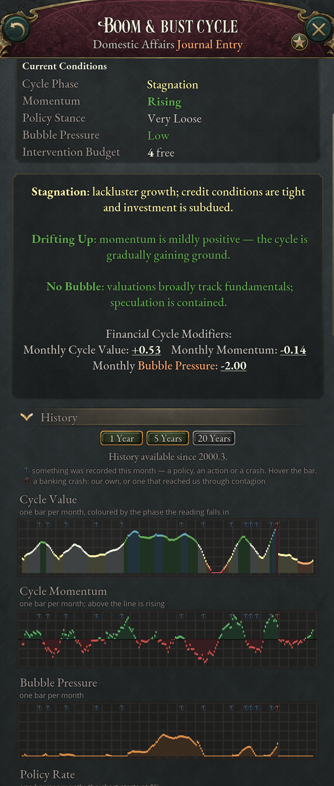
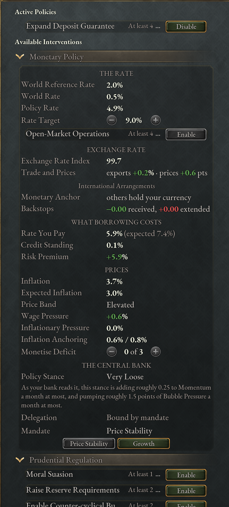

# Banking and monetary policy

The banking cycle gives every economy with a stock exchange a financial cycle of
its own: booms that build speculative bubbles, crashes that burst them, and
contagion that carries a crash along trade routes into other countries. On top
of the cycle sits a monetary layer: a central-bank policy rate, inflation, an
exchange rate, gold reserves, and treaties that tie one currency to another. The
Banking System game rule controls both. *Enabled* gives you everything in this
chapter, *Simplified* keeps the cycle and drops the monetary layer, and
*Disabled* removes the journal entry (see the
[Introduction](01-introduction.md)).

Under every setting the mod replaces the base game's flat interest rate on
government debt. You borrow at a rate built from a world reference rate, your
country's credit standing and a risk premium, so a banking panic makes your
loans dearer and a sound currency makes them cheaper.

## The Banking Cycle journal entry

The cycle lives in a journal entry in the Domestic Affairs group. Its title
follows your economic system: Boom & Bust Cycle in a market economy, Logistics &
Allocation Gauge under Command Economy, and Cooperative Finance Dashboard under
Cooperative Ownership. Its description changes with the title and explains what
the readings mean in that economy. The model is the same in all three; the phase
effects and the tools differ.

The entry appears once you have researched Stock Exchange and own an Urban
Center of level 5 or higher. It starts at Stable with no momentum or bubble, and
stays for the rest of the game. If a revolution succeeds, the new government
carries on the cycle and the central bank where the old one left them (see
[After a revolution](05-politics.md#after-a-revolution)), but policies you had
switched on are lost and must be enabled again.

The same panels appear as a Banking tab in the Budget panel, and a change made
in one shows in the other. The tab is grayed until the journal entry appears;
hover it for what you still need. It ends with an Open Journal Entry button,
which opens the entry with its description and status text. [The banking
panels](#the-banking-panels) describes what they show.

<!-- screenshot: the Banking tab of the Budget panel, with the four bars, the overview's icons and Active Policies in view -->

### Cycle value, momentum and bubble pressure

Three readings drive the cycle, each drawn as a bar at the top of the panels:
Banking Cycle Value, Banking Momentum and Bubble Pressure. The cycle value runs
from 0 to 100 and decides the phase. Momentum is added to the cycle value every
month, so it sets how fast conditions change; it loses a tenth of itself each
month. Bubble pressure, also 0 to 100, is accumulated speculation. It decides
how likely a crash is and how hard it hits. A fourth bar, Policy Stance, runs
from tight to loose and shows where your interest rate sits; it moves only
under the full Banking System.

The overview's icons report momentum and bubble pressure as bands, not figures.
Momentum reads Collapsing, Falling, Steady, Rising or Surging. Bubble pressure
reads Low (under 15), Building (15 to 29), Elevated (30 to 49), High (50 to 74) or Severe <!-- style: allow ai-vocab -->
(75 and up). The entry's status text lists the Financial Cycle Modifiers:
Monthly Cycle Value, Monthly Momentum and Monthly Bubble Pressure, the change
your country's modifiers make to each reading every month. Hover a figure for
the modifiers behind it.

### The seven banking cycle phases

Each phase applies a modifier every month. The low phases hurt output and drain
bubble pressure; the high phases raise output and build it.

| Phase | Cycle value | Effects in a market economy |
|---|---|---|
| Panic | under 10 | Services output −50%, manufacturing throughput −20%, capitalists' investment-pool contribution −25%, +2 points of risk premium, bubble −7 a month |
| Downturn | 10–24 | Services −25%, manufacturing −10%, capitalists' contribution −10%, +1 point of risk premium, bubble −3 a month |
| Stagnation | 25–39 | Services −10%, manufacturing −5%, +0.4 points of risk premium, bubble −1 a month |
| Stable | 40–59 | None |
| Expansion | 60–74 | Services +25%, manufacturing +5%, capitalists' contribution +5%, bubble +3 a month |
| Boom | 75–87 | Services +35%, manufacturing +10%, capitalists' contribution +10%, bubble +4 a month |
| Frenzy | 88 and up | Services +50%, manufacturing +15%, capitalists' contribution +15%, bubble +8 a month |

The capitalists' contribution figures are percentage points, not percentages.
Capitalists put a share of their income into the investment pool, and a Panic
takes 25 points off that share rather than a quarter of it.

A command economy's phases change construction costs and bureaucracy instead of
services and investment; a cooperative economy's grow or shrink the investment
pool. Both are far less exposed to crashes.

### What moves the banking cycle

Two forces pull the cycle back toward the middle: the phases, and a random
monthly nudge that your laws scale (Banking Cycle Volatility).

Two others can push against that pull. In a market economy, bubble pressure
feeds momentum, so a boom keeps climbing once a bubble forms; the tooltip shows
this as the Speculative Inertia, Feedback and Euphoria modifiers. A budget
deficit lifts the cycle by a tenth of a point a month per 1% of GDP, up to one
point, and a surplus lowers it (the Government Fiscal Policy Effect).

Policies, laws, events and, under the full Banking System, your policy stance
push the readings directly. Fiat Money and Digital Currency add 0.2 bubble
pressure a month, and Digital Currency and Decentralized Cryptocurrency make the
cycle more volatile.

## Banking crashes and contagion

A crash is the cycle's failure state. It starts at home from your own bubble, or
arrives from a trading partner's crash.

### How a banking crash starts

Every month the game rolls for a crash. The higher the phase, the lower the
bubble at which risk begins and the faster it grows. Base monthly chances in a
market economy, before the Banking Crash Likelihood your laws and policies add:

| Phase | Risk begins above bubble | At bubble 50 | At bubble 75 |
|---|---|---|---|
| Frenzy | 15 | about 11% | about 17% |
| Boom | 25 | about 4% | about 7% |
| Expansion | 50 | none | about 1% |
| Stable | 75 | none | none |
| Stagnation or lower | 90 | none | none |

A command economy rolls at about a third of these chances, a cooperative economy
at about two thirds.

### Banking crash severity

Severity is about half the bubble pressure at the moment of the crash,
multiplied by a random factor between a half and two. It decides the event and
how far the cycle falls, and every crash wipes bubble pressure to 0.

| Severity | Event | Cycle value after | Momentum after |
|---|---|---|---|
| 80 and up | Systemic Collapse | 5 | −5 |
| 60–79 | Banking Panic | 10 | −4 |
| 40–59 | Financial Crash | 20 | −3 |
| 20–39 | Market Downturn | 30 | −2 |
| under 20 | Market Correction | 40 | −1 |

Climbing back from a Panic-level crash to Stable takes more than a year without
a crash response. Command economies suffer 40% less severity and cooperative
economies 20% less, and less still when the crash is imported.

### Responding to a banking crash

The crash event always offers Weather the storm, which is free but angers the
upper and middle strata. Beside it you get one response set by your financial
regulation law and up to four more, depending on your technology and laws: an
emergency discount window (Central Banking), coordinated swap lines (Investment
Banks; not the treaty article), a fiscal stimulus (Keynesian Economics) and
emergency capital controls (Corporate Governance).

Each response adds back 3 to 12 cycle value and up to 3 momentum. It costs a
GDP-scaled treasury expense that fades over six months, holds 1 to 4
intervention points for a year (see [the intervention
budget](#the-intervention-budget)), and radicalizes some
of the upper strata. If your intervention budget goes negative, for example
after a law downgrade, the game switches off one crash response a month. Once
those are gone, it lifts one of the five monetary interventions in External &
Currency each month
until the budget balances or none of those interventions remains.

### Banking contagion

A crash can spread to any country that holds the banking journal entry and is
tied to the crashing one by a shared market, customs union, currency or border,
economic dependence, or more than 1% of its market's trade, production or
consumption. A country more than 20 times the crashing economy's size is
immune, and the limit applies at every step of a cascade, so a crisis wave
rarely climbs from small economies to large ones. Each exposed country has a
25% base chance to be reached, more when the source is at least your size, when
the ties are close and when the crash was severe.

A week later, the reached country's own bubble pressure (plus a bump for the
original crash's severity) decides whether it crashes outright or only suffers a
scare of −3 cycle value and −1 momentum. A country with a small bubble is mostly
safe. One that does crash passes contagion on, so one crash can become a wave.

Command and cooperative economies are harder to infect. A Bank Holiday or a
banking union lowers the chance of catching a crash, and a Lender of Last Resort
guarantee makes an imported one start less deep. The contagion event lets you
shut your markets to protect domestic banks or keep them open at the cost of
more radicals.

## The banking panels

The journal entry and the Budget panel's Banking tab show the same overview and
sections, in the same order. The overview at the top is always shown: the four
bars, then two rows of icons, each with a caption above it and a word beside
it. Hover a caption for what the term means, and hover the icon or its word for
the reading in detail; the first row's tooltips also list what pushes the cycle
each month.

| Caption | Icon | Word |
|---|---|---|
| Cycle Phase | A bank front with a mark: arrows down in a Panic or Downturn, a level bar in Stagnation or Stable, arrows up from Expansion, and the bank gilded in a Boom or Frenzy | The phase |
| Momentum | An arrow, doubled for Collapsing and Surging | The momentum band |
| Bubble Pressure | Coins inside a bubble that grows band by band, its rim going from green to red, cracked at Severe | The bubble band |
| Policy Stance | A tap: the more coins fall from it, the looser the stance, and a padlock at Very Tight | Very Loose, Loose, Neutral, Tight or Very Tight |
| Inflation | A price tag marked for the band, from a blue arrow down at Deflation to a flame at Very high; a wheelbarrow of banknotes at Hyperinflation | The price band, or Foreign money once you dollarize, or Set by plan in a command economy |
| Budget | A stack of gold tokens | How many intervention points are free |

Policy Stance appears only once you hold a dial, and Inflation only under the
full Banking System. A warning mark on the bubble means a crash is at its most
likely: the cycle value is 90 or more, or a Boom or Frenzy has momentum
Surging. The words are colored by how far the reading is from calm: green and
white are safe, yellow and gold warn, and red marks an extreme (Panic, Frenzy,
Collapsing momentum, Severe bubble pressure). A Boom reads blue.

The first row's three icons also sit in the top bar, right after your weekly
balance, while the journal entry is running. They show no words or figures:
hover one for its word and the same tooltip, with the warning mark on the
bubble as here, and click it to open the Banking tab.

Below the overview come five sections. All start open except the explanations,
and each heading opens or closes its section:

| Section | Starts | Shows |
|---|---|---|
| Active Policies | Open | The tools in force, each with its point cost and a Disable button. |
| Monetary Policy | Open | Under the full Banking System, the rate, gold, the exchange rate, what borrowing costs and prices (see [Monetary policy under the full Banking System](#monetary-policy-under-the-full-banking-system)). Under Simplified, only the Open-Market Operations row, in a market economy. |
| Available Interventions | Open | Your economic system's other tools, in categories you can close one by one, each tool with its point cost and an Enable button. |
| History | Open | The charts in [Banking history charts](#banking-history-charts). |
| How Banking Works | Collapsed | The explanations: the cycle, crashes and the intervention budget, and under the full Banking System the policy rate, the stance and what borrowing costs. |

Each tool's name is underlined: hover it for what the tool does, its full name
and what it requires. A grayed button means you cannot use the tool now, and
its tooltip says why. Enabling a tool moves it to Active Policies. Some rows
carry a shortened name: under Directed Credit each row names only its sector,
and Counter-cyclical Buffer stands for Enable Counter-cyclical Buffer. The
tables in this chapter use the full names.

### The intervention budget

The intervention budget is the pool of points your active policies hold. Your
financial regulation law gives 1 to 7 points, National Bank Established 1 more,
and a power bloc's banking union 1 more. The overview's Budget icon shows how
many are free, and the journal entry repeats it as Free Intervention Points: a
command economy calls it the Free Planning Budget and a cooperative the Free
Council Mandate Points.

Switching a tool on has its own price: the lending tools charge the treasury
0.2% to 2.5% of GDP, most regulatory tools create radicals, and Capital Controls
(Outflows) costs infamy and great-power relations. Sterilize Capital Inflows and
Emergency Import Financing charge cash on activation and each month; their
tooltips show the current monthly cost.

### Market economy banking tools

A market economy has twenty-two tools under the full Banking System, seventeen
under Simplified. The leaning tools drain bubble pressure and cool a boom, the
credit tools feed growth, the crisis tools shorten a slump, and the foreign
capital tools manage gold and the exchange rate. The sections below say what
each group buys, what it needs and when it is worth its points. [Banking tool
list](19-appendix-reference-lists.md#banking-tool-list) gives every tool with its
category, points and requirements in one table.

Because momentum loses a tenth of itself each month, a steady push settles at
about ten times its monthly figure. A tool worth −0.05 momentum a month ends up
taking about half a point a month off the cycle value.

### Leaning against a boom

The four leaning tools in Prudential Regulation drain bubble pressure and slow
momentum every month they run. Switch them on once the cycle reaches Expansion
and bubble pressure starts to build. Lift them when it falls back to Stable: in
a slump they slow the recovery you want. The counter-cyclical buffer needs
International Exchange Standards; the other three are available from the start.

| Tool | What you gain each month | What you pay or give up |
|---|---|---|
| Moral Suasion | −0.15 bubble pressure, −0.02 momentum | 1 point and nothing else. |
| Raise Reserve Requirements | −0.9 bubble pressure, −0.04 momentum; under the full Banking System, half a point less inflation pressure | 2 points and 5% lower investment efficiency for capitalists. 2% of pops radicalize when you raise them, and again when you lift them. |
| Enable Counter-cyclical Buffer | −1.5 bubble pressure, −0.05 momentum | 2 points. Capitalists pay 1 point and shopkeepers 5 points less of their income into the investment pool. Radicals when you enable it and when you lift it, as above. |
| Raise Margin Requirements | −1.2 bubble pressure, −0.05 momentum | 2 points and −0.5 standard of living for the middle strata. Radicals when you raise them and when you lift them. |

Measure them against the phases: Expansion adds 3 bubble pressure a month, Boom
4 and Frenzy 8. All four together drain about 3.75 and take 7 points, enough to
hold an Expansion's bubble steady but not a Boom's. Under the full Banking
System a Tight or Very Tight policy stance drains up to 3 more (see [Monetary
policy stance](#monetary-policy-stance)), so the rate and the tools together can
hold a Boom. In a Frenzy the bubble outgrows everything you can drain, so lean
early.

The AI uses Moral Suasion in an Expansion, reserve requirements and the buffer
from Expansion upward, and margin requirements in a Boom or Frenzy. It uses any
of them while momentum reads Surging, and lifts them once the cycle turns down.

### Directing credit into growth

Directed credit steers cheap loans to one sector. Each sector builds its
buildings 10% faster, pleases some interest groups and angers others, and adds
momentum and bubble pressure, so it belongs in a cycle at or below Stable, not in
a boom. Each costs 3 points and a one-off 0.8% of GDP from the treasury, the
state's share of the loans, and lifting it radicalizes 2% of pops. Only one
sector runs at a time, two under Directed Credit & Development Banks, and
Prudential / Narrow Banking forbids them all. Electrification & High Tech needs
Rural Electrification; the other four are available from the start.

| Sector | Builds 10% faster | Approve | Disapprove | Each month |
|---|---|---|---|---|
| Directed Credit to Infrastructure | Infrastructure | Armed Forces +1, Trade Unions +1 | Industrialists −5 | +0.05 momentum, +0.3 bubble pressure; decrees also cost 10% less |
| Directed Credit to Heavy Industry | Heavy industry | Industrialists +3 | Landowners −3 | +0.05 momentum, +0.3 bubble pressure |
| Directed Credit to Agriculture | Farms, plantations and ranches | Landowners +3, Rural Folk +2 | Industrialists −3 | +0.04 momentum, +0.4 bubble pressure |
| Directed Credit to Armaments | Military industry and shipyards | Armed Forces +3 | Intelligentsia −2 | +0.05 momentum, +0.2 bubble pressure |
| Directed Credit to Electrification & High Tech | Power plants and high-tech industry | Intelligentsia +2, Trade Unions +1 | Industrialists −3 | +0.05 momentum, +0.3 bubble pressure |

Pick the sector you are building in and whose interest groups you can afford to
annoy. Infrastructure is the one that costs you the Industrialists' favor.

Export Credit Facility, listed under External & Currency, is the credit tool for
exporters. It gives +25% export advantage, +0.05 momentum and +0.15 bubble
pressure a month, for 2 points, 0.2% of GDP at the start and 2% less tax
collection while it runs. It needs Corporate Governance, and Prudential / Narrow
Banking forbids it.

AI countries direct credit in a Downturn, in Stagnation, or while a Stable cycle
has momentum Collapsing. They choose the sector by who governs: heavy industry
for Industrialists, agriculture for Landowners or Rural Folk, armaments for the
Armed Forces or in war, electrification for the Intelligentsia, infrastructure
otherwise. They lift it in a Panic or once the cycle climbs past Stable, and run
Export Credit Facility from Stagnation down.

### Pulling out of a slump

Six tools help in a Downturn or Panic: the four in Crisis Response, Expand
Deposit Guarantee from Prudential Regulation, and Open-Market Operations from
Monetary Policy. They run alongside the crash event's responses (see
[Responding to a banking crash](#responding-to-a-banking-crash)), which hold
points of their own for a year. Emergency Liquidity needs Investment Banks,
Asset Relief and Open-Market Operations Keynesian Economics, the bail-in
Globalization and the deposit guarantee Consumer Credit.

| Tool | What you gain | What you pay or give up |
|---|---|---|
| Declare a Bank Holiday | Falling momentum halves at once. For 90 days, crash likelihood −90%, which also keeps contagion out. | 2 points; −20% services output and −5% tax collection while it lasts. Radicals: 5% of middle-strata pops, 3% of upper and 2% of lower, about 2.5 to 3% of your population. Only in a Downturn or Panic, and once in five years. |
| Emergency Liquidity Program | +12 cycle value at once, then −0.8 points of risk premium and +0.08 momentum a month. | 4 points; 1.2% of GDP when you open it, 1% refunded when you close it. +10 bubble pressure at once and +0.8 a month. |
| Asset Relief Program | +0.3 cycle value a month. | 5 points; 2.5% of GDP at once; −5% tax collection and −5% bureaucracy; 3% of pops radicalize. |
| Bail-in Regime | +0.15 cycle value and −0.3 bubble pressure a month. | 3 points and nothing from the treasury: the banks' creditors take the losses. +0.1 point of risk premium, and 3% of upper-strata pops radicalize. |
| Expand Deposit Guarantee | −0.2 points of risk premium, +0.03 momentum and −0.2 bubble pressure a month. | 4 points. 2% of pops turn loyalist when you expand it; 3% radicalize when you withdraw it. |
| Open-Market Operations | +0.1 momentum a month and +5% services output. | 4 points and 0.5% of GDP at the start; +1.5 bubble pressure a month and, under the full Banking System, about a point of inflation pressure. |

A Bank Holiday is the first answer to a Panic: it halves the fall at once and
keeps a trading partner's crash out while you recover, but you get one every
five years. It ends by itself after 90 days, and you can end it sooner. Emergency
Liquidity lifts the cycle most at once, and closing it hands most of its cost
back, so close it once you are out of the slump, before its bubble pressure
feeds the next boom. A deposit guarantee is cheap to open and costly to
withdraw, so keep it for a lasting slump.

Asset Relief Program and Bail-in Regime exclude each other. Asset Relief lifts
the cycle twice as fast, at 2.5% of GDP and a standing cost in tax and
bureaucracy; a bail-in costs the treasury nothing and angers the upper strata
instead. Open-Market Operations is what is left when you can't cut any further:
under the full Banking System it needs Fiat Money or Digital Currency with your
policy rate at its floor.

The AI declares a Bank Holiday and opens Emergency Liquidity in a Panic, or in a
Downturn that is still falling fast. It expands the deposit guarantee in a
Downturn or Panic, uses Asset Relief or a bail-in from Stagnation down, and
uses Open-Market Operations at the rate floor in a slump or deflation. It lifts
them as the cycle climbs back to Stable and beyond.

### Managing foreign capital and import credit

External & Currency groups export lending and outflow controls with five
monetary interventions. These five appear only under the full Banking System.
Each holds 2 points while it runs (Emergency Import Financing 3), leaving fewer
for deposit guarantees, domestic credit or crisis relief. Restrict Speculative
Inflows needs your own policy rate; Sterilize Capital Inflows and the surrender
requirement need a convertible Gold Standard with your own policy rate; Limit
Foreign-Currency Borrowing and Emergency Import Financing need National Bank
Established. The tooltips show their current costs and restrictions.

| Intervention | What you gain | What you pay or give up |
|---|---|---|
| Restrict Speculative Inflows | Halves incoming speculative gold and the upward exchange-rate pressure from a positive real-rate gap. Gold can still leave at its usual speed. | Slower reserve accumulation, −3% bureaucracy and slightly slower credit growth. Bubble pressure also falls. |
| Sterilize Capital Inflows | Removes 75% of the inflation pressure from incoming gold. | 0.01% of annual GDP in cash on activation and each month, with slightly slower credit growth and less bubble pressure. Foreign lenders retain their claims on the vault, and outgoing gold still causes deflation. |
| Limit Foreign-Currency Borrowing | Gradually reduces the risk premium caused by a weak currency, reaching half that component after about 24 months. | Adds 0.25 percentage points of risk premium while active and slows credit growth. Protection takes time to build; it also takes about 24 months to disappear after you lift the limits. |
| Foreign Exchange Surrender Requirement | Buys gold for the central bank with treasury cash, without adding Borrowed Gold that foreign lenders can withdraw. | −10% export advantage and −3% bureaucracy, plus the cash spent on reserves. Purchases stop at the vault's capacity and cannot exceed available cash. |
| Emergency Import Financing | +15% import advantage while a financial crisis lasts. | Cash on activation and each month: initially 0.05% of annual GDP, rising to 0.10% after 12 funded months. Holds 3 intervention points. |

Surrender purchases depend on your market's exports. The monthly cap is 0.05%
of annual GDP when export reliance is above 30%, half that amount above 10%,
and a quarter with any smaller positive share. A market with no exports buys
nothing. Cash needed for the other funded interventions reduces what you can
spend on these purchases.

Emergency Import Financing is available during a Downturn or Panic, a gold
crisis with Peg Confidence at 40 or below, or hyperinflation. War alone does not
qualify. It supports imports generally; it does not guarantee supplies or get
ships through a blockade. The tool ends when the crisis passes or you cannot
fund it. Each inactive month removes one month of its accumulated surcharge;
switching it off and back on does not reset the cost.

Sterilize Capital Inflows ends if you cannot fund it. Both it and Foreign
Exchange Surrender Requirement end when you lose the conditions for convertible
gold flows, including a suspension of convertibility. Other tools are lifted
when their law or monetary requirements no longer hold. Restrict Speculative
Inflows and the surrender requirement share the outflow control's wartime
exception to restrictive financial regulation laws.

The AI restricts inflows when positive rate pressure accompanies an Expansion
or hotter cycle, and sterilizes when gold is arriving during those phases. It
uses borrowing limits when the Exchange Rate Index is below 95, surrender
requirements when its vault is less than half full and it has cash, and import
financing during a financial crisis. It favors lifting each tool when those
reasons end.

### Command economy and cooperative tools

Under Command Economy the cycle measures planning strain, and the panels offer
eight planning tools plus two transfers, which have a Transfer button and no
point cost. Under Cooperative Ownership it measures the balance between what
worker-owners pay themselves and what they reinvest, and there are eight council
tools. Changing economic system switches the old system's tools off. An open
Emergency Liquidity Program still refunds 1% of GDP when that closes it.

| Economy | Category | Tools (points) |
|---|---|---|
| Command Economy | Plan Management | Emergency Plan Revision (3), Production Target Reduction (2), Plant Consolidation Order (2) |
| Command Economy | Allocation & Supply | Emergency Resource Allocation (3), Strategic Material Stockpile (2), Central Distribution Upgrade (4) |
| Command Economy | Administration | Administrative Performance Campaign (3), Inter-Sectoral Coordination Protocol (1) |
| Command Economy | Investment Pool Transfers | Capital Injection moves 0.2% of GDP from the treasury into the investment pool. While private projects are queued, the pool then spends about a 24th of itself a week, and the treasury keeps topping it up as State Investment Funding. Capital Withdrawal moves 0.2% of GDP back, or the whole pool if it holds less |
| Cooperative Ownership | Surplus & Reserves | Dividend Restraint Resolution (2), Mutual Aid Fund Deployment (4) |
| Cooperative Ownership | Investment & Credit | Collective Capital Investment Plan (4), Cooperative Credit Union Expansion (3) |
| Cooperative Ownership | Council Direction | Federation Council Advisory Directive (1), Consumption Ceiling Resolution (2) |
| Cooperative Ownership | Membership Mobilisation | Worker Solidarity Campaign (1), Worker Buyout Facilitation (3) |

### Banking history charts

The History section starts open in both the journal entry and the Banking tab.
It charts the last 1 Year, 5 Years or 20 Years month by month: Cycle Value,
Cycle Momentum, Bubble Pressure, Policy Rate and Rate Paid on Debt, plus
Inflation and the Exchange Rate Index under the full Banking System. Markers
flag policy changes, including tools a change of economic system switches off,
and crashes, including imported ones. History is kept for the player and for
major powers and above.

## Financial regulation laws

The Financial Regulation law group sets how volatile your banking system is, how
likely it is to crash, how large your intervention budget is, which tools you
may use and which response the crash event offers.

| Law | Unlocked by | Points | Volatility | Crash likelihood | Locks |
|---|---|---|---|---|---|
| Unregulated Banking | default | 1 | +50% | +25% | Capital Controls (Outflows), Asset Relief Program |
| Free & Mutual Banking | Postal Savings | 3 | – | −10% | Capital Controls (Outflows), Asset Relief Program |
| Universal Banking (Light Prudence) | Central Banking | 4 | +10% | – | Capital Controls (Outflows), Asset Relief Program |
| Prudential / Narrow Banking | Modern Financial Instruments | 7 | −60% | −50% | Open-Market Operations, all directed credit, Export Credit Facility |
| Directed Credit & Development Banks | Central Planning | 5 | −20% | −20% | none (two credit sectors) |
| State-Owned Banking | needs Command Economy | 7 | −35% | −35% | Capital Controls (Outflows), Asset Relief Program |
| Central Bank Independence | Keynesian Economics, with National Bank Established | 7 | −10% | – | Capital Controls (Outflows) |

The capital-controls locks in the table also apply to Restrict Speculative
Inflows and Foreign Exchange Surrender Requirement. All three are allowed in
any war and lifted when it ends if your law forbids them. The laws also have
effects outside the cycle, listed in their tooltips, and these apply under every setting of the Banking System rule,
Disabled included: Urban Center throughput, the investment pool, innovation and
government dividends. Central Bank Independence, for one, strengthens your
economic defense against covert operations (see [Covert
defense](10-influence.md#covert-defense)).

The National Bank law group decides whether you have a central bank. National
Bank Established (Central Banking) adds an intervention point and the National
Bank institution, and gives you a policy rate under the full Banking System.
Most countries start in 1836 with Unregulated Banking, Commodity Money and no
national bank. Britain starts with Universal Banking (Light Prudence), a
national bank and the Gold Standard; France, Sweden and the Netherlands with
Universal Banking and a national bank; Austria and Denmark with a national bank;
and the United States with Free & Mutual Banking.

## Monetary policy under the full Banking System

With the rule on Enabled, every country runs the monetary model whether or not
it holds the journal entry, and the Monetary Policy section shows it. Its rows
are grouped under The Rate, Gold and the Peg (on a gold standard with a dial),
Exchange Rate, International Arrangements (while you are anchored, party to a
monetary treaty or in a bloc with a Monetary Union principle), What Borrowing
Costs and Prices. Hover a row's label for what the term means and the row for
the detail behind its figure. Your Policy Stance and price band are icons in
the overview.

### Who sets the policy rate

You have a dial, a policy rate of your own, with National Bank Established and a
currency law of Commodity Money, Gold Standard, Fiat Money or Digital Currency,
unless you run a Command Economy, have dollarized, or tie your currency to
another country's. Everyone else still has a rate, and the Monetary Policy
section says why it is out of your hands: without a national bank or under
Decentralized Cryptocurrency it is the world rate plus expected inflation plus a
point, a command economy's is fixed at 3%, and an anchored country takes its
anchor's.

### Rate target, delegation and mandates

You choose a Rate Target and the policy rate moves toward it by a third of a
point a month (two thirds under Digital Currency). Click the stepper for a
point, Ctrl-click for a tenth, Shift-click for the limit of your currency law.
Changes are free and have no cooldown.

You start with the dial delegated: the central bank sets the target every month
from its mandate. Take Control and Delegate switch between you and the bank,
free of charge.

| Mandate | What the bank does |
|---|---|
| Price Stability | Raises the rate more than a point for each point of inflation above target, and leans fully against where the cycle is heading |
| Growth | A quarter point looser at target, half as responsive to the cycle, and blind to inflation below 4% |
| Peg Defence | Holds the world rate, up to a point above while gold is short, and ignores the domestic cycle; convertible gold standard only |

A mandate-run bank cuts three times as fast once the cycle falls into Stagnation
or worse.

Central Bank Independence makes delegation permanent: you choose the mandate,
but you no longer set the rate or print money. Lenders reward it. Your credit
standing improves by half a point and its floor drops from 0.5 to 0.25 points,
and the bank's estimate of what your economy can bear (see [Monetary policy
stance](#monetary-policy-stance)) errs by less. Each level of the National Bank
institution adds a tenth of a point of Inflation Anchoring, which absorbs that
much standing wage and price pressure.

### Monetary policy stance

Policy Stance reports your rate as Very Loose, Loose, Neutral, Tight or Very
Tight against what your economy can bear. The loose bands add momentum and
bubble pressure every month, and the tight bands drain them. What the economy
can bear is hidden even from your bank, and the band is the bank's estimate, so
stepping the dial will not find the exact turning point.

The push is capped unevenly. On the loose side it tops out at about +0.25
momentum and +1.5 bubble pressure a month, so loosening much further adds
nothing to the cycle. On the tight side it goes to about −0.5 momentum and −3
bubble pressure a month.

Six months on the tight side bring Dear Money Politics (Landowners and Petite
Bourgeoisie approve; Industrialists, Rural Folk and Trade Unions disapprove),
and six months on the loose side bring Cheap Money Politics, the reverse. Both
fade after a return to Neutral.

### What your government pays to borrow

Rate You Pay shows the yearly interest on your debt. It adds up the market yield
(the higher of your policy rate and the World Reference Rate plus expected
inflation), your credit standing and your risk premium, less the inflation that
actually happened, and never falls below 0.5%.

Credit standing is what your country is: rank, finance technologies and a stock
exchange, institutions and currency credibility. It cannot go below 0.5 points
(0.25 under Central Bank Independence). Risk premium is what is happening: the
cycle phase, crisis tools, banking events, bankruptcy, a debt load past a
quarter of your credit limit (up to +4 points at the limit), expectations that
have strayed from target, money printing and a weak currency.

The World Reference Rate is 3% for every country, 2.5% once any great power has
Macroeconomics and 2% once one has Globalization. The World Rate is the real
interest rate of the great powers that set their own; gold flows and exchange
rates are measured against it.

### Inflation and price bands

Inflation shows what prices did over the last year, and Expected Inflation what
lenders and workers assume they will do. A loose stance, a boom, deficits, money
printing, dearer goods and imports, and inflowing gold push it up, as do the
Wage Pressure of your labor and welfare laws and any other standing Inflationary
Pressure, such as a devaluation. Above 8% inflation, the wage pressure of your
labor and welfare laws counts twice.

Every country starts on metallic money, Commodity Money or the Gold Standard,
and there expected inflation is fixed at 0%: money redeemable in metal promises
stable prices, lenders take the promise at face value, and the money itself
pulls inflation back toward zero. Expected inflation sets the floor under your
borrowing, so on metal any inflation erodes your debt and any deflation adds to
it.

Fiat Money and Digital Currency replace that promise with the bank's inflation
target of 2%. Expected inflation then follows actual inflation, pulled toward
the target the more lenders trust the bank: most under Central Bank
Independence, less when you delegate the dial, less again when you set it
yourself, and least under State-Owned Banking. That trust wears away as
inflation strays from the target and is gone 10 points from it. Expectations
adjust twice as fast under an independent bank, and only inflation that lenders
did not foresee erodes your debt.

Inflation puts you in one of six price bands, each a modifier on your country;
the overview's Inflation icon shows which. You leave a band only once inflation
is a quarter point past its edge. Above Stable prices, each band is worse than
the one below on every count; the modifier's tooltip gives the figures.

| Band | Inflation | Main effects |
|---|---|---|
| Deflation | below −1% | Momentum drains; Rural Folk and Trade Unions disapprove |
| Stable prices | −1% to 3% | None; labor laws pay the Real-Wage Dividend |
| Elevated | 3% to 8% | Lower strata expect more; Petite Bourgeoisie disapprove | <!-- style: allow ai-vocab -->
| High | 8% to 20% | Tax waste, weaker investment, more interest groups disapprove |
| Very high | 20% to 50% | Less minting, and bubble pressure builds |
| Hyperinflation | 50% and up | The hyperinflation crisis fires |

The Real-Wage Dividend turns your labor laws' wage pressure into a lower
standard-of-living expectation for the lower strata (see [Economy and
construction](03-economy.md)) and a little momentum, while prices are stable.
Command and dollarized economies never get it.

### Monetizing the deficit

Monetise Deficit, from 0 to 3, has your national bank print money for the
treasury. Each level mints about 1% of a year's GDP, adds about 2.5 points of
inflation pressure and half a point of risk premium. It needs Fiat Money or
Digital Currency and a bank that takes instructions, so Central Bank
Independence, Command Economy, dollarization and an anchored currency rule it
out.

### Currency regimes and the policy rate

Your Monetary Policy law sets the dial's range.

| Currency law | Unlocked by | Rate range | Notes |
|---|---|---|---|
| Commodity Money | default | World rate −1 to +3, with a national bank | Prices that outrun the world's are pulled back down; fixed at par |
| Gold Standard | Central Banking | 0% to 15% | A point off credit standing; gold reserve; Peg Defence; fixed at par |
| Fiat Money | Keynesian Economics, with National Bank Established | 0% to 25% | Open-Market Operations and money printing; floats |
| Digital Currency | Universal Digital Identity, with National Bank Established | −3% to 25% | As Fiat, and the rate moves twice as fast; floats |
| Decentralized Cryptocurrency | Cybersecurity | no dial | Borrows at the world rate plus a spread; floats |

### Gold reserves and the run on the vault

A gold-standard country with a dial gets a Gold and the Peg group in the
Monetary Policy section. The Bank's Gold is the central bank's vault, not your
treasury. Each point your rate sits above the World Rate draws in gold worth
0.2% of GDP a month, and each point below sends as much out. Gold drawn in is
Borrowed Gold: your budget pays your policy rate on it (the Interest on It row
beneath), and it leaves first, at double speed, once your rate is no longer
above the world's. Recapitalise the Bank moves a tenth of the reserve's limit
from treasury to vault, in cash, for good.

Peg Confidence (0 to 100) reacts to your rate only while the vault is under a
tenth of its limit:

| While the vault is low | Peg Confidence a month |
|---|---|
| Each point your rate is below the World Rate | −3 |
| Downturn or Panic | −2 |
| Debt at half your credit limit or more | −2 |
| Rate at or above the World Rate | +2 (+1 at 70 or more) |

With more gold in the vault, it recovers while your rate is at or above the
world's and no Borrowed Gold is leaving. Borrowed Gold leaves only once your
rate is no longer above the world's, so a bank holding its rate above the World
Rate keeps recovering while it draws gold in. The lower confidence is, the
faster it comes back:

| Peg Confidence | Recovery a month |
|---|---|
| Under 40 (Doubted) | +3 |
| 40 to 69 (Watched) | +2 |
| 70 or more (Trusted) | +1 |

An overvalued currency drains it at any time and stops the recovery. At 20, The
Run on the Vault fires:

| Option | Effect |
|---|---|
| Defend the peg: "Raise the rate until the gold comes back." | For a year the rate target stays at least 4 points above the World Rate; Peg Confidence +40 |
| Suspend convertibility: "Suspend payment in gold. For the duration." | Five years as a paper currency with a free rate; +2 points of risk premium for five years; gold's credit-standing bonus lost for ten |
| Devalue: "The peg holds. The price of gold does not." | The vault gains 15% of its limit, Peg Confidence resets to 50, the exchange-rate index drops to 88 and recovers over five years; prices rise; the great powers resent it |

### The exchange-rate index and capital controls

The Exchange Rate Index is your currency's real value to foreigners, where 100
is par. On Commodity Money and the Gold Standard your currency is fixed at par
and the index moves only after a devaluation. The pressure that would move it
shows up as overvaluation instead, which pulls prices down on commodity money
and drains Peg Confidence on gold.

Fiat Money, Digital Currency and Decentralized Cryptocurrency float, and nobody
sets the index: it moves between 50 and 150, drifting toward a target that
rises when your real interest rate beats the World Rate and falls when your
inflation runs above the world's, when lenders charge you a risk premium, or
when events knock it; the tooltip lists each term. Every point below par
gives +1.25% export advantage and −1.25% import advantage, and above par the
reverse. A weak currency adds risk premium, and a fall below its three-year
average raises prices for a while.

Capital Controls (Outflows), an External & Currency tool for 2 points, cut the
effect of the gap between your rate and the world's on your exchange rate, gold
and peg to a quarter. Each peacetime year
they stay on adds a step of Trapped Capital, up to five, costing Industrialist
and Petite Bourgeoisie approval and investment efficiency. The count freezes in
a war or crisis and fades after the controls come off.

### Hyperinflation and dollarization

When inflation reaches 50%, Not Worth the Paper offers three answers:

| Option | Effect |
|---|---|
| Currency reform: "Call in every note. We begin again." | Inflation and expectations reset to 5%; printing stops; the investment pool is wiped out; middle and upper strata radicalize; Currency Reform adds 5 points of risk premium for ten years |
| Dollarize: "Let them keep the foreign money. They already have." | A Dollarised Economy: inflation drops to the bank's target, but the dial and money printing are gone and minting falls 75%. Enacting any monetary law brings back your own currency, with inflation at 5% and ten years of Currency Reform; Command Economy ends it free |
| Wait: "It will pass. Everything passes." | Nothing; the question returns in two years |

### Monetary treaty articles

Five treaty articles tie money or debts across borders; all need the full
Banking System (treaties in general: [Diplomacy](08-diplomacy.md)).

A pegged country is anchored. It has no dial and prints no money: its policy
rate is the anchor's plus a spread, its exchange rate is the anchor's, and it
gets up to 80% of the anchor's credibility. It keeps its own inflation and
banking cycle; when its inflation runs ahead of the anchor's, the difference
shows as overvaluation, which drains Peg Confidence. While overvaluation stays at
5 points or less, confidence recovers on the same schedule as a gold peg's: +3,
+2 or +1 a month by band.

| Article | Unlocked by | What it does |
|---|---|---|
| Currency Peg | International Exchange Standards | The weaker party pegs to the stronger at the anchor's rate plus half a point, and its credit standing improves |
| Swap Line | Macroeconomics | Lowers the recipient's risk premium and steadies its peg; in a financial crisis it borrows from the provider, repaid interest-free |
| Lender of Last Resort | Intergovernmental Organizations | Halves the ward's debt-load premium; if the ward defaults, the guarantor pays out or reneges at a cost in infamy and prestige |
| Imposed Currency Peg | International Exchange Standards | A peg at the anchor's rate plus a point, with no credit benefit and −10 legitimacy, that the pegger cannot break |
| Debt Receivership | International Exchange Standards | The debtor pays the creditor 0.1% of GDP a month, with −10 legitimacy, until its debt stays low for 12 months |

The last two are hostile: a larger power can demand them only of a country in
default. If the stronger party leads a power bloc, each article also gives it
leverage generation over the weaker, from 150 to 500 by article, which builds
the Leverage Advantage it needs to invite that country into its bloc (see [Other
power bloc changes](08-diplomacy.md#other-power-bloc-changes)). A country may
receive only one swap line at a time. A treaty pegger at Peg Confidence 20 gets
The Peg Under Siege: impose capital controls for a year (+40 confidence), break
the peg by leaving the treaty, or re-peg lower. AI countries look for a swap line when
their peg wobbles and a guarantee when heavily in debt, and are reluctant to peg
their own currency.

Each side signs for its own reasons:

| Article | Why the weaker side takes it | Why the stronger side agrees |
|---|---|---|
| Currency Peg | A small economy that trades mostly inside a bigger country's market, or a fiat currency whose bank commands little trust (a rate set by hand, State-Owned Banking, inflation running high). It borrows more cheaply and takes on the anchor's credibility, but gives up its dial and money printing, and suffers when its inflation outruns the anchor's. | A great or major power, or a market leader, drawing trading partners into its monetary orbit at no risk to itself: +2% prestige, better relations, and cheaper borrowing as more of the world's GDP pegs to it. A bloc leader also gains 200 leverage generation over the pegger. It pays the article's upkeep. |
| Swap Line | A country with high borrowing costs, a shaky gold peg or a habit of financial crises: −1 point of risk premium at once, +2 Peg Confidence a month, and credit of up to 2% of its GDP in a crisis, repaid afterwards. | A larger economy backing a partner cheaply: +1% prestige and better relations, and as a bloc leader 150 leverage generation over the partner, for extra risk premium in proportion to the partner's size (a sliver when a great power backs a minor) and loans in a crisis. It pays the upkeep. |
| Lender of Last Resort | A heavily indebted country: its debt-load premium halves, imported panics start shallower, and a default brings a payout unless the guarantor refuses. Each payout makes the guarantee worth less. | A rich power sure of its ward: +2% prestige and better relations, and as a bloc leader 300 leverage generation over the ward, for extra risk premium in proportion to the ward's size. On a default it pays 5% to 15% of the ward's GDP, or refuses at a cost in infamy, prestige, relations and its own borrowing costs. |
| Imposed Currency Peg | Nothing it would choose: it is forced on a country in default. | A major power or better that wants a defaulted country's money tied to its own for good; a bloc leader also gains 400 leverage generation over it. |
| Debt Receivership | A defaulted country that needs cheaper credit more than it needs legitimacy, though it is usually forced. | A larger financial power facing a defaulted country: it collects 0.1% of the debtor's GDP a month until the debtor recovers, and takes on a little of its risk. A bloc leader also gains 500 leverage generation over the debtor. |

### The Monetary Union principle group

A power bloc can bind its members' money together through the Monetary Union
principles. Each tier includes the ones before, and all need Central Banking.

| Tier | Principle | Effect |
|---|---|---|
| I | Monetary Cooperation | Every member gets half a swap line from the leader |
| II | Common Currency | Members may adopt the leader's money: its rate with no spread, its exchange rate and +5% export and import advantage |
| III | Fiscal Backstop | The leader is lender of last resort to every adopter |
| IV | Banking Union | Adopters get −25% crash likelihood and volatility and an intervention point; needs Keynesian Economics |
| V | Reserve Currency | The leader borrows more cheaply and earns on the world's balances; adopters gain more trade advantage; needs Globalization |

Adopting needs Fiat Money or Digital Currency with a national bank, inflation
within 3 points of the leader's and debt under half your credit limit. Leaving
worsens your credit standing for ten years, costs investment pool, relations and
bloc cohesion, and bars you for ten years. A leader can Press for Convergence at
50 influence per holdout, which waives the debt condition and puts The Question
of the Common Currency to each holdout; one that refuses costs the bloc cohesion
and gains Monetary Independence. Power blocs in general are covered in [Power
bloc principles and
identities](08-diplomacy.md#power-bloc-principles-and-identities).

### Currency boards for subjects

A puppet, vassal, colony or crown land whose overlord has a dial runs a currency
board: the overlord's rate plus a quarter point, its exchange rate, and half the
subject's minting goes to the overlord. Six months at Very Tight or Very Loose
bring The Overlord's Rate, which raises liberty desire. More autonomy ends the
board.

### How the AI runs monetary policy

AI countries always delegate. They run Peg Defence on a convertible gold
standard, Growth at war or with debt at half their credit limit, and Price
Stability otherwise. They print money only at war with heavy debt and stop
gradually afterwards, and a gold-standard AI tops up its vault when it is under
a quarter full and the treasury is flush.

## The Simplified banking setting

*Simplified* keeps the cycle and everything tied to it: crashes, contagion,
rescue appeals, the Great Depression, the seventeen cycle tools and the
financial regulation laws. The five additional monetary interventions in
External & Currency are unavailable; Export Credit Facility and Capital
Controls (Outflows) remain. It drops the monetary layer: no rate target or
mandates, inflation,
exchange rate, gold reserve, monetary treaty articles, Monetary Union principles
or currency boards.

You still borrow at a rate of your own: the World Reference Rate, a point more
without a national bank, plus credit standing and risk premium, so a Panic still
raises your interest. Open-Market Operations needs only Keynesian Economics,
four points and a law that allows it, and The Gold Window Closes, a
gold-standard crisis event, appears only under this setting. With the rule on
*Disabled* interest works the same way, minus the cycle's premium.

## Bailouts and the Great Depression

One country can ask another to rescue its banks, a wave of crashes can become a
worldwide depression, and the United Nations can lend to a member caught in one.

### Appeals for a banking rescue

A rescue comes through the random banking events of a possible rescuer: a
country that has researched Keynesian Economics, holds cycle value 40 or more
and is not in default. Its event can pick a smaller trading partner in a
Downturn or Panic, not at war with it, where one of the two markets relies on
the other for at least 5% of its trade. That partner gets Appeal for a Rescue?;
asking costs 5% prestige for a while (Hat in Hand). The rescuer then answers
International Bailout Request:

| Answer | Effect |
|---|---|
| Extend a generous rescue package | A sum scaled to the rescuer's GDP, capped at a fifth of the recipient's; +30 relations; five years of Restored Banking Confidence for the recipient |
| Offer a smaller emergency grant | An eighth of the package; +10 relations; two and a half years of Restored Banking Confidence |
| They must solve their own problems | −20 relations, and the largest of the three hits to the rescuer's own cycle |

Restored Banking Confidence lowers crash likelihood by 10%, raises company
throughput by 5% and blocks another appeal while it lasts.

### The Great Depression

Every crash that starts at home begins a new crisis wave, replacing any wave
still running, and each contagion crash adds to it. If ten or more countries
crash in one wave and together hold half of world GDP, every country with the
banking journal entry gets The Great Depression three days later. It happens at
most once per game.

| Your situation | Modifier |
|---|---|
| Crashed in the wave | Great Depression for ten years: −0.4 momentum a month, +3 points of risk premium, −5% prestige; radicals |
| Not crashed, under Isolationism or Command Economy | Global Depression (Sheltered) for five years: −0.1 momentum a month |
| Not crashed, any other country | Global Depression for ten years: −0.2 momentum a month, +1 point of risk premium |

### The UN emergency loan

A United Nations member with the banking journal entry that is in a Panic or in
default can be offered An Emergency Lending Facility through the UN's docket
(see [The UN docket](09-united-nations.md#the-un-docket)), once a crisis wave
has reached it or while any country suffers the Great Depression. The offer
comes at most once in ten years, and never while you are still repaying a UN
loan or your representation is suspended.

| Option | Effect |
|---|---|
| Accept the facility and its conditions | 2% of your GDP at once, repaid as 110% over five years through the weekly UN Emergency Loan Repayments expense. For the same five years you carry UN Emergency Loan Conditions (−5 legitimacy, −50 Authority, the government resource rather than UN Authority) and Restored Banking Confidence. Cycle value +10. Trade Unions and Rural Folk disapprove, Industrialists approve. The loan adds to UN Authority's delivery pillar |
| We will weather this alone | Nothing |

The loan is capped at half a year of the dues members pay together, so a
Moribund UN, which collects no dues, has nothing to lend.

## Banking events

The cycle also draws random events: railway bond fever, bank runs, derivatives
scandals, mortgage-backed securities, shadow banking and many more, with their
own versions for command economies and cooperatives. Which ones can fire depends
on the phase, the bubble, your technology and your economic system. After one,
no random banking event fires for at least 18 months, and none in a crash month.
Their options move the cycle's readings, and the tooltip shows by how much. A
few tie into the banking tools: The Bank Holiday appears only when you could
declare one, and its first option does.
