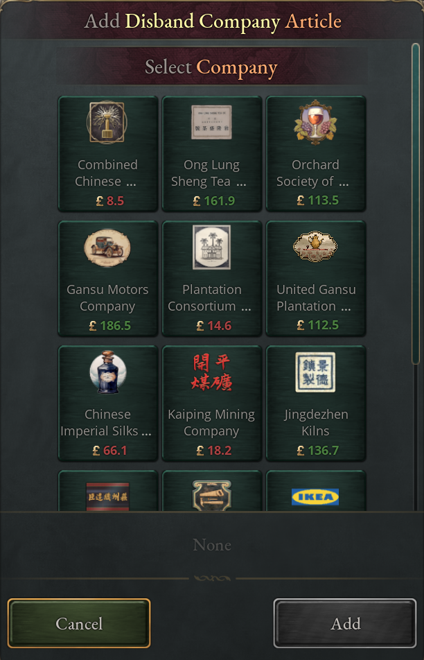
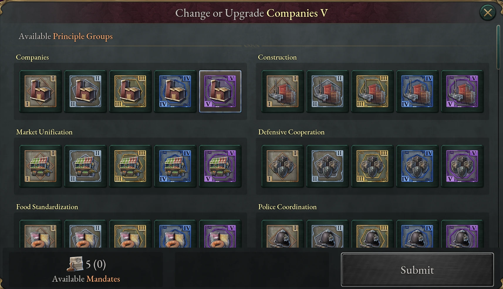

# Diplomacy

The mod adds 35 treaty articles, extra escalation in diplomatic plays, events
between rival powers, a reunification system for divided nations, two more tiers
of power bloc principles, and ten late-game formable countries. None of this has
a game rule or journal entry of its own: it works through the base game's treaty
screen, diplomatic plays, power bloc panel and formation panel, though some
pieces depend on other systems' rules. Much of it opens up in era 6, with
Decolonization and Intergovernmental Organizations.

## Treaty articles

The new articles appear in the treaty draft beside the base-game ones. Most have
a technology gate (listed in the tables), a power bloc principle (see
[principles that unlock articles and
actions](#principles-that-unlock-articles-and-actions)), or another system's
game rule. A directed article binds one side, the conceding country, and gives
something to the other. An enforceable article can also be demanded as a war
goal. The draft shows each article's influence cost.

### Choosing a company or state for an article

Six articles ask you to name something. Seize Company and Disband Company take a
company. Minority Protection, Free Port Concession, Religious Mission Rights and
Demilitarized Zone take a state. When you add one to a draft, the article shows
a button with its current choice; click it to pick from a list.

The state or company always belongs to the conceding country, so only a
country that owns at least one company can be asked for Seize Company or
Disband Company. Free Port Concession needs a coastal state, and a demilitarized
zone can't be the capital. A country can concede each of the four state
articles to the same partner only once at a time, across all their treaties, so
a second demilitarized zone against the same country waits until the first
ends. The company articles can be repeated for different companies.

The four state articles act on the state itself, and only while the conceding
country owns it under a treaty in force. They end with the treaty, and they
leave the state at once if it passes to another country, which includes the
conceding country being annexed. If the other party is annexed instead, they
end within a month. A state taken by rebels in a civil war keeps them, and one
that returns to the conceding country while the treaty still stands gets them
back.

### Treaty articles by purpose

The corporate articles let a winner, or a patron, reach into another country's
economy.

| Article | Unlocked by | Enforceable | What it does |
|---|---|---|---|
| Seize Company | Always available | Yes | The conceding country hands one of its companies to the other, unless the receiver already has a company of that type. |
| Disband Company | Always available | Yes | The conceding country dissolves one of its companies. |
| Enforce Privatization | Stock Exchange | Yes | The conceding country must privatize its government-owned buildings while the treaty stands. The demanding country needs Laissez-Faire or Interventionism, and the conceding country Cooperative Ownership, Agrarianism or Traditionalism. |
| Free Port Concession | International Trade | Yes | The chosen state drops its tariffs (within a year) and gets +50% trade capacity, +25% trade advantage and more migration pull, but collects half the tax and assimilates more slowly. Blocked by Isolationism on either side. |

The humanitarian and cultural articles move people, faiths and cultures.

| Article | Unlocked by | Enforceable | What it does |
|---|---|---|---|
| Minority Protection | International Relations | Yes | Halves assimilation and conversion in the chosen state. The conceder loses legitimacy and pays authority; the other side gains prestige. The protecting side must be in a Cultural Commonwealth or Religious Convocation bloc. |
| Religious Mission Rights | Colonization | Yes | Each year 5% of the chosen state's pops of other faiths convert to the other side's religion. The side sending the missionaries must be in a Religious Convocation bloc. Neither country can have State Atheism, and the treaty freezes if the conceding country adopts it later. |
| Cultural Exchange Program | Pan-nationalism | No | Mutual: +1 yearly cultural acceptance, +2% prestige and +1 cultural pull for both, better relations, −5 ideological covert defense. |
| Population Transfer | Pan-nationalism | Yes | Moves pops of the receiving country's primary cultures out of the conceding country, once. See [population transfers by treaty](#population-transfers-by-treaty). |

The military and security articles cover disarmament and cooperation between
armed forces.

| Article | Unlocked by | Enforceable | What it does |
|---|---|---|---|
| Demilitarized Zone | International Relations | Yes | No conscription, Barracks, Naval Fortifications or Military Bases in the chosen state; an existing Military Base is dismantled. While it stands the conceding country uses 25 authority and loses 5 prestige. |
| Forced Disarmament | Intergovernmental Organizations | Yes | Military wages −25%, conscription halved, military industry throughput −25% and −10 prestige. Every Arms Industry, Artillery Foundry, Munition Plant, Naval Administration, Naval Fortification, Naval Logistics Center and Military Base in the conceding country is dismantled; Shipyards and Military Shipyards are spared. |
| Intelligence Sharing Pact | Intergovernmental Organizations | No | Mutual, between two major powers or greater that have both established a Ministry of Intelligence and Security: +3 intelligence capacity, a stronger but dearer intelligence ministry, and a [defense shield](#the-intelligence-sharing-pacts-defense-shield). Costs each side 1 infamy. |
| Joint Military Exercises | Combined Arms | No | Mutual: +25% army experience gain and admiral rank impact, military goods 5% dearer for each treaty that carries it. Needs an alliance or defensive pact, already in force or in the same treaty, a subject relation between the two, or a shared Military Treaty bloc. Each country can hold it in at most three treaties. |

The requirements on Minority Protection, Religious Mission Rights and Joint
Military Exercises apply when a treaty is signed or renegotiated. An article
already in force stays if they stop being met, but renegotiating its treaty
means meeting them again or dropping it.

Arms control between nuclear powers belongs to the nuclear system: Nuclear Arms
Limitation holds two countries to the same ceiling on warheads, and leaving it
weakens the nuclear taboo unless another such treaty still binds you as tightly
(see [The Nuclear Arms Limitation
treaty](14-nuclear.md#the-nuclear-arms-limitation-treaty)).

The aid and influence articles are how power blocs extend their reach. All but
Request Influence and Reduce Subject Liberty need a principle in your bloc. In
the aid articles the donor must outrank the recipient, pays a running cost and
gains leverage over it, and relations improve.

| Article | Offered by | What it does |
|---|---|---|
| Request Influence | A country outside any bloc, to a bloc leader | The leader gains leverage over you very fast, so it can soon invite you into its bloc. It is the way for a player to join a bloc: an AI leader accepts readily, but an AI country essentially never agrees to be the one asking. |
| Extend Influence | Bloc leader | The leader gains leverage over the other country. |
| Crisis Resolution | Bloc leader with over 100 authority | The recipient gets +40 minimum legitimacy, lower liberty desire and half the radicalism from enacting unpopular laws; the leader pays authority. |
| Education Aid | A more literate member | +10% education access for a recipient with a weak Ministry of Education or none. |
| Healthcare Aid | A member with a Ministry of Health at level 3+ | −5% mortality and +1 standard of living for a recipient with a weak health system. |
| Security Aid | A member with a Ministry of Public Safety at level 3+ | −20% turmoil effects and lower liberty desire for a recipient with weak policing. |
| Development Assistance | A member | +2 standard of living for the lower strata of a recipient whose primary cultures average below 15. |
| Modernization Aid | A member with more technologies and a Ministry of Science at level 2+ | The recipient gains technology spread; the donor loses weekly innovation. |
| Extensive Modernization Aid | A member with a Ministry of Science at level 4+ | Four times Modernization Aid, which it requires. |
| Reduce Subject Liberty | A subject, to its overlord | Lowers the subject's liberty desire. |

The remaining articles belong to systems with chapters of their own.

| Article | Game rule | Chapter |
|---|---|---|
| Currency Peg, Imposed Currency Peg, Swap Line, Lender of Last Resort, Debt Receivership | Banking System set to Enabled | [Banking and monetary policy](04-banking.md) |
| Nuclear Disarmament, Nuclear Program Freeze, Nuclear Program Aid, Nuclear Guarantee, Nuclear Security Assistance, Nuclear Arms Limitation | Nuclear Weapons | [Nuclear weapons](14-nuclear.md) |
| Require UN Membership | United Nations | [The United Nations](10-united-nations.md) |
| Enforce Emissions Reduction | Global Warming | [Climate and pollution](15-climate.md) |

### Treaty article events

Some articles have events that can fire in any year the treaty stands.
Intelligence Sharing Pact, Minority Protection and Cultural Exchange Program
each have a good and a bad one, such as a foiled plot or a nationalist backlash.
Joint Military Exercises, Education Aid, Security Aid, Nuclear Disarmament and
Nuclear Program Freeze have one each, and Population Transfer has one that can
fire while its disruption lasts.

### Dynamic treaty names

A treaty containing one of the mod's articles gets a fitting name instead of
"Treaty of" plus the signing city: a Nationalization Accord for a seized
company, a Convention on Minority Rights, a Demilitarization Agreement, and so
on for about half of the new articles and for money transfers. The draft's
randomize button draws from the names that fit.

### The Intelligence Sharing Pact's defense shield

Once a year, each partner in an Intelligence Sharing Pact compares its own
covert defense with its partners'. If a partner's is higher, you gain half the
gap between your combined economic, military and ideological defense and your
strongest partner's, spread evenly over the three: a sixth of the gap on each.
The stronger partner gains nothing from the shield, so the pact lets a great
power cover a weaker partner against [covert
operations](11-influence.md#covert-defense), and partners can't run covert
operations against each other. The AI signs readily with a country that shares
one of its rivals, and almost never with a rival.

### Population transfers by treaty

Population Transfer takes effect once, on ratification. Every pop in the
conceding country whose culture is primary for the receiving country, and not
for the conceding one, moves to the receiving country, mostly to its most
populous states. Both countries then take a five-year Population Transfer
Disruption to bureaucracy and legitimacy, with more radicals from conquest. It
fades over time, and its strength grows with the share of each country's
population that moved, never falling below a quarter.

The draft blocks the article when the receiving (demanding) country has
Universal Citizenship. It also needs at least one community of the receiving
country's primary cultures inside the conceding country with acceptance below
60. The transfer then moves every such pop, well-accepted communities included.

The AI demands a Population Transfer, in a treaty or as a war goal, only when
it would move at least 100,000 people. You can still demand smaller ones.

## Diplomatic play escalation

In the base game a play escalates by one point a day. The mod adds extra
escalation about once a week from the countries in the play, each for its own
role as initiator, target or committed participant. No country adds more than 10
a week, each country's weekly figure is rounded to a whole point, and nothing
slows a play below the base rate: laws and seats that slow plays only cancel
extra escalation.

| Source | Effect |
|---|---|
| Fourteen technologies of eras 6–12, mostly military, from Bombing Aircraft and Mass Media to Orbital Weapon Platforms | +0.5 to +2 a week each in plays you start; three also add 10% |
| Total War (Rules of War law) | +25% in plays you start and plays against you |
| War Crimes Forbidden, Humanitarian Regulations, Limited War (Rules of War laws) | −10%, −20%, −30% in plays you start and plays against you |
| Vassalization V and Aggressive Coordination V principles | +0.5 and +1 a week in plays you start |
| Defensive Cooperation V principle | −20% in plays against you |
| UN membership, a Security Council seat, permanent membership | Small reductions; see [The United Nations](10-united-nations.md) |
| Rising Global Tensions and Home Front Strain | +1 and +2 a week in plays you start, in the run-up to and during a world war; see [Ideological tension](13-military.md#ideological-tension) |

A country with all of these technologies reaches the cap, so plays it starts
escalate about two and a half times as fast as in the base game, leaving the
defender little time to gather support. The mod adds no escalation events of its
own; Nuclear Brinkmanship, below, fires during plays between nuclear-armed
countries.

## International relations events

Major and great powers roll monthly for a pool of Cold War events. The more of
them a country qualifies for, the likelier one fires, up to about one chance in
ten a month. Most offer a move against a rival of major power rank or greater (a
buildup, a proxy insurgency, propaganda, an embargo or a planted agent) or
restraint. The others are a great-power summit, a space milestone to celebrate,
and Nuclear Brinkmanship when both sides of a play hold nuclear weapons. With
Covert Warfare on, its operations replace the proxy war, propaganda and
espionage events (see [The covert
operations](11-influence.md#the-covert-operations)). Each event, what it needs
and its choices are in [International relations event
list](19-appendix-events.md#international-relations-event-list).

### Rival-choice event chains

When an event says a rival has acted against you, the rival chose to. Plans on
the Table, The War of Words and An Agent in Place go to the rival first, and you
hear only if it acts; your answer goes back to it. The chains are in
[Rival-choice chain list](19-appendix-events.md#rival-choice-chain-list).

## Irredentism and reunification

After Decolonization, countries that share a people but not a flag can press for
reunion, by war or by consent. The AI does this through its Irredentist Pressure
strategy.

### Reunification candidates and drivers

A country is a candidate for you when it shares one of your primary cultures,
holds no homeland of a culture you lack, owns a homeland state of yours that you
claim and where your people still live, and either borders you or has a coast
while you have one too. You can't both be subjects of the same overlord.

Your government must also give the cause a voice: Ancestral Citizenship,
Cultural Citizenship, Universal Citizenship or Council Republic, a governing
interest group whose leader's ideology takes up the cause (jingoist, fascist,
communist, market liberal, humanitarian, pacifist and several more), or the base
game's Warlord Era journal entry. The ideology sets whether the AI prefers war
or union; it never locks either path.

The Reunify the Nation war goal annexes a candidate outright. It needs enough
irredentist pressure, which comes mostly from claims on the target's homeland
states: several of them, or fewer when your government leans hard toward war or
union, and more when you share a bloc with the target. Its infamy is what the
base game charges for annexing that country: it grows with the size and wealth of
the states taken, and it falls for states that are homeland to your culture, states
you hold claims on and states you border. It isn't offered against countries with
the base game's German, Italian or Chinese unification entries.

### Irredentist events

Two events come with a reunification candidate. "The Diaspora Calls" offers a
claim, cultural ties that make a later union likelier, or a demand that the
target cede a state or face your diplomatic play. "An Opportunity for Union"
comes when relations are warm. Their options and costs are in [Irredentist event
list](19-appendix-events.md#irredentist-event-list).

### A bloc leader's blessing

A bloc member that doesn't lead its bloc can't use the reunification war goal
without its leader's blessing. Ask with the Seek Blessing for Reunification
action, taken on the country you would fight. A blessing lasts five years and
covers that one target. A refusal costs 10 relations with the leader and stirs
radicals at home for five years, during which you can't ask again. A war on the
bloc leader can't be blessed. AI members with warlike governments ask on their
own.

### Voluntary union

Voluntary Union is a diplomatic action that merges one of your reunification
candidates into your country. You need Decolonization, amicable relations, no
truce and a higher rank than the target, which can't be another country's
subject. Each side must be outside a bloc, lead one, sit in a bloc the other
leads or in a Diplomatic Framework, or have its leader's blessing. The AI starts
from a strong no and wants friendly relations, cultural ties or a powerful
kinsman's protection before it accepts.

Integrate Decentralized Power, also from Decolonization, absorbs a decentralized
nation without consent, if it borders you or you both have a coast. Until
Globalization it works only on your own peoples; after it, on any. The AI
absorbs at most one such nation a year.

## Power bloc principles and identities

The mod adds one identity, fifteen principle groups, and tiers IV and V to every
base-game group. A bloc can hold five mandates instead of three.

Each tier's effects are the complete list for that tier: tier V replaces tier IV
rather than adding to it. Compare tiers by their tooltips, not by summing them.

### The Diplomatic Framework identity

Diplomatic Framework is a bloc built on collective security rather than control.
Members get +10% influence; the leader gets +50% pact leverage generation and
+25% infamy generation. Every member adds mandate progress, great powers most.
Cohesion rests on the leader's legitimacy, the worst relations inside the bloc,
and the infamy of the leader and the worst member. The leader can use Diplomatic
Alignment, a pact that slowly aligns a country's relations with third parties to
its own, and a Diplomatic Framework never blocks a member's voluntary union.

### New principle groups

Foreign Service and Multilateral Institutions are open only to a Diplomatic
Framework, and Artistic Expression only to a Cultural Commonwealth.
Vassalization, Colonial Offices and Sacred Civics are closed to a Diplomatic
Framework. Urban Planning and Rural Development exclude each other.

| Group | First tiers need | What it does |
|---|---|---|
| Foreign Service | Nothing | Influence, faster relations, cheaper sway. |
| Multilateral Institutions | Intergovernmental Organizations | Diplomatic reputation and UN alignment; at tiers IV and V members can't fight each other. |
| Global Security | Nuclear Weapons | Less radicalism and turmoil in members, more maneuvers for the leader. |
| Education | Nothing | Cheaper schools, education access, technology spread. |
| Healthcare | Pharmaceuticals | Cheaper health ministries, recovery and birth rate. |
| Welfare | Nothing | Welfare payments, lower living-standard expectations. |
| Cultural Unity | Nothing | Faster assimilation and homeland change. |
| Cultural Plurality | Nothing | Cultural acceptance, migration, technology spread. |
| Artistic Expression | Nothing | Fine art, arts services, academics' clout. |
| Military Training | Nothing | Army experience, mobilization speed. |
| Engineering and Logistics | Nothing | Supply, entrenchment, convoy protection. |
| Environmental Sustainability | Environmental Movement | Less coal and oil use, fewer emissions. |
| Urban Planning | Urbanization | More room in crowded cities, better urban services. |
| Rural Development | Nothing | Arable land, farm throughput. |
| Monetary Union | Central Banking | A shared currency; see [Banking and monetary policy](04-banking.md). |

### Principle tiers IV and V

Every base-game group, from Construction to Maritime Supremacy, gains tiers IV
and V, and the new groups' last tiers work the same way. Each needs the bloc
leader to have researched a particular technology, all but one of them from the
mod's eras. Mass Media opens tier IV of ten groups, Combined Arms of the four
military ones, Globalization tier V of six. The principle's tooltip names its
technology.

### Principles that unlock articles and actions

Several principles give your bloc an article, action or decree.

| Principle | Unlocks |
|---|---|
| Global Security, any tier | Crisis Resolution |
| Multilateral Institutions I+ | Require UN Membership |
| Multilateral Institutions III+ | Development Assistance |
| Foreign Service IV and V | Extend Influence |
| Education IV and V | Education Aid |
| Healthcare IV and V | Healthcare Aid |
| Police Coordination IV and V | Security Aid |
| Advanced Research IV and V | Modernization Aid; V adds Extensive Modernization Aid |
| Welfare IV and V | Humanitarian Aid, a pact that sends part of your income to another country's poor in return for leverage and better relations |
| Vassalization IV and V | Peaceful Integration: annex a puppet or colony with under 25 liberty desire, cordial relations and under a tenth of your GDP, without a play |
| Cultural Unity II+ | Enforce Cultural Acceptance: a member of five years or more adds your primary cultures to its own, if the bloc has 50% cohesion and you have three times its prestige |
| Cultural Unity V | Enforce Cultural Adoption: a subject replaces its primary cultures with yours |
| Cultural Unity, any tier | Cultural Emigration Initiative decree |
| Freedom of Movement IV and V | Greenest Grass Campaign decree |

### Other power bloc changes

A bloc holding unspent mandates gains cohesion from a Mandate Reserve, set once
a year: +3 per unspent mandate, up to +12. Example new bloc names include the
Global Accord for a Diplomatic Framework and the Anglosphere for a cultural
bloc.

Joining a bloc gets easier with technology. In the base game a leader needs a
Leverage Advantage of 200 over a country to invite it, and the same to accept
its request to join. The mod lowers that with the bloc leader's technology: to
100 with Intergovernmental Organizations and to 50 with Globalization. The
Request Influence article and the mod's monetary articles (see [Monetary treaty
articles](04-banking.md#monetary-treaty-articles)) build leverage toward it.

With Intergovernmental Organizations, a bloc leader can build one Power Bloc
Headquarters, a government building with a very high construction cost. What it
does depends on the bloc's identity: authority and cheaper decrees for a
Sovereign Empire, military industry throughput and faster training for a
Military Treaty bloc, trade advantage and capacity for a Trade League, and so
on. Its production method lists the effects.

Subjugate, the leader's action that makes a bloc member a protectorate, is open
to every identity. It needs a Subjugation Strength of at least 1.0, which means
roughly that your prestige is twenty times the target's: ten times if your bloc
is a Sovereign Empire, and about twelve times when your identity's bond applies
(shared religion, governance principle or culture, economic dependence, or an
army five times the target's). Its infamy grows with the target's population, up
to 25; a Sovereign Empire pays half as much, so it reaches that cap only against
far more populous targets.

## Formable countries

The mod adds ten formable countries. All need Decolonization and form through
the base game's leadership and unification plays, with up to three candidates. A
candidate needs major power rank and, except for United Earth, a capital in the
region. The regional unions also need a world that pushes them together: a
top-three great power outside the region, every major power of the region allied
to you, in a defensive pact or customs union with you, in your bloc, or your
subject, and no rivalry or war with any of them.

| Country | States needed | Also needs |
|---|---|---|
| African Union | 50% | Pan-nationalism |
| East African Federation | 65% | |
| European Union | 50% | Pan-nationalism |
| Intermarium | 65% | |
| North American Union | 65% | |
| Dar-Al-Islam | 50% | Pan-nationalism; a Sunni, Shiite or Ibadi state religion, without Total Separation or State Atheism |
| United Earth | 75% | Quantum Communications and Space Colonization; the United Nations at the Supranational tier (with the United Nations game rule off, no great power outside your bloc instead); you lead a bloc holding every great power but at most one, which must be aligned with you; no rivalry or war with any great power |
| India | 65% of its core | |
| Indonesia | 65% of its core | |
| China | 65% | |

India, Indonesia and China are nations the base game can already form, but
there one country forms each by holding enough of its states. From
Decolonization on, the mod's versions are major formations like the unions:
major powers with a capital in the region can be candidates and compete
through leadership and unification plays. They need none of the unions' world
conditions, so in a world of former colonies these three come together far more
often. Once Decolonization is researched, the base game's India and Indonesia
formations leave the list and these replace them. While a base-game India or
Indonesia exists, the new one can't be unified.

### Government-flavored country names

Each formable renames itself with its government. The African Union becomes the
Pan-African Socialist Federation under communism, the African Imperium under
fascism, the African Empire as a monarchy, and a theocracy or technate
otherwise. Some names follow the ruler's culture or the country that formed it:
the Empire of the Great Qing for a China with a Manchu monarch, the Ottoman or
Safavid Caliphate, or Pax Americana for a United Earth formed by the United
States.

### India, Indonesia and Operation Polo <!-- style: allow title-case-heading -->

Forming India claims the Pakistani, Bangladeshi, Himalayan and Ceylonese
periphery; forming Indonesia claims Malaya, northern Borneo and eastern New
Guinea. A Muslim-ruled state inside India's core isn't swept up in unification.
While an independent, Muslim-ruled insignificant power borders India, "An Island
of Resistance" can fire and lets India annex it by police action (20 infamy),
pressure it into accession as a major power or greater (8 infamy), or leave it
be.

<!-- screenshot: the formation panel showing the European Union with its requirements tooltip -->

## Country ranks and other diplomatic actions

The mod doesn't change rank thresholds. Great powers gain +25% cultural pull,
two covert operation slots and +10 intelligence capacity; major powers +10%, one
slot and +5. Each rank also sets part of your credit standing, and so what you
pay to borrow (see [What your government pays to
borrow](04-banking.md#what-your-government-pays-to-borrow)).

Colonial Culture Change lets an overlord with three times a colonial subject's
prestige replace the subject's primary cultures and religion with its own, at
+20 liberty desire. Covert operations are in [Cultural hegemony and covert
warfare](11-influence.md), nuclear warnings and strikes in [Nuclear
weapons](14-nuclear.md), and UN lobbying in [The United
Nations](10-united-nations.md).
