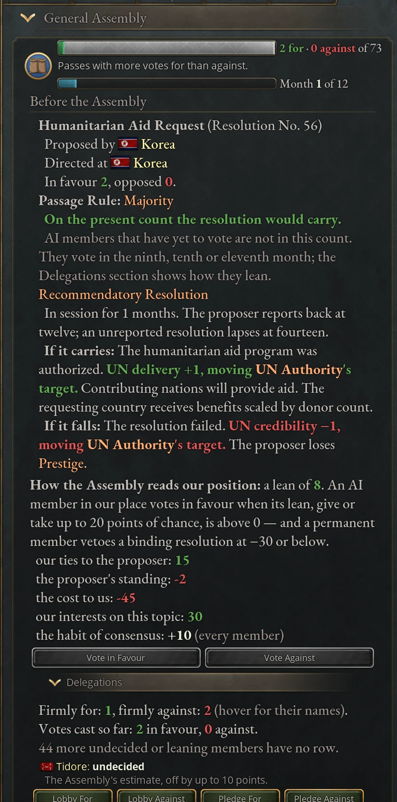
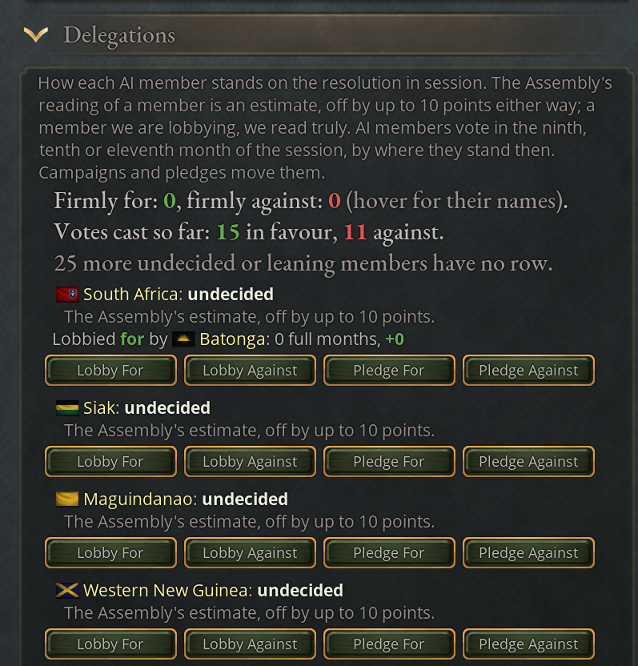
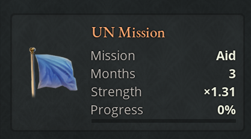
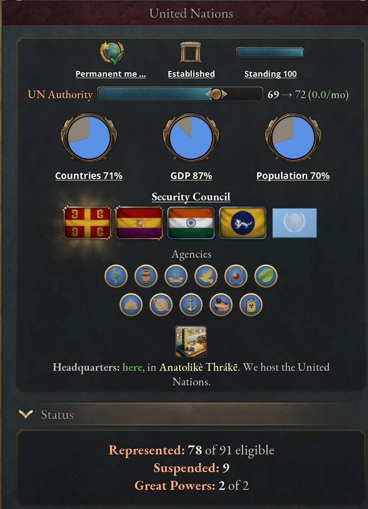

# The United Nations

One great power founds the United Nations; the rest of the world joins, ignores
or works against it. The journal entry appears once you research
Intergovernmental Organizations, an era 6 society technology, and for every
country once a UN exists. It shows UN Authority (how seriously the world takes
the organization), the Security Council of five permanent members with a veto,
the conventions in force, missions in individual states and the dues members
pay. It also holds the General Assembly, where you vote and table resolutions.
The same panels appear as a UN tab in the Diplomacy panel (see [The UN
panels](#the-un-panels)). The United Nations game rule turns the system off.

## Founding the United Nations

A great power that has researched Intergovernmental Organizations and is not a
subject can press Found the United Nations while no UN exists. Founding costs
prestige and bureaucracy for five years. The founder becomes the first member, a
founding member, the headquarters host and the first permanent member of the
Security Council, and UN Authority starts at 50.

Every other country that conducts its own foreign policy then receives The
United Nations Charter:

| Option | Result |
|---|---|
| Sign the Charter | You join as a founding member (UN Founding Member: prestige and leverage generation). A signer without Intergovernmental Organizations is a founding member too, from the moment its UN journal entry opens. |
| We shall observe, but not yet commit | UN Observer Status for ten years (+5% relations improvement speed). You can join later. |
| This undermines our sovereignty | UN Rejectionist for five years (−10% relations improvement speed, +50 Authority, the government resource rather than UN Authority). |

Signing seats nobody on the Security Council; seats go by prestige (see [The UN
Security Council](#the-un-security-council)). The host may build one United
Nations Headquarters, which raises influence, prestige and society research
speed and adds +1 to the UN Authority Target (see [What counts toward
Policy](#what-counts-toward-policy)), but adds 10% infamy generation. While the UN is above Moribund, the host's
covert networks in other members grow 25% faster. If the host leaves or loses
its representation, the headquarters passes to another member and the old
building is demolished.

### Joining and leaving the UN

Any country that conducts its own foreign policy may press Join the United
Nations: an independent country, or a dominion, protectorate or tributary.
Puppets, vassals, colonies, personal unions, crown lands, chartered companies
and decentralized nations cannot. No technology is needed.

Members get UN Membership Privileges at once: +10% relations improvement speed,
+5 leverage generation, +3% prestige, +3% influence and slower escalation when
defending in a diplomatic play. From the Contested tier they also get UN
Membership Benefits, scaled by authority ÷ 50 (at 50: +10% relations improvement
speed, +1% research speed, +3% prestige). Joining binds you, without a choice,
to every convention already in force, and makes you pay [UN
dues](#un-dues-and-article-19).

Leave the United Nations ends your membership, seat, programs and conventions.
It costs 5 [standing](#international-standing) and gives UN Withdrawal
Consequences for five years (−25% relations improvement speed, −5% prestige),
during which you cannot rejoin. Sanctions against you stay in force, and so do
unpaid dues. A permanent member walking out knocks authority down at once (4
points for a typical great power, up to 8).

When a revolution wins, the mod carries the nation's membership, seat and
conventions over to the winner and rebuilds them in the following months (see
[After a revolution](05-politics.md#after-a-revolution)).

### Subjects and suspended representation

A member that stops conducting its own foreign policy, for example by being made
a puppet, keeps its membership but has its **representation suspended**. It
casts no vote, tables nothing, holds no permanent seat, cannot host the
headquarters and runs no UN programs. It pays no dues itself: if its direct
overlord is a represented member, the overlord is assessed on the subject's GDP
too, and while the overlord pays, the subject keeps its membership benefits.
Representation returns as soon as the country conducts its own foreign policy
again, and Conventions Passed in Our Absence then offers it the conventions
adopted meanwhile, all or none. Countries that cannot join are never treated as
pariahs, and an annexed member's seat simply ends.

### The Require UN Membership treaty article

A power bloc leader that is a UN member, and whose bloc holds a Multilateral
Institutions principle, can add Require UN Membership to a treaty with a
non-member that has researched Intergovernmental Organizations. The target joins
at its next monthly update if it conducts its own foreign policy. The AI resists
it under Isolationism and refuses it under Total War. See
[Diplomacy](08-diplomacy.md).

## UN Authority

UN Authority runs from 0 to 100 and is the bar at the top of the UN panels. Each month
it closes a 48th of the gap to a target, at most 1 point, so a change in the
world shows over years. The target is the sum of eight pillars:

| Pillar | Range | What moves it |
|---|---|---|
| Base | 15 | Constant. |
| Participation | 0 to +25 | The share of world prestige held by members. |
| Commitment | −25 to +25 | Members championing (+1) or undermining (−1) the order, weighted by their share of world power. Members of a bloc with Multilateral Institutions count a little in favor. |
| Credibility | −25 to +25 | Resolutions carried or failing, vetoes, members backing or defying the UN in events, lifted sanctions, abused mandates, failed missions. |
| Funding | −10 to +10 | The power-weighted share of major and great power members running UN programs, minus up to 15 for dues withheld. |
| Peace and order | −20 to 0 | Members at war with fellow members, and nuclear use. |
| Delivery | 0 to +10 | Aid and peacekeepers delivered, emergency loans, mandates discharged, missions accomplished. |
| Policy | −25 to +25 | The UN Authority Target modifier carried by laws and institutions, with each country's total scaled by its weight. A member that is not undermining the UN counts for or against; any other country counts only against. A negative total pulls authority down. See [What counts toward Policy](#what-counts-toward-policy). |

Credibility, delivery and the nuclear half of peace and order are kept as
ledgers: each act adds or subtracts points. Credibility entries halve every ten
years; delivery entries and nuclear use halve every four. Acts by powerful
countries count for more. Each entry is multiplied by the actor's **weight**,
its share of world prestige against a typical great power's 10% (×1), up to ×5;
the Policy row scales each country's modifier the same way. A permanent member walking out and a
nuclear first strike also knock authority down directly. A new UN starts at 50,
but with empty ledgers, no champions and no programs its target sits well below
that, so expect authority to fall in its first years unless great powers
champion it and run programs.

Policy counts a country's UN Authority Target in full only while the country is
a member and is not undermining the UN. A non-member, or a member undermining
it, counts only when its total is negative: its harmful policies pull authority
down, and its good ones can only offset them. Leaving the UN, or pressing
Undermine International Order, stops a positive total from counting. Hover the
Policy row to see your own figure, your weight and what you count for.

### What counts toward Policy

These carry the UN Authority Target modifier. Your total is multiplied by your
weight, so for a typical great power each point is one point of target.

| Source | UN Authority Target |
|---|---|
| Rules of War law | Total War −2, Traditional Rules of War 0, War Crimes Forbidden +0.5, Humanitarian Regulations +1, Limited War +1.5 |
| Isolationism (trade policy) | −1.5 |
| Ministry of International Aid | +0.15 for each level of investment (+1.35 at the cap of 9) |
| Nuclear doctrine | No First Use +0.5, Existential Deterrence 0, Flexible First Use −0.5, Nuclear Compellence −1, Nuclear Warfighting −1.5 |
| The Burden of the Bomb | Up to −1, in step with your arsenal's burden |
| United Nations Headquarters (the host) | +1 |
| Peace Palace | +0.5 |
| Palais des Nations | +0.5 |

The positive entries count only while you are a member and are not undermining
the UN; the negative ones count whatever you do. A member great power under
Limited War, with a funded Ministry of International Aid and a No First Use
doctrine, holds about +2.5 to +3.4. A great power under Total War and
Isolationism holds −3.5 before its nuclear posture. The AI does not weigh this
modifier when it chooses laws or doctrine.

### UN authority tiers

Authority sets the tier, and the tier sets the UN's **enforcement**: the
multiplier on every penalty the Assembly imposes and on every convention's
effects. A tier is entered at its floor and left 4 points below it.

| Tier | Authority | Enforcement | Dues (GDP a year) | What changes |
|---|---|---|---|---|
| Moribund | below 20 | ×0 | none | Resolutions are recommendations, vetoes cost only relations, members lose UN Membership Benefits, and power blocs gain cohesion and leverage (Vacuum of World Order). |
| Contested | 20–45 | ×0.5 | 0.1% | Membership benefits are paid. |
| Established | 45–70 | ×1 | 0.2% | Countries that could join but stay out become International Pariahs. Each war goal a play's initiator adds without a mandate costs 2 extra infamy. Peacekeeping requests send full deployments. |
| Strong (needs Charter Reform I) | 70–85 | ×1.5 | 0.4% | Outsiders also lose trade advantage and leverage. Sanctions become embargoes, condemned countries are Shunned, the surcharge rises to 4, members share intelligence, and nationalist interest groups resent the UN. With the IAEA, members without the bomb are held to disarmament. |
| Supranational (needs Charter Reform II) | 85+ | ×2.5 | 1% | The surcharge rises to 10, condemned countries are also Restrained, and outsiders of major rank or with a nuclear program carry a standing case of 50. |

From Strong, the surcharge doubles against a country hosting UN peacekeepers,
your patriotic, jingoist, isolationist and sovereignist interest groups lose
approval, and those led by humanitarians or pacifists gain it (twice as much at
Supranational). If a resentful group is powerful and in government, or two are
powerful, a yearly check can send Sovereignty First, at most once a decade:
leave, buy their patience with concessions, or stay and anger them.

### UN charter reforms

The charter caps the target at 70, so the founding charter allows no more than
Established. Charter Reform I, Standing Mandate Force and Compulsory
Jurisdiction, raises the ceiling to 85. Charter Reform II, Veto Restraint and
the UN Levy, raises it to 100 and restrains the veto: a binding resolution other
than a charter reform that two thirds of the members with a vote carry is no
longer stopped by a veto.

A reform is ripe once authority has held within 5 points of the ceiling for 24
months running; Why UN Authority Is Moving counts the months. A member of major-power
rank may then table it, and the docket may offer it to a great power (The
Charter Has Been Outgrown). It needs two thirds of all members with a vote, any
permanent member can veto it outright, and the next reform cannot be tabled for
five years.

### The UN crisis and dissolution

Below authority 10 the UN is in crisis until authority climbs above 20. Every
great power then receives The United Nations in Crisis: members can stand by the
organization (−10% influence for five years, credibility +2 × weight), outsiders
can join to save it, and anyone can wait and see or let it go (+5% influence for
five years, credibility −2 × weight). Why UN Authority Is Moving lists every
great power that could lift the target, and by how much. If the target falls below 5
during the crisis, authority falls at least a quarter point a month, and at 0
the UN dissolves.

Dissolution ends every membership, seat, program, convention, agency, sanctions
regime, mandate and mission, demolishes the headquarters and writes off unpaid
dues. Every power bloc gains The UN Has Fallen (+20 cohesion, +20% leverage
generation, fading over ten years). Twenty years later any great power with
Intergovernmental Organizations can convene a founding conference with Found the
United Nations. The great power with the most prestige, if it is not the
convener, receives A Founding Conference and may join, stay out or oppose;
opposing wrecks it and blocks another for ten years. Otherwise the UN is
refounded after twelve months at authority 25, under the founding charter and
with no agencies.

## The UN Security Council

The Security Council has five permanent seats. The founder takes one. The other
four stay open for a twelve-month signing period, then go to the great-power
members with the most prestige, never to whoever joined first. A seat that falls
vacant later is filled the same way the next month. The overview shows the
permanent members' flags; hover Security Council for the candidates in line.

A seat brings leverage generation, +250 Authority, prestige, influence and
slower escalation in diplomatic plays. It is lost by leaving the UN, by ten
continuous years below great-power rank, by a motion to expel, or by suspended
representation. A member two years behind on its dues cannot be seated.

### Vetoes in the Security Council

A permanent member may veto one of the six binding topics, from the vote event
or the chamber. The veto kills the binding form; if the Assembly still carried
the resolution, a weaker form applies:

| Binding topic | If vetoed but carried |
|---|---|
| Condemnation of Aggression | A non-binding rebuke. |
| International Sanctions | Voluntary partial sanctions, with no enforcer. |
| Request a Peacekeeping Deployment | An observer mission only. |
| International Criminal Court | A symbolic censure of the vetoer; no court. |
| Charter Reform | Blocked outright. |
| Authorized Military Mandate | Blocked outright. |

After Charter Reform II, a resolution that two thirds of the members with a vote
carry overrides the veto and takes its full form. This covers every binding
topic, military mandates included, except Charter Reform itself.

A veto costs credibility (1.5 × your weight), Diplomatic Isolation After Veto
for five years, −5% influence for ten, 25 relations with the proposer, and 3
infamy when it blocks a condemnation, the ICC or a peacekeeping request. At
Moribund it costs only the relations. While you carry the isolation, any member
may table a Motion to Expel a Permanent Member against you: it needs two thirds
of the members with a vote and cannot be vetoed. If it carries you lose the seat
and 5 standing, stay a member, carry UN Withdrawal Consequences for ten years,
and lose your standing benefits for five.

## Resolutions in the General Assembly

The floor takes one resolution at a time, and each is open for a year. The
proposer's own vote counts in favor. Human members can vote in the chamber at
once and receive the UN General Assembly Vote event after 30 days. Its "We will
decide later." option closes the event without voting, and it comes back in the
ninth and eleventh months of the session. AI members vote late: each votes in the
ninth, tenth or eleventh month, drawn at random, by its lean at that time. An AI
member that still has not voted (one that joined late, for example) votes in the
last month of the session. After a year, General Assembly Vote Results applies the
outcome.

Most topics pass by **Majority**: the votes in favor outnumber those against.
Charter reforms and motions to expel need **Two-Thirds**: two thirds of all
members with a vote, so abstaining counts against them. A vote in favor gives +15 relations with the
proposer, a vote against −15. On a resolution that accuses a country (a
condemnation, sanctions, a mandate or a motion to expel), voting in favor also
costs 15 relations with the target and voting against gains 15. When a power
bloc leader's resolution carries, its bloc gains 3 leverage in each of its other
members that sits in the Assembly; when it falls, the bloc loses 3.

### General Assembly topics

There are eighteen topics. Six are binding and can be vetoed: Condemnation of
Aggression, International Sanctions, Request a Peacekeeping Deployment, the
International Criminal Court, Charter Reform and Authorized Military Mandate.
The other twelve are recommendatory. Eleven topics, the ICC among them, are
conventions (see [UN conventions and agencies](#un-conventions-and-agencies));
the other seven are:

| Topic | Who may table it | If it carries |
|---|---|---|
| Condemnation of Aggression | A member with a rival that started a war it is still fighting and has a [case](#grounds-for-un-censure) of 30+ | Condemned for ten years: prestige, relations improvement speed and infamy decay, × enforcement. |
| International Sanctions | A major power, against a rival with a case of 50+ | Sanctioned: trade advantage, influence and prestige, × enforcement. The proposer enforces them until it presses Lift Sanctions. That ends its own regime and any whose enforcer has left the UN or is gone; a regime another member still enforces continues. |
| Authorized Military Mandate | See [UN military mandates](#un-military-mandates) | A mandate for the proposer. |
| Request a Peacekeeping Deployment | A member at war or with a devastated state, for its own territory | A peacekeeping mission. Major-power members that voted and take part (a yes vote, or a no vote they then accept) contribute and pay for it; nobody else is asked. |
| Request Humanitarian Aid | A member with a state below 8 standard of living or devastated | An aid mission; major-power members that voted and take part pay for ten years. |
| Charter Reform | A major power, once the charter is ripe | The next reform. |
| Motion to Expel a Permanent Member | Any member, against a permanent member that vetoed within five years | The seat is stripped. |

From Strong, sanctions also become embargoes: each major-power member with
diplomatic relevance to the target that voted for them (at Supranational, every
such member) loses 30 relations with it and, if relations are then Poor or worse
and the pact can be made, embargoes it at its own influence cost. Dropping such
an embargo by choice once its first year is out counts as busting the sanctions.
A condemnation adds Shunned by the United Nations (−6 diplomatic reputation ×
enforcement) from Strong, and Restrained by the United Nations (fewer play
maneuvers, more infamy) at Supranational.

### Grounds for UN censure

Punitive topics need grounds. Every country has a **case strength** from 0 to
100 built from its record:

| Record | Case |
|---|---|
| War begun without a mandate | 10 to 30 (more against a greater power) |
| Binding resolution refused | 10 |
| Sanctions busted | 8 |
| Court ruling defied | 6 |
| Mandate abused | 20 |
| Severe covert operation exposed | 15 |
| Nuclear first strike | 40 |
| Tactical nuclear strike | 20 |
| Nuclear retaliation | 10 |
| Infamy | 0.8 per point, up to 50 |

Each entry halves every five years. A condemnation needs 30, sanctions 50 and a
military mandate 60, so a clean record cannot be censured. The Our Record
section shows your own case, each part of it, and whether it would support a
condemnation, sanctions or a mandate against you today.

### How members decide their UN votes

Every ballot comes from one number, the member's **lean** on that resolution.
The General Assembly prints your lean term by term under the resolution, and
the Recorded Ballot shows every voter's lean and why the members voted as they did.

| Term | Value |
|---|---|
| The habit of consensus | +10 |
| The case against the target | Half of how far the target's case clears the threshold, −20 to +30 |
| It is our own censure | −50 (−30 from Strong) |
| Our ties to the proposer | Alliance +20, same bloc +20, rivalry −30, diplomatic relevance +5, relations up to ±10 |
| Our ties to the target, on accusing topics | Alliance −60, same bloc −35, rivalry +30, relations up to ±10 |
| Our own record (glass houses) | −10 with a case of 30, −20 at 50 |
| The proposer's standing | Exemplary +5, Respected +2, Poor −2, Disgraced −5 |
| A pledged vote | +100 for, −100 against |
| The target accepted the verdict | +15 |
| The cost to us, on aid and peacekeeping requests | −15 per earlier contribution, up to three; more for aid to a great, major or richer country |
| Our interests on this topic | Laws, technologies and what the convention's terms would do to us |
| Lobbying campaigns on us (AI members only) | 3 a month per campaign, up to 15; at most 20 each way |

An AI member votes in favor when its lean, plus a random −20 to +20, is above
0. An AI permanent member vetoes a binding resolution at a lean of −30 or below
(−50 if it vetoed recently, −10 at Moribund), leaving any pledge out of the
count, and never when it pledged to vote for. A pledge against therefore never
makes a member veto, and never stops one that would have. Lobbying campaigns do
count, so a campaign can push a permanent member toward a veto or away from one.

### Reading how the members lean

The Delegations list under the General Assembly shows each AI member's lean as
a band, not a number:

| Band | Lean |
|---|---|
| Firmly for | +30 or more |
| Leaning for | +10 to +29 |
| Undecided | −9 to +9 |
| Leaning against | −10 to −29 |
| Firmly against | −30 or less |

The band is the Assembly's estimate. Each member's reading is off by −10, 0 or
+10, fixed for the whole session, so a member shown as undecided may lean either
way. While you run a campaign on a member, you see its true band. Votes still
carry the random −20 to +20, so a close vote can turn on the day it is cast.

### Complying with a UN resolution

When a resolution carries, every member that voted against it may accept it or
refuse. Refusing a convention (Refuse to ratify it) keeps you outside it, with
neither its obligations nor its benefits. Refusing an aid or peacekeeping
request (Refuse to take part) means you contribute nothing. Refusing anything
else (Denounce the decision) is a statement on the record that changes nothing.
Refusing costs 20 relations with the proposer and 3 infamy, and for a binding
resolution also 5 standing and 10 case strength. Accepting a binding resolution
you opposed earns 2 standing. A member that voted in favor, or did not vote,
ratifies a carried convention without being asked.

### Tabling UN business

You table the seven topics above from the Propose a Resolution rows or the
journal entry's buttons, and any convention from those rows. The rows sit under
the General Assembly while no resolution is in session. Each gives the topic,
whether it is a Binding Resolution (which can be vetoed) or a Recommendatory
one, its passage rule and its target. "Target: None" means no country gives
grounds right now; hover it for why. Hover a convention's name for the agency it
would found and when the docket raises it. A greyed Propose button lists in its
tooltip what stops you. Tabling on
your own motion puts UN Request Cooldown on you, during which you can table
nothing else yourself. It lasts ten years for an ordinary member. A great power
waits half as long, and [standing](#international-standing) stretches or
shortens the wait: 15% shorter at Respected, 30% shorter at Exemplary, 25%
longer at Poor and 50% longer at Disgraced (never under one year). Suspended
standing benefits count as Neutral. The sponsor mark that also bars a second
proposal shortens the same way, from five years. A convention or charter reform the docket
offers you is free, so the docket's offer is the cheap way to bring one to the
floor. A topic cannot return to the floor for five years after a resolution on
it closes (ten for a motion to expel), except that an appeal over a nuclear
strike can table a condemnation despite that cooldown (see [The UN
docket](#the-un-docket)),
and mandates have a five-year cooldown per proposer. After every vote the floor is in recess for three months, when
only human members may table, and you are told when it reopens.

### The UN docket

Most business reaches the floor through the docket. Once a month the UN takes
stock of the world and, at most once every three months, takes up the gravest
situation and offers it to the countries it concerns. Roughly from gravest down:

| Situation | Offered to | Event |
|---|---|---|
| A nuclear strike | The struck country first | An Appeal to the Assembly |
| The end of a year-long war between great powers | A proposer | Declaration of Universal Human Rights, or International Criminal Court |
| A war of aggression on a member, six months or more, with heavy devastation | The attacked member first | An Appeal to the Assembly |
| A warming threshold (0.5, 1, 2 and 3 °C) | A proposer | Climate Change Resolution |
| A country's first nuclear bomb | A proposer | Nuclear Non-Proliferation Treaty |
| A severe covert operation exposed | The target first | An Appeal to the Assembly |
| A state collapse | Up to three peacekeeping powers | A State Has Collapsed |
| The charter outgrown | A great power | The Charter Has Been Outgrown |
| A famine | Up to three donor powers | Humanitarian Crisis Demands Response |
| A banking panic or default in a contagion wave | The member in trouble | An Emergency Lending Facility |
| A colonial empire's collapse | A proposer | Decolonization Resolution |
| The first Moon landing or colony | A proposer | International Space Cooperation |
| A trade embargo between members | The weaker party | International Trade Dispute |
| Nothing graver, at most once in 24 months (12 while a great power member is Respected or better) | A proposer | A convention no situation raises |

An appeal lets the wronged party table a condemnation or sanctions, ask for
peacekeepers, take the accused to the World Court, or pass the matter to a
member with a stake, never one on the accused's side. An appeal over a nuclear
strike can table a condemnation even while that topic is on its five-year
cooldown, as long as the striker's case gives grounds. That vote is the
Assembly's verdict on the use: a condemnation that carries strengthens the
nuclear taboo, and one that fails, or that a veto cuts to a rebuke, weakens it.
Sanctions or a World Court case over the same strike give no verdict (see [The
United Nations and the taboo](13-nuclear.md#the-united-nations-and-the-taboo)). Business with no wronged
party goes first to a human member that qualifies. Every proposer event has
"Leave it to another delegation", which passes the item on and earns nothing;
refusing a convention outright costs credibility and bars you from tabling it
for five years. A major power that refuses a famine appeal while UN authority is
40 or more loses prestige and relations improvement speed for five years. The
lending facility's loan and conditions are covered in [The UN emergency
loan](04-banking.md#the-un-emergency-loan).

### Lobbying for UN votes

Any member can try to move an AI member's vote, for or against the resolution in
session, in two ways: a campaign, which costs influence and builds up over
months, or a pledge, which costs an obligation and works at once. Because AI
members vote only in the ninth to eleventh month, you have most of the session
to work on them.

A campaign is a diplomatic pact, Lobby For the Resolution or Lobby Against the
Resolution, started from the diplomacy panel or the Delegations rows.
It uses 100 influence while it runs. Each full month it runs moves the member's
lean 3 points its way, up to 15, so it needs five months to reach its full
effect. Campaigns on the same side stack to 20, and campaigns on opposite sides
cancel out. A campaign ends when the member votes or the resolution closes, and
you can stop it at any time, which frees the influence and loses what it had
gained. Only AI members can be lobbied, never the resolution's target, and you
need a vote yourself.

Lobby Top Members For and Lobby Top Members Against, above the Delegations rows,
start campaigns in bulk. One press puts a campaign on each listed member the
Assembly doesn't yet read as leaning your way, from the top of the list down,
until your influence runs out. Members you already lobby are skipped. The
tooltip says how many campaigns your influence covers. A button is greyed if you
have no vote, less than 100 influence, or no member on the list left to lobby.

Seek a Vote Commitment: For and Seek a Vote Commitment: Against ask a member to
pledge its vote. If it accepts, you owe it an obligation and its lean moves 100
points your way. A member pledges once per resolution, and the first pledge it
accepts stands. You can ask each member once per resolution and collect two
pledges per resolution, and you cannot ask the target or a member that has
voted. From the Delegations rows an AI member answers at once; a human member
answers a request from the diplomacy panel. A kept pledge gives the member +1
standing and +10 relations with you; a broken one costs it 4 standing and 20
relations and cancels your obligation. A permanent member that pledged against
and then vetoes has kept its word.

## UN conventions and agencies

A convention is a standing regime. When it carries it founds its agency (the
decolonization declaration founds none), and every member that ratifies it
carries its member modifier. Its effects are multiplied by the UN's enforcement,
never below ×0.01, so a Moribund UN leaves conventions dormant rather than
lapsed. Most also name winners and losers among the parties. Our Obligations
lists each convention you are party to, with your terms under it; hover a
convention or a term to see its modifier. Terms are re-read when the tier
changes and once a year.

| Convention (agency) | Can come to the floor with | Parties gain | Winners and losers |
|---|---|---|---|
| Universal Declaration of Human Rights (UNHRC) | Authority 40; a proposer with Human Rights | Acceptance of other cultures, prestige | Countries with Ancestral Citizenship, Outlawed Dissent, Penal Labor Camps or slavery lose legitimacy and prestige. |
| International Criminal Court (ICC), binding | Authority 40; the Declaration in force (a great-power war's end can raise it sooner); a major-power proposer with Human Rights | Less infamy generation, faster relations | The court indicts rulers. |
| Nuclear Non-Proliferation Treaty (IAEA) | Authority 40; a proposer with Nuclear Weapons | Faster infamy decay, prestige | Programs without a bomb run 25% slower; countries with neither a bomb nor a program defend better against strikes. |
| Climate Accord (UNEP) | Authority 30; Environmental Movement; the Global Warming rule | Environment ministry impact, prestige | Market leaders with 10%+ of world emissions cut emissions and heavy industry; low emitters get adaptation aid. |
| Global Pandemic Response (WHO) | Authority 20; a major-power proposer with Antibiotics | Cheaper health system, prestige | None. |
| International Refugee Resolution (UNHCR) | Authority 20; a country at war or with a state below 6 standard of living | Refugee ministry impact, prestige, migration pull | The 20 richest countries per head take in migrants and turmoil; the poorest gain standard of living. |
| Cultural Heritage Program (UNESCO) | Authority 40 | Prestige, research speed | Countries with a wonder gain cultural pull and tourism, and build slower. |
| Decolonization Resolution | Authority 30; Decolonization; a country holding a subject | Binds every member | Colonial powers lose colonial stability; members' colonies gain liberty desire. |
| International Space Cooperation (UNOOSA) | Authority 40; a major-power proposer with Space Exploration | Science ministry impact, space race progress | The space race leader slows and laggards speed up; orbital battlestation holders lose prestige. |
| Convention on the Law of the Sea (ITLOS) | Authority 30; International Trade | Cheaper port connections, prestige | Great powers gain less prestige from their navies. |
| Convention on the Physical Protection of Nuclear Material (CPPNM) | Authority 30; warheads missing; a proposer with Nuclear Weapons; the Nuclear Weapons rule | Prestige | Half as many of the parties' warheads go missing, and they may recover lost ones. |

Three member modifiers also carry a cost: the NPT raises infamy generation and
lowers your units' kill rate, the Climate Accord lowers bureaucracy, and the ICC
makes casualties cost more war support. While in force, the NPT and the CPPNM
also raise the target of the [nuclear
taboo](13-nuclear.md#what-moves-the-nuclear-taboo), by up to 8 and 4 points, in
proportion to UN authority.

The overview shows eleven specialized agencies, each lit once founded. Ten come
from the
conventions in the table: WHO, UNESCO, UNHRC, IAEA, UNEP, UNHCR, UNOOSA, ITLOS,
the ICC and the CPPNM. The eleventh, the International Court of Justice, is
founded the first time a country accepts a World Court ruling against it. Once
the International Criminal Court convention is in force, the court indicts the
ruler of a country that ratified it (from Established) or of any country (at
Supranational) for a nuclear first or tactical strike or an exposed
regime-change operation, at most once a decade. Handing the ruler over sends
them into exile, and your heir, if you have one, succeeds them. Defying the
court costs 5 standing, 10 case strength and credibility, and brings
International Court Defied (−25% infamy decay, −5% prestige, fading over five
years, × enforcement); defying a World Court ruling brings the same modifier at
full strength. A party to the
Declaration that runs a coercive resettlement program is penalized (see [Costs
and consequences of
resettlement](07-states.md#costs-and-consequences-of-resettlement)).

## UN military mandates

A mandate licenses one member to recover one state region from one country. To
move for one you need authority 40, no mandate in force and none proposed in the
last five years, standing above Disgraced, and a target that is not a subject,
has a case of 60 or more and holds a state in a region you claim. The button
picks the case (a condemned or sanctioned target first, a rival before a
stranger, a weaker country before a stronger), and both Mandates in Force and
the Propose a Resolution row preview it.

A carried mandate lasts five years and makes the Authorized Restoration war goal
available against that country, for that state, at no infamy, in one diplomatic
play. Enforcing the goal adds delivery and 6 standing. Adding any other demand
against that country in that play for territory, subjugation, regime change or
humiliation abuses the mandate, and so does backing down; reparations and
similar demands are allowed at their normal price. Abuse ends the mandate,
brings a condemnation, costs 12 standing, suspends your standing benefits for
ten years and adds 20 to your case. From Strong, a holder at war under the
mandate loses less war support to casualties and defeats.

## UN missions in the field

Missions put the UN's work in one state:

Hover the name of a mission (on the state panel, in Missions in the Field or in
a tooltip) for its Peacekeeping Mission, Aid Mission or Stabilisation Mission
entry, which sets out how that kind opens, what it does, what its progress
means and when it succeeds, fails or lapses.

| Mission | Opened by | Effect on its state | Succeeds when |
|---|---|---|---|
| Peacekeeping | A peacekeeping request carried in full | Turmoil effects −20%, devastation recovery +50% | The host has 24 months of peace. |
| Aid | A carried aid request, or a full answer to a famine | Standard of living +1.5, food security +0.2, mortality −5% | After six months, no famine and, without the mission's help, a standard of living of 10 or 1 above where it started, whichever is higher. |
| Stabilisation | A full answer to a state collapse | Turmoil effects −30%, standard of living +0.5 | About a year after the collapse ends, sooner if the mission served through it (it progresses slowly during the collapse). |

Effects scale with the UN's enforcement, fall by up to half when members
withhold dues, and rise with each contributor up to three. A mission fails if
its host is attacked after it arrived, if every contributor leaves a
peacekeeping or Stabilisation mission, or if the host expels a Stabilisation
mission. It lapses after six months if nobody has joined a peacekeeping or
Stabilisation mission, or if its host or state is gone. A mission has no time
limit: one that is not done goes on for as long as it keeps contributors, so a
member that keeps paying for its contingent can keep it in the field. Time
works on the AI instead, which grows less willing to send a contingent to a
mission the longer it has run. Success adds delivery and gives each
contributor 3 standing and 15 relations with the host; failure costs
credibility. The state panel shows a UN Mission tile, and contributors build
covert networks in the host faster.

Any major-power member not under sanctions can press Send a Contingent on a
mission's row in Missions in the Field, if it is not the host, not at war with it and has
not left that mission before. Each mission joined this way costs a quarter of a
percent of GDP a year, free for peacekeeping and Stabilisation if you run the
peacekeeping program. Bring Our Contingent Home costs 2 standing and 10
relations with the host, and a peacekeeping or Stabilisation mission left empty
fails.

## UN programs and great-power stances

A major power's programs count toward the funding pillar while they run (two
count in full), and every program earns standing after 24 months.

| Button | Requires | Cost | Gives |
|---|---|---|---|
| Contribute to Peacekeeping | Major power | 0.5% of GDP a year, bureaucracy, +5% military goods cost; cannot be ended for ten years | Leverage generation and prestige; covers peacekeeping contingents |
| Fund Development Programs | Major power | 0.5% of GDP a year, bureaucracy | Commerce ministry impact |
| Champion Human Rights Resolution | Universal Citizenship, Universal Suffrage or Protected Speech | Bureaucracy | Prestige, refugee ministry impact |
| Join Arms Control Treaty | War Crimes Forbidden, Humanitarian Regulations or Limited War | Bureaucracy, +5% infamy generation | Faster infamy decay, less devastation, cheaper military goods; lower kill rate |

Great powers can also Champion International Order or Undermine International
Order, each costing Authority and influence, which count +1 or −1 in the
commitment pillar. Undermining also drains standing, and after 24 months it
suspends your standing benefits until you stop.

## UN dues and Article 19

Every represented member pays dues, the share of GDP set by the tier, as a
weekly expense. Withhold our UN dues saves the money but costs 3 standing,
lowers the funding pillar and weakens every mission. Each month you withhold
while dues are assessed is a month in arrears. After 24 months you lose your
vote (Article 19): you cast no ballot, table nothing, cannot be given a
permanent seat, and lose 5 more standing. Pay our UN dues settles everything
owed at once and restores the vote. Arrears survive leaving and rejoining; only
a dissolution writes them off.

## International standing

Standing is your own record in the organization, from 0 to 100, separate from UN
Authority. It starts at 50 when you join.

| Tier | Standing | Effect |
|---|---|---|
| Exemplary | 80+ | +4 diplomatic reputation, faster infamy decay and relations |
| Respected | 60–79 | +2 diplomatic reputation, faster infamy decay |
| Neutral | 40–59 | None |
| Poor | 20–39 | −2 diplomatic reputation |
| Disgraced | below 20 | −4 diplomatic reputation, slower infamy decay; no mandates |

Standing also sways votes on your resolutions and sets how soon you may table
business again (see Tabling UN business). When the docket offers a convention,
it goes to the strongest member with a claim, ranked by power share and stretched
the same way: a great power in good standing first, a member with a ruined record
last. You earn it by delivering:
programs kept for two years, aid and peacekeepers sent, missions accomplished,
mandates discharged, and binding resolutions accepted at a cost. Gains shrink as
standing rises, and voting earns none apart from a kept vote pledge. Censure,
sanctions, defiance, abused mandates, leaving and withheld dues cost it.

## The UN panels

The United Nations journal entry and the UN tab in the Diplomacy panel show the
same panels, and a change made in one shows in the other. The tab is greyed
until the journal entry is active; hover it for what is still missing. The tab
adds the entry's status text and buttons as Status and Actions sections, and
ends with an Open Journal Entry button.

The overview at the top is always shown. Its first row is icons: your
membership (a check for a member, a star for a permanent member, a pause mark
while your representation is suspended), the UN's tier, a Crisis alert while
the crisis runs, and your standing. Below them are the authority bar, with a
tick at the target and the monthly change, and three pies: the members' share
of the world's countries, GDP and population. Then come the Security Council's
five flags (hover one for the country, click it to open the country), the
eleven agencies, lit once founded, and the headquarters. Hover any of them for
the detail.

The sections below are open by default when they change month to month, and
collapsed when they are reference:

| Section | Starts | Shows |
|---|---|---|
| General Assembly | Open | The resolution in session: its topic, a tally bar (green for, grey not yet voted, red against, with a mark at two thirds for the topics that need it), how many of its twelve months have run, the grounds, your lean and the vote buttons. Delegations and Recorded Ballot sit under it while a resolution is in session; Propose a Resolution takes their place when none is. |
| Why UN Authority Is Moving | Open | A bar for each pillar, with its trend since last month (hover a pillar for how it is computed), then your weight, the tier and the authority cap, the champions and underminers, and the newest ledger entries (collapsed). |
| Missions in the Field | Open | A row for each mission, with Send a Contingent or Bring Our Contingent Home; ended missions below, collapsed. |
| Programmes and Conventions | Collapsed | How many countries take part in each program and convention, and how many are under sanctions. |
| Mandates in Force | Open | The mandates in force, and the case a mandate of yours would take. |
| Our Obligations | Open | Your dues beside the whole budget, then each convention you are party to, with your terms under it, and from Strong the UN's reach (shared intelligence, your interest groups' reaction). |
| Our Record | Open | Your case strength and its parts, and whether it would support a condemnation, sanctions or a mandate. |
| UN Authority History | Open | A chart of authority over time. |
| Resolutions on the Record | Collapsed | Closed resolutions, with how each member voted. |
| How the UN Works | Collapsed | The explanations: authority, standing, missions, delegations, dues and the record. |

## How the AI uses the UN

AI countries play by the same rules and numbers you do:

- They vote by the same lean and veto rule, in the ninth, tenth or eleventh month
of the session.
- A proposer lobbies for its resolution. On a resolution that accuses a country,
that country, its allies and its bloc leader lobby against it. Each runs up to
three campaigns at once on AI members close to the line, starts at most one a
month and only with influence to spare, and asks for pledges now and then,
humans included. They never run campaigns on human members.
- They table the seven non-convention topics through the journal entry's buttons
when their situation calls for it, and reach conventions only through the
docket, so a qualifying human is offered convention business first.
- They join readily unless isolationist, and withhold dues when isolationist,
undermining the order, in default or facing a high levy.
- They send contingents to missions hosted by allies, bloc partners and
subjects, and bring them home when attacked or short of money. A country holding
a mandate is steered toward the target and the authorized goal.

## How the UN connects to other systems

Nuclear strikes lower peace and order and add to the striker's case, the NPT
reaches threshold states, at authority 60 with the IAEA in place the Nuclear
Program Aid treaty article is forbidden, and the NPT, the CPPNM and the
Assembly's verdict on a nuclear use move the nuclear taboo ([Nuclear
weapons](13-nuclear.md)). The
Climate Accord exists only under the Global Warming rule ([Climate and
pollution](14-climate.md)). The decolonization declaration presses colonial
powers ([Colonial empires and decolonization](11-decolonization.md)), and the
space treaty slows the leader ([The space race](15-space.md)). Exposed covert
operations feed appeals, cases and indictments, and the headquarters host and
mission contributors build networks faster ([Cultural hegemony and covert
warfare](10-influence.md)). Power blocs gain cohesion when the UN is Moribund or
gone, and the Multilateral Institutions principle strengthens membership
benefits ([Diplomacy](08-diplomacy.md)).
