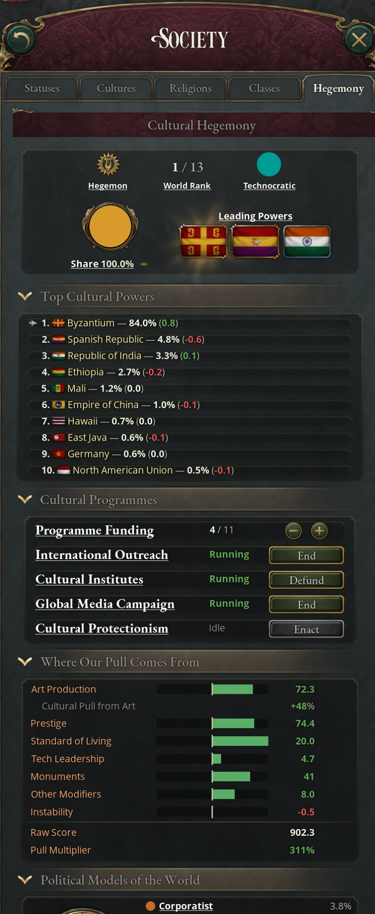
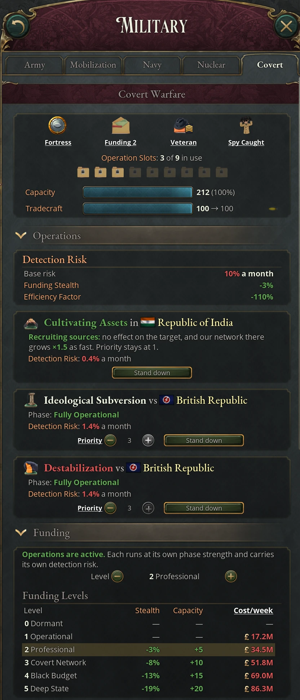

# Cultural hegemony and covert warfare

Two systems let countries compete for influence without going to war. Cultural
Hegemony measures how much of the world's cultural influence each country holds
and turns a large share into migrants, legitimacy pressure on trailing countries
and pressure on foreign political movements. Covert Warfare gives you an
intelligence agency that runs espionage, subversion and sabotage against other
countries, at the risk of being caught. Each has its own game rule, Cultural
Hegemony and Covert Warfare, and both are on by default.

## The Cultural Hegemony journal entry

The game scores every country's cultural pull from the first day of the
campaign, but the Cultural Hegemony journal entry and everything it does wait
until some country in the world has researched Mass Media (an era 6 society
technology) and you have Romanticism. Until then the scores run in the
background and have no effect. The entry never completes. Before it opens, the
entry shows only your tier and cultural share; after that, its panels show the
rest (see [The Cultural Hegemony panels](#the-cultural-hegemony-panels)).

### The Cultural Hegemony panels

The Cultural Hegemony journal entry and the Hegemony tab in the Society panel
show the same panels, and a change made in one shows in the other. The tab is
grayed until the journal entry opens; hover it for what is still missing. It
ends with an Open Journal Entry button.

The overview at the top is always shown. Its first row is icons with a word
beneath: your influence tier (a gray sprig for Negligible, then a lyre that
gains a laurel wreath and turns bronze, silver and gold up to Hegemon), your
World Rank, the leading power's political model in its pie color, and a red
Benchmark icon while you carry the Foreign Cultural Benchmark. Below them are a
pie of your cultural share (amber for yours, gray for the rest of the world),
with an arrow for the change since last month, and the flags of the three
Leading Powers, the leader first. Hover a flag for the country and click it to
open the country. Hover the other icons for the detail: the tier's full name,
the model's share of world culture and its push abroad, the benchmark's
strength.

The sections below all start open except the explanations:

| Section | Starts | Shows |
|---|---|---|
| Top Cultural Powers | Open | The ten largest cultural shares at the last recount, each with its change since the recount before (green up, red down). An arrow marks your row; hover a row for that country's pull components. When you are outside the top ten, Our Rank below the list gives your place. |
| Cultural Programmes | Open | Programme Funding with its − and + buttons, then a row for each program with Running or Idle and its button (International Cultural Outreach's row reads International Outreach). Hover a program's name for what it gives while it runs, and a button for what is missing and what it would do. While you lack Ministry of Culture Established, a line above the rows says so. |
| Where Our Pull Comes From | Open | A bar for each component of your pull, with zero in the middle: gains fill to the right in green, penalties to the left in red, each against that component's usual range. Hover a row for the working behind the number and the bar's range. Cultural Pull from Art sits under Art Production when it is not zero, and Raw Score and Pull Multiplier close the list. |
| Political Models of the World | Open | The pie of the world's political models and its legend, by short name. Hover a model for its full name and the laws that put a country in it. |
| History | Open | Each political model's share of world cultural influence, stacked to 100% in one bar per year, over 5, 20 or 100 years. Hover a bar for its date and all fifteen model shares. Every country sees the same history. Existing saves begin collecting at the next cultural recount; up to 100 annual snapshots are kept. |
| How Cultural Hegemony Works | Collapsed | The explanations: cultural share and tiers, the programs, where pull comes from, the top cultural powers, political models and the Foreign Cultural Benchmark. |

### Cultural share and influence tiers

Your **cultural share** is your raw cultural pull as a percentage of the world's
total. Other countries' pull is recounted about twice a year and after every
war, while yours counts as it stands, so your share can step a little without
your own output changing. Your share sets your tier:

| Cultural share | Tier |
|---|---|
| Under 2% | Negligible Cultural Influence |
| 2% | Minor Cultural Influence |
| 5% | Moderate Cultural Influence |
| 10% | Significant Cultural Presence |
| 15% | Major Cultural Power |
| 25% | Cultural Hegemon |

The country with the highest share is the world's leading cultural power, the
hegemon, whatever its tier.

### Where cultural pull comes from

Your raw score is the sum of the components below, multiplied by your pull
multiplier. Where Our Pull Comes From, in the panel, shows each one for your
country as a bar.

| Component | How it counts |
|---|---|
| Art Production | Your fine art output, capped at your percentage share of world production, with diminishing returns above a third of world output. Free Speech, Church and State and LGBTQ+ Rights laws, Romanticism, Realism and Film change it through the Cultural Pull from Art modifier. |
| Prestige | Your prestige divided by 5, capped at your percentage share of world prestige. Recognized countries only. |
| Standard of Living | Your average standard of living minus the world average (−5 to +20): in full for great powers, half for major powers, a quarter for minor powers, nothing below. |
| Tech Leadership | +2 each time you research a technology no other country has yet, up to 30, fading by a tenth at each recount. |
| Monuments | +3 per monument: the mod's wonders, the base game's monuments and the Space Program (power bloc statues don't count). Up to +5 more from grand monuments: +1 for each step of their combined grandeur, in steps of 10, counting only monuments that are not contested. |
| Megaprojects | +3 for each of the seven megaproject types you have completed. |
| Other Modifiers | Flat pull from program funding, events, tiers IV and V of the Education power bloc principle and the Cultural Exchange Program treaty article. |
| Infamy | −0.1 per point of infamy. |
| Instability | Up to −10 at full turmoil, and −20 during a civil war. |

The multiplier comes from your rank (great power +25%, major power +10%), laws
(free trade, open borders and inclusive citizenship raise it; isolationist,
exclusionary and repressive laws lower it), technologies such as Romanticism,
Realism, Film and Television, the Ministry of Culture institution, programs and
events. Wonders, megaprojects and grand monuments are described in [The extended
timeline](02-timeline.md).

### What cultural dominance gives

Once your share reaches 1%, you get a Cultural Hegemony modifier whose strength
grows in step with your share:

| Effect | At 10% share | At 25% share |
|---|---|---|
| Mass migration attraction | +2.5% | +6% |
| Tourism output | +10% | +25% |
| Trade advantage for fine art | +10% | +25% |
| Loyalists from high legitimacy | +10% | +25% |
| Power bloc leverage generation | +10% | +25% |
| Diplomatic reputation | +1 | +2.5 |
| Infamy decay | +10% | +25% |
| Assimilation | +50% | +125% |

Tourism itself is covered in [State tourism](08-states.md#state-tourism).

### Legitimacy pressure on trailing countries

Every country with the journal entry whose share trails the hegemon's by more
than about three points carries the Foreign Cultural Benchmark modifier: its
people measure their government against the leading power's, and legitimacy
falls. The penalty grows with the gap. With the hegemon at 30% and you at 5%, it
costs about 4 legitimacy. The hegemon never carries it. Tier V of the Education
power bloc principle shrinks the penalty, and so does being a party to the UN
Convention on Cultural Diversity: a quarter off at Contested, half at
Established, three quarters at Strong and all of it at Supranational. A
hegemon that ratifies the convention projects 10% less cultural pull, scaled
the same way (see [UN conventions and
agencies](10-united-nations.md#un-conventions-and-agencies)). While you carry it, the overview shows
a red Benchmark icon; hover it for the current strength.

### Political models of the world

At each recount the game sorts every country into one of fifteen political
models by its laws, from Liberal / Progressive Democratic and Constitutional
Monarchist to Communist / Vanguardist, Technocratic, Developmentalist Junta and
Mixed / Other. Some tests also ask who runs the government, meaning the
strongest interest group in it. A Command Economy under a Single-Party State is
Communist only when that group is Communist or Vanguardist, and any other
left-wing lead makes it Socialist. Cultural Citizenship, a common starting
law, makes a Single-Party State Fascist unless that group is left-wing, and
makes Autocracy Fascist only when that group is Fascist or Ethno-Nationalist.
A left-wing planned economy that keeps the law is still Communist or
Socialist, and a monarch who takes absolute power over it is Absolutist
Monarchist.
The pie chart shows each model's share of world culture, weighted
by the cultural pull of the countries running it rather than by their number.
Hover a model in the legend for what qualifies. The tests run in a fixed
order and a country counts as the first model it fits, so a monarchy with
Universal Suffrage is Constitutional Monarchist, not Liberal, a monarchy under
Technocracy is Technocratic, and a Single-Party State with Ancestral Citizenship
and a Command Economy is Fascist, not Communist.

The hegemon's model pushes on every country that carries the Foreign Cultural
Benchmark: the matching political movement there (a liberal movement under a
liberal hegemon, for example, or a related one if it is absent) grows more
active and attracts more pops. The push is zero while the model holds less than
15% of world culture and grows with its share after that; hover the model in
the overview for its strength. A hegemon with feminist, civil-rights,
environmental, abolitionist, labor or land-reform laws also feeds those
movements abroad, and one at peace without Mass Conscription feeds anti-war
movements. Movements are covered in [Government, laws and
characters](06-politics.md).

### Cultural programs

Every program needs the Ministry of Culture Established law (unlocked by Mass
Propaganda). If you repeal it, funding drops to zero and all four programs stop
at the next monthly update.

| Program | Controls | Effect | Cost |
|---|---|---|---|
| Programme Funding | − and + | Each step adds +1 cultural pull and +5% pull. | A weekly expense per step that grows with your GDP, so the bill rises with every step. The tooltip shows the cost of one step and of your current level. |
| International Cultural Outreach | Begin / End | +10% pull, +5% prestige, +10% mass migration attraction. Needs Mass Media. | The weekly cost of one funding step. |
| Cultural Institutes | Fund / Defund | +10% pull. | +100 authority cost. |
| Global Media Campaign | Launch / End | +15% pull, +5% prestige. Needs Mass Media. | +100 authority cost. |
| Cultural Protectionism | Enact / End | +10% pull, +100 authority. | −5% society research speed, −10% mass migration attraction. |

The funding cap is one step per level of the Ministry of Culture institution,
plus one each from Mass Media and Television; the panel shows it. The four
programs run until you end them. Global Media Campaign and Cultural
Protectionism exclude each other: while one runs, the other's button is grayed
out.

### Cultural hegemony events

Rising powers get opportunities as their share climbs past 8%, mostly trading
authority or prestige for pull, research or migration, and two milestones fire
once, at 10% and at 25% while ranked first. Trailing countries under the
benchmark get events of their own. Most let you embrace the foreign influence
(research, relations, often a push toward the hegemon's model) or resist it
(authority and interest group approval, often at a cost in relations,
legitimacy or pull). The harshest, Hegemonic Convergence, can press you to adopt
one of the hegemon's laws once it holds 25% and your share is a tenth of its
share or less. Four more events follow the political models. All of them are in
[Cultural hegemony event list](19-appendix-events.md#cultural-hegemony-event-list).

### How the AI competes for culture

AI countries use the same programs. Those with a share of 10% or more begin
outreach and launch media campaigns. An AI raises funding at a share of 10% or
more, or below 5%, but only while it is out of default and its weekly surplus
covers one more step; below 2% it is more likely to cut funding. Small
countries under the benchmark enact Cultural Protectionism and end media
campaigns, and drop protectionism once their share passes 10%.

## The Covert Warfare journal entry

The Covert Warfare journal entry is where you run your intelligence agency. It
becomes active when you hold one more covert operation slot than your rank
grants for free (every country gets one, major powers two, great powers three).
The first extra slots come from the Ministry of Intelligence and Security
Established law (unlocked by Mass Surveillance), whose institution adds a slot
per level, and from the era 7 technology Mainframe Computers. Once active, the
entry stays open even if you later lose that extra slot. It never completes.

You launch operations from another country's diplomatic actions, listed as
"Covert: ..." with the operation's name. Everything else is in the journal
entry.

The same panels appear as a Covert tab in the Military panel, and a change made
in one shows in the other. The tab is grayed until the journal entry is active;
hover it for what is still missing. It ends with an Open Journal Entry button.

The overview at the top is always shown. Its first row is icons with a word
beneath:

- Your intelligence standing, a shield from gold-rimmed (Fortress) to split in
  two (Vulnerable); see [Intelligence capacity and operation
  slots](#intelligence-capacity-and-operation-slots).
- Your funding level ("Funding 3"), an envelope of banknotes, or an empty grey
  one at 0.
- Your Tradecraft tier, a fedora with up to four chevrons.
- Spy Caught, while your counterintelligence has caught a foreign operation in
  the last ten years.

Below the icons, Operation Slots shows how many slots you hold and how many are
in use, as case files lit while an operation fills them. Two bars follow:
Capacity, your intelligence capacity as a share of the world's best, and
Tradecraft, with a tick at the next tier and an arrow for which way it last
moved. Hover any of them for the detail: the standing's meaning, the funding
level's name and cost, the capacity breakdown, the Tradecraft rules and why it
last changed.

The sections below are open by default, except the explanations at the foot:

| Section | Starts | Shows |
|---|---|---|
| Operations | Open | A warning while funding is 0, or "No operations running" (hover it for how to launch one). Then the Detection Risk every operation shares (base risk, Funding Stealth, Efficiency Factor), and a row for each running operation: its icon, type and target, its phase, its own Detection Risk, the priority stepper and Stand down. |
| Funding | Open | What your funding level is doing, the Level stepper, and the Funding Levels table: each level's Stealth, Capacity and weekly cost, with your level's row shaded gold. |
| Agent Networks | Open, once you have a network | A row for each network: the target's flag (hover it for the country, click it to open the country), its strength with a bar and an arrow for growing or decaying, and what it reports. |
| Counterintelligence | Open | Unused slots redirected, your funding bonus and your economic, military and ideological defense, each with its breakdown on hover; then Last Caught while a catch stands. |
| How Covert Warfare Works | Collapsed | The explanations: operations, funding, detection, networks, Tradecraft, counterintelligence and intelligence standing. |

### Intelligence capacity and operation slots

Intelligence capacity is your agency's size: a base of 5, plus your rank (great
power +25, major power +10), your literacy (up to 50 at full literacy), your
share of world GDP (two points per percent, up to 50), and modifiers from
technologies, laws such as Secret Police and Censorship, and the Ministry of
Intelligence and Security (+4 per level). Tradecraft then multiplies the total.
The overview's first icon rates your capacity against the world's best:
Fortress at 80% of the best or more, Hardened from 60%, Defended from 40%,
Exposed from 20% and Vulnerable below that.

Capacity cuts both ways. The stronger a target's capacity is against yours, the
likelier your operations there are caught; the stronger yours, the likelier you
catch operations against you. Rank and GDP share give a great power's service an
edge that a small, literate country can't match: a small country's lightly
funded operations against a great power are caught noticeably more often,
though high funding still hides most of them. Capacity also gives separatism
and coup resistance (the Intelligence Capacity modifier), growing up to a
capacity of 125.

Each operation occupies one slot. Beyond the rank and ministry slots, Mainframe
Computers, Computer Networks, Cyber Warfare and Quantum Computing each add one,
to a maximum of ten. You can run one operation of each type at first, and one
more of each type with Mainframe Computers, with Cyber Warfare and with a
[Veteran](#tradecraft) agency.

### Covert funding levels

The Level stepper in the Funding section sets what the agency spends. Every
operation needs funding of at least 1, so stepping down to 0 ends them all; the
step's tooltip warns you first. The weekly cost grows with your GDP, the funding
level and the number of operations (weighted by priority, plus a base share paid
even with nothing running). The section's Funding Levels table shows what each
level costs you a week at your current operations, with your level's row shaded
gold.

Funding from level 2 up gives Funding Stealth, points off every operation's
Detection Risk, and counterintelligence capacity:

| Level | Name | Funding Stealth | Counterintelligence |
|---|---|---|---|
| 0 | Dormant | Nothing can run | None |
| 1 | Operational | None | None |
| 2 | Professional | −3 points | +5 intelligence capacity |
| 3 | Covert Network | −8 points | +10 intelligence capacity |
| 4 | Black Budget | −13 points | +15 intelligence capacity |
| 5 | Deep State | −19 points | +20 intelligence capacity |

From level 3, idle networks also decay half as fast.

### The covert operations

There are fourteen operations. Every one needs a free slot, room under the
per-type limit, no operation of the same type already running against that
target, funding of at least 1, a target that is not decentralized, no truce with
it, and no Intelligence Sharing Pact binding it (see [The Intelligence Sharing
Pact's defense
shield](09-diplomacy.md#the-intelligence-sharing-pacts-defense-shield)).
Election Interference, Financial Subversion, Ideological Subversion and the two
wartime operations can't target a country with amicable relations or better
toward you, and Destabilization can't target one at cordial or better. The
others have no relations limit.

Seven operations also need a technology, named first in the table's last
column: Mass Media and Cryptography (era 6), Television Broadcasting, Pop
Culture and Satellite Communications (era 7), Computer Networks (era 8) and
Social Media (era 9). The operations that can bring down a great power come
late in the tree, so a small country can't rush them before the great powers
have agencies of their own.

| Operation | What it does at base strength | Also needs |
|---|---|---|
| Election Interference | Target −5 legitimacy; its electoral confidence falls at the end of each election campaign | Television Broadcasting; target has an elected legislature |
| Financial Subversion | Target +2 bubble pressure a month | Computer Networks |
| Infrastructure Sabotage | Target units lose morale 15% faster; each month a random target state gets −15% infrastructure and −10% throughput for three months | War or a diplomatic play against the target |
| Communications Disruption | Target −10% unit offense and defense | Cryptography; war or a diplomatic play against the target |
| Industrial Espionage | You: +5 weekly innovation, and [stolen production technology](#stealing-technology). Target: −3 authority | Target has researched a production technology that you could research now |
| Military Espionage | You: +5% unit offense and defense, and [stolen military technology](#stealing-technology). Target: −3 authority | |
| Influence Campaign | Target −15% leverage resistance | Mass Media; you lead a power bloc the target is not in |
| Ideological Subversion | Target −10% separatism resistance; movements there matching your political model grow more active and attract more pops | Pop Culture; target has a political movement |
| Destabilization | Target −15% separatism resistance, worse colonial stability; every movement there grows more active and attracts more pops | Social Media; target has a political movement |
| Regime Change | Target −5 legitimacy, −1 coup resistance, more radical movements; once fully operational, a coup under way there gains 5 progress a month | Satellite Communications; a rivalry; target not your subject; Seasoned [Tradecraft](#tradecraft) |
| Nuclear Programme Sabotage | Target's nuclear program 25% slower | Target runs a funded program; Seasoned Tradecraft |
| Space Programme Espionage | You: space race milestones 10% faster and 10% less risky. Target: −3 authority | Target has completed a milestone you have not |
| Cultivate Assets | Nothing to either country; your network there grows half again as fast | Target not your subject |
| Secure Loose Material | Once established, a 3% monthly chance (6% fully operational) of finding and destroying one of the target's missing warheads | Target has warheads unaccounted for; Nuclear Weapons rule on |

If you run several espionage operations of one type, their bonuses come from the
strongest and don't add up. Stolen technology does add up: each operation steals
from its own target. Election Interference cuts electoral confidence by
5% once establishing and 10% once fully operational, half that against a
country hosting UN [electoral observers](10-united-nations.md#electoral-observers),
which also catch it more often. Bubble pressure is
explained in [Banking and monetary policy](04-banking.md), nuclear programs and
loose warheads in [Nuclear weapons](14-nuclear.md), and milestones in [The space
race](16-space.md).

#### Stealing technology

From its sixth month, each Industrial Espionage operation steals production
technology from its target every month, and each Military Espionage operation
steals military technology. The progress goes to your current research if it
is in that tree and the target has researched it. Otherwise it goes to a random
technology in that tree that the target has and you could research now. If
there is none, nothing is stolen that month.

Each theft is 5% of the technology's era cost at base strength, 10% once fully
operational, and 16% fully operational at priority 3. Progress that reaches a
technology's cost completes it. Each operation's row shows how much it has
stolen and the latest technology.

Hover over an operation before launching it: the tooltip previews its effects at
base strength (established, priority 1) and how phase and priority scale them,
and the description says how the world will read it if it is exposed.

### Operation phases and priority

An operation does nothing for its first six months (Preparatory). From month 6
it is Establishing and has its base effect; from month 12 it is Fully
Operational and its effects double. Each row shows the phase and the months to
the next one; hover the phase for what it does. Ideological Subversion's push on
movements is the exception: it doesn't double, and stays at its establishing
strength.

Each row also has a priority stepper from 1 to 3; hover the word Priority for
what the current level multiplies. Priority multiplies what the operation does,
but costs and exposure rise faster:

| Priority | Effect | Share of upkeep | Detection risk |
|---|---|---|---|
| 1 | ×1 | 1 | Base |
| 2 | ×1.35 | 1.6 | +2 points |
| 3 | ×1.6 | 2.4 | +4 points |

Priority 3 needs an Established agency; a fully operational operation at
priority 3 works at 3.2 times base strength. A click changes detection risk at
once, in either direction, but the effects only at the start of the next month.
Raising priority raises upkeep at once; lowering it cuts upkeep only when the
effects fall. Cultivate Assets stays at priority 1. Election Interference's cut
to electoral confidence and Regime Change's push on a coup are fixed and don't
scale with priority.

### Agent networks

Every country you run operations against keeps a network of yours, rated 0 to
100, that outlives the operations. It grows by about 2 a month with one
operation there, faster with two or three and more slowly above 50, so one
operation takes it to 50 in about two years (Cultivate Assets, in about 17
months). With nothing running it decays by 1.5 a month. An exposed operation
costs its network 25.

A strong network gives new operations there a head start of up to five months
(strength ÷ 20) and takes up to 5 points off their detection risk. It also adds
up to 10 points (strength ÷ 10) to the detection risk of every operation that
country runs against you, because your agents inside its service hear of them;
the network's row shows how many. From strength 50 it reports the target's
intelligence capacity and technology count beside yours, and from 75 how many
covert operations the target runs against you: the only way to learn of
operations your counterintelligence has not caught, though it never says which. Each network's row shows its strength as a number and a
bar, with an arrow for growing, decaying or at full strength; hover the strength
for what the report shows at 50 and at 75. In the space race, the same two tiers
narrow your estimate of that country's progress on a milestone from ±25% of the
goal to ±10% and ±5% (see [The space milestone
panel](16-space.md#the-space-milestone-panel)).

### Tradecraft

Tradecraft is your agency's experience, from 0 to 100. Each month every
operation past its preparatory phase adds 1 (a preparatory one half that, and
Cultivate Assets always half), counting at most four operations, and gains slow
above 50. An exposed operation costs 3 (routine espionage or wartime sabotage),
6 (interference) or 9 (an attempt on a government). With nothing running,
Tradecraft drifts down by a quarter point a month. Standing an operation down
costs nothing.

| Tier | Tradecraft | Unlocks |
|---|---|---|
| Untested | 0 | |
| Fledgling | 20 | |
| Established | 40 | Priority 3 |
| Seasoned | 60 | Regime Change and Nuclear Programme Sabotage |
| Veteran | 80 | One more operation of each type |

Each tier above Untested adds 5% to your intelligence capacity and makes your
networks grow 15% faster. Falling below a tier never ends a running operation.

### Detection and exposure

Each operation has its own monthly Detection Risk, shown on its row (hover
it for how it is made up). It starts at 10%, falls with your Funding Stealth and
your network in the target, and rises with priority, with the target's
counterintelligence (its capacity plus its defense against that kind of
operation, compared to yours; up to +20 points) and with any network the target
holds inside your country (up to +10 points). Your Efficiency Factor, from
the Covert Operation Efficiency modifier that technologies, laws and the
Ministry of Intelligence and Security give, then cuts it by up to four fifths,
within a range of 0.1% to 50%. The Operations section lists the base risk, your
Funding Stealth and your Efficiency Factor above the rows. Each operation rolls
separately, so three at 10% give about a 27% monthly chance of a catch, but at
most one is exposed a month.

A caught operation ends in the Operation Compromised event, which also costs its
network 25 and costs you Tradecraft. Recalling your operatives and apologizing
takes the full infamy and half the relations damage. Denying everything takes
half the infamy and the full relations damage, and the target gains Heightened
Vigilance (+25 to all three of its covert defenses, decaying over five years). At
the establishing phase the costs are:

| Exposure tier | Operations | Recall and apologize | Deny everything |
|---|---|---|---|
| Routine espionage | Industrial, Military and Space Programme Espionage, Cultivate Assets, Secure Loose Material | +1 infamy, −5 relations | +0.5 infamy, −10 relations |
| Interference in internal affairs | Election Interference, Financial Subversion, Influence Campaign | +2 infamy, −10 relations | +1 infamy, −20 relations |
| Attempt to bring down a government | Ideological Subversion, Destabilization, Regime Change, Nuclear Programme Sabotage | +4 infamy, −20 relations | +2 infamy, −40 relations |
| Wartime sabotage, caught during the war | Infrastructure Sabotage, Communications Disruption | Nothing | Nothing |
| Wartime sabotage, caught before the war | The same | +4 infamy, −10 relations | +2 infamy, −20 relations |

An operation caught while preparatory costs half as much, and one caught fully
operational half as much again. Exposing an attempt on a government also costs
10 relations with every country in the target's power bloc and every treaty ally
of the target, and the United Nations records it (see [The United
Nations](10-united-nations.md)).

### What the target learns

A country that catches your operation gets the Foreign Interference Detected
event, which names you and the operation. It can shore up its
counterintelligence (Counterintelligence Alert: +6 intelligence capacity and
more separatism and coup resistance, fading over five years), retaliate in kind
(a network of up to 25 inside your country, if it has a Covert Warfare journal
entry of its own), or expel your diplomats (−25 relations; your network inside
its country loses another 25, and any network it runs inside yours loses 25 when
you answer in kind). The event
fires at most once every two years per country, whether or not that country has
a Covert Warfare journal entry. The Spy Caught icon and the Last Caught line in
the Counterintelligence section show your latest catch, and who ran it, for ten
years. Nothing else names the country behind an operation. A target can see the
effects among its own modifiers, gets an unsigned Election Interference Detected
notification with each confidence hit, and can count the operations against it
through a strong network of its own.

### Covert defense

Each unused slot becomes Domestic Intelligence Focus: +2 intelligence capacity,
more separatism and coup resistance, calmer movements and better colonial
garrisons. You also have three covert defenses, economic, military and
ideological, each added to your capacity against operations of its kind. Strict
IP Protection and Central Bank Independence raise economic defense and Publicly
Funded Elections ideological defense, by 10 each; No IP Protection, Unregulated
Banking and No Campaign Finance Laws lower them. Against an agency of about 100
capacity, 10 points of defense add about 1.5 points to its Detection Risk. The
Intelligence Sharing Pact treaty article adds intelligence capacity and lends
the weaker partner part of the stronger one's covert defenses.

### When operations end

An operation runs until one of these happens:

- It is exposed.
- You press Stand down on its row, or break the pact in the diplomacy outliner. This frees the slot at once at no infamy or relations cost, but the months invested are lost.
- Your funding drops to 0, which ends every operation.
- A truce with the target begins.
- A wartime operation's war ends, or its diplomatic play ends without one.
- Something it needs goes: the target's elections, its political movements, its lead in space, its missing warheads or its nuclear program (frozen by treaty, held at an arsenal ceiling or while it dismantles, or given up), your rivalry, or your power bloc lead over a target outside the bloc. Destabilization also ends if relations reach cordial. Technology and Tradecraft conditions only gate the launch.

A war with the target does not end a peacetime operation.

With the Covert Warfare rule off, a few international-relations events such as
The Shadow War and The Spy Who Was Caught stand in for the operations; see
[International relations events](09-diplomacy.md#international-relations-events).

### How the AI runs covert operations

AI countries set their funding each month: none while idle, level 1 to keep
operations alive when bankrupt or without rivals (and for a major power with a
rival), level 3 for a great power with a rival or a major power at war, and
level 5 for a great power at war. They launch rarely. Peacetime operations come
mostly from major and great powers, aimed at rivals or countries they feel
antagonistic or domineering toward; espionage goes to countries with technology
to steal or ahead in space, and a funded AI at war or in a play uses the wartime
operations. Upkeep grows with the operator's GDP, not the target's, so an AI
leaves a country with less than a tenth of its GDP alone unless its gold
reserves are at least half full and its budget is in surplus. Espionage,
Nuclear Programme Sabotage and Secure Loose Material ignore the target's size,
and so does a wartime operation against a country the AI is losing to. The AI
raises priority to 2 against rivals and to 3 when a great power is at war with
the target. Once launched, an operation stays until it is fully operational,
unless it is caught or something it needs goes. After that the AI calls it off
only when its reason has gone: no rivalry either way, no hostile attitude and
relations above poor, nothing left to steal, or no space milestone of its own
under way. It stops Cultivate Assets once its network reaches 75. It needs Seasoned Tradecraft for the two most severe operations, as
you do, so it rarely launches them.
