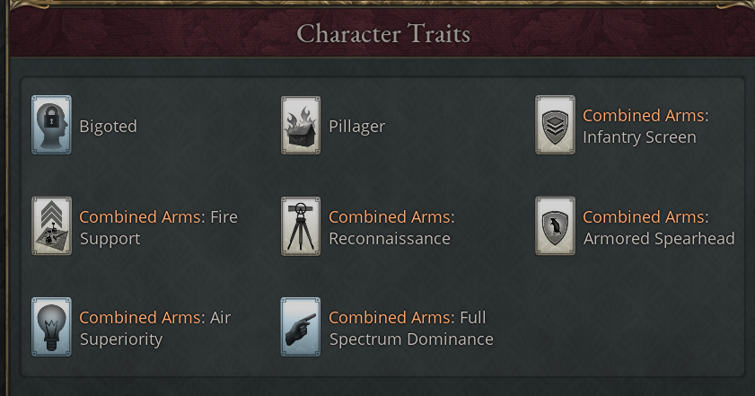

# Military and war

The mod carries the army and navy through to era 12. It adds 25 battalion types,
two new unit groups (Heavy Tanks and Aircraft) and 19 ship types, and it rewards
armies that mix their arms. Military Bases fortify states against invasion and
missiles, several of the mod's systems feed war support, and mobilization drives
a sharp rise in ammunition demand. All of this is always on. The optional part
is the World War journal entry, which needs the World War game rule (disabled by
default): great powers of opposed ideologies drift into a global war and then
settle the peace.

## Combined arms bonuses

Combined arms rewards army formations that field several kinds of battalion. It
starts when you research the Combined Arms technology (era 6, after Mobile
Armor), which also unlocks Armored Infantry and Combined Arms Marines.

Each month, and whenever you create a formation, recruit a general or finish
barracks, the game sorts each army formation's battalions into five groups:
Infantry (marines count as infantry), Artillery, Cavalry (including Light Tanks
and the mod's reconnaissance vehicles), Heavy Tanks and Aircraft. A group counts
as present when it makes up at least 5% of the formation. With two or more
groups present, the formation's general gets a trait for each group present, and
a sixth trait when all five are. The traits apply to the troops the general
commands.

| Trait | Earned by | Effect |
|---|---|---|
| Combined Arms: Infantry Screen | Infantry | +5% unit defense |
| Combined Arms: Fire Support | Artillery | +5% unit offense |
| Combined Arms: Reconnaissance | Cavalry | +1 maximum offensive battles |
| Combined Arms: Armored Spearhead | Heavy Tanks | +5% offense, +3% defense, −5% morale loss |
| Combined Arms: Air Superiority | Aircraft | +5% offense, +100% advancement speed |
| Combined Arms: Full Spectrum Dominance | All five groups | +5% offense, +5% defense, +1 maximum offensive battles |

The bar is low: a formation of 19 infantry and one artillery earns Infantry
Screen and Fire Support. A formation of a single group earns nothing however
large it is, and a formation without a general earns nothing at all.

## New combat units

Every unit line runs past the base game's last tier, and the new units appear in
the upgrade options of the older units in their line, so you can upgrade
battalions in place. The base game's Heavy Tanks (Mobile Armor, era 5) move from
the artillery group to the new Heavy Tanks group, with lower stats than in the
base game, and aircraft form a group of their own. Each group gains three to
five units, from Armored Infantry and Propeller Aircraft in era 6 to the Utility
Fog Phalanx and Orbital Weapons Platforms in era 12, and later units come in
smaller battalions, down to 100 for the orbital ones. [Combat unit
list](20-appendix-reference-lists.md#combat-unit-list) gives each unit's
technology, era and battalion size.

Offense and defense climb steeply with each tier, but read them with the
battalion size. A battle weighs each battalion by its manpower as well as its
stats, so a 100-man orbital battalion carries less weight than its unit card
suggests. The reconnaissance vehicles occupy territory fast (+100% to +200%
occupation), and the new infantry and marines lose fewer provinces when pushed
back.

Their upkeep runs to tanks, aeroplanes, radios, electronic components and
industrial robotics, and launch capacity for the orbital units. Tanks, aircraft,
and the new artillery, cavalry and marines after Combined Arms Marines can't be
built under the Peasant Levies law.

## Ships and ship modifications

Nineteen ship types extend the navy from era 6, with escorts, submarines,
carriers, battle-line ships and troop transports in most eras: from the Fleet
Carrier and ASW Destroyer of era 6 to the Antimatter Battleship and Orbital
Support Mothership of era 12. [Ship list](20-appendix-reference-lists.md#ship-list)
gives each ship's class, role and technology, and the technology that makes it
obsolete.

The Expeditionary Fast Transport is quick and carries little; the Expeditionary
Sea Base is slow and carries four times as much. The base game's late ships go
obsolete as their successors arrive: the Super Dreadnought with Bombing
Aircraft, the Troopship with Combined Arms, the Destroyer and Light Cruiser with
Sonar, the Submarine with Advanced Submarine Technology and the Aircraft Carrier
with Nuclear Energy.

In the ship designer, nine of the new ships bring their own armor, guns,
propulsion and range modifications in three tiers; the others reuse those of a
related ship. Eight new utility modifications join the base game's, from the
Sonar Suite (Sonar) to Composite Armor Plating (Modern Material Science); [Ship
utility modification list](20-appendix-reference-lists.md#ship-utility-modification-list)
gives each one's technology and effect and the ships that mount it.

Shipyards gain a Production Focus group that trades civilian hulls for naval
construction; its strongest setting, Wartime Mobilization, needs the Total War
law.

## Mobilization options

The mod adds 27 mobilization options, some in a new Training group. The new
transport and medical options join the base game's exclusive sets: a formation
picks one of Forced March, Truck Transport, Rail Transport, Air Transport and
Space Transport, and one of First Aid, Field Hospitals and Medevac Helicopters.
Many options can be chosen only while your market has the goods they consume for
sale.

Beyond transport and medicine, the options run from logistics that cut
attrition, through morale and combat gear such as Radar Equipment, Night Vision
Gear and Exoskeleton Suits, to terrain training from your power bloc's
principles and bioenhancement under the augmentation laws. [Mobilization option
list](20-appendix-reference-lists.md#mobilization-option-list) gives each
option's unlock and effect.

Entrenchment, the three terrain trainings, Missile Defense System and
Exoskeleton Suits add ammunition to a mobilized battalion's upkeep, on top of
the fourfold rise that mobilization already brings ([Wartime demand for
munitions](03-economy.md#wartime-demand-for-munitions)).

## Military bases

The Military Base is a government building that fortifies a state. It unlocks
with Trench Works and grows to five levels, one each from Trench Works, Defense
in Depth, Concrete Fortifications, Guided Missiles and Precision Guided
Munitions. Each level employs 200 soldiers and 50 officers, buys small arms and
ammunition, and adds +5 infrastructure.

Three production method groups set what it does. The Fortification Type and Base
Purpose methods decide the state's fortification level, 1 to 4 for each level of
the base. The purpose can instead
calm turmoil and add war support (Garrison Duty), or add infrastructure and cut
your whole army's supply use (Logistics Hub). A Missile Defense method, from
Missile Defense Systems, raises the state's chance of stopping a nuclear strike.
[Military base production method
list](20-appendix-reference-lists.md#military-base-production-method-list) gives
each method's unlock and its effect per fully staffed level. The AI values bases
far more at war or when committed to a diplomatic play.

<!-- screenshot: a Military Base building panel at level 5 with Hardened Positions, Territorial Defense and Missile Defense Battery selected -->

### Fortification levels and battle conditions

A state's fortification level adds up across its base's production methods, so
five levels of Hardened Positions with Territorial Defense give 20. When your
general defends a state with a Military Base, one of four battle conditions can
apply, set by that level. Each tier replaces the one below it.

| Battle condition | Fortification level | Effect for the defender |
|---|---|---|
| Fortified Position | Any base | +20% defense, −10% morale loss, −20% combat width |
| Fortified Stronghold | 5 or more | +35% defense, −20% morale loss, +10% kill rate, −40% combat width |
| Fortified Bastion | 10 or more | +50% defense, −30% morale loss, +15% kill rate, +5% recovery, −60% combat width |
| Impregnable Fortress | 15 or more | +70% defense, −40% morale loss, +20% kill rate, +10% recovery, −80% combat width |

The base game's Naval Fortification also gains two late production methods,
Coastal Missile Battery (Guided Missiles) and Integrated Coastal Defense
(Missile Defense Systems), which raise its resistance to invasion, bombardment
and blockade.

### Bases under nuclear attack

A base's missile defense covers its own state, on top of the defense your
technologies give every state. AI strike planners weigh target states by the
chance a warhead gets through, so defended states draw fewer strikes.

A tactical nuclear strike halves every Naval Fortification and Military Base in
the state, and what survives keeps its production methods; see [What a nuclear
strike does](14-nuclear.md#what-a-nuclear-strike-does).

### Demilitarized zones and forced disarmament

Two treaty articles, Demilitarized Zone and Forced Disarmament, dismantle
military buildings, Military Bases included, and both can be war goals; see
[Treaty articles by purpose](09-diplomacy.md#treaty-articles-by-purpose).

## War support from mod systems

The mod adds weekly lines to the war support breakdown.

| Line | When it applies | Per week |
|---|---|---|
| Home front strain (World War) | Your world war is 2 years old | −0.5 |
| Prolonged World War | Your world war is 4 years old (adds to the line above) | −0.5 |
| Condemned by the United Nations | The UN condemned you | −0.5 |
| Rebuked by the United Nations | The UN rebuked you and did not condemn you | −0.25 |
| Fighting a UN-condemned enemy | An enemy in this war is condemned | +0.25 |
| Enemy communications disruption | An enemy in this war runs a communications-disruption operation against you | −0.25 |
| Enemy nuclear arsenal | An enemy has nuclear weapons, you don't, and neither a nuclear-armed guarantor nor your overlord's nuclear umbrella covers you | −0.25 |
| Shelters and civil defence | The line above applies and you have Civil Defence, from a [nuclear taboo event](14-nuclear.md#nuclear-taboo-events) | +0.125 |

The United Nations, covert operation and nuclear lines come from systems with
their own game rules, and appear only when those systems are on.

At war, states also add war support each month, scaled by their share of your
population. The War Propaganda decree is worth 5 a month in its state, and a
Military Base 0.25 per level on Garrison Duty (half that on Territorial
Defense), each times that state's share. The Private Military Contractors law
adds 0.25 across the country. **Fervor** is the religious kind, from the Sacred
Civics power bloc principle at tier II and up: 5 a month times the Devout
interest group's clout.

Laws and technologies also change how far battles move war support.

| Source | Victories | Defeats |
|---|---|---|
| Total War law | +25% | +25% |
| Limited War law | −10% | −10% |
| Ministry of Propaganda Established law | +15% | −15% |
| Unregulated Internet / Net Neutrality laws | +20% / +15% | +20% / +15% |
| State-Controlled Internet law | −10% | −20% |
| State Secrets / Freedom of Information / Open Government laws | −5% / +5% / +10% | the same |
| Television Broadcasting / Satellite Communications / Social Media technologies | +10% / +5% / +15% | +15% / +10% / +20% |

Total War and Limited War belong to the Rules of War law group; see [Government,
laws and characters](06-politics.md).

## Ammunition and mobilization

Mobilization quadruples a battalion's ammunition use, even for a diplomatic play
that never becomes a war; see [Wartime demand for
munitions](03-economy.md#wartime-demand-for-munitions).

## The World War journal entry

The Gathering Storm is a journal entry for great powers that have researched
Combined Arms, present only when the World War game rule is enabled. It follows
the hostility between great powers of opposed ideologies through a leadup, a
world war and three post-war years, and it fails if you drop below great power.

<!-- screenshot: The Gathering Storm journal entry at high tension, with the Begin Rearmament and Provide Lend-Lease buttons -->

### Ideological camps

The entry sorts countries into camps by their laws, and its status shows your
own camp on a second line (Non-Aligned when you are in none). Democratic opposes
communist and fascist, and communist opposes fascist. Authoritarian countries,
and those in no camp, oppose nobody, so their entry stays inactive.

| Camp | Laws |
|---|---|
| Democratic | Census Suffrage, Universal Suffrage, Wealth Voting or Landed Voting; Presidential Republic, Parliamentary Republic or Monarchy; neither Single-Party State nor Autocracy |
| Communist | Council Republic, with Command Economy or Cooperative Ownership |
| Fascist | Corporate State with Single-Party State, or Autocracy with Single-Party State and Ancestral, Cultural or Racialized Citizenship |
| Authoritarian | Autocracy, Single-Party State or Oligarchy, when not communist or fascist |

### Ideological tension

Each great power has its own tension, from 0 to 100: +20 when one of your rivals
is an opposed great power, +10 for each opposed great power, +15 if you are
fascist, +10 if communist, +20 while you are at war, and −30 if you have nuclear
weapons. The entry doesn't show the number; its status text names the band.

| Tension | Status text | What opens |
|---|---|---|
| 20 | The great powers watch each other warily | Pursue Appeasement |
| 30 | Tensions are rising | Begin Rearmament, the Ideological Demands event, and Rising Global Tensions (+25 maneuvers in your plays, faster escalation as aggressor, +5% military goods cost, +10% prestige from army power projection) |
| 40 | Tensions are rising | Provide Lend-Lease, the Border Incident event |
| 50 | High tension | The Diplomatic Crisis event |
| 70 | Crisis: war is imminent | The Brink of War event |

### Preparing for the world war

Three leadup policies sit on the entry as buttons, each with a matching button
to end it.

| Button | Needs | Modifier while active |
|---|---|---|
| Begin Rearmament | Tension 30, not appeasing | +10% army offense and defense, +20% prestige from army power projection, +15% military goods cost. Armed Forces approve. |
| Pursue Appeasement | Democracy, tension 20, not rearming | +50 influence, +10% relations improvement speed, −5% military goods cost. Intelligentsia approve, Armed Forces disapprove. |
| Provide Lend-Lease | Major power, tension 40 or a world war under way, not at war | +50 influence, +15% prestige, +15% military goods cost. Industrialists approve. |

The AI rearms when it is fascist or authoritarian and tension is high; AI
democracies appease between 30 and 70. An AI great power that stays out of a
world war leans strongly toward providing Lend-Lease.

Leadup events come at random, each over an opposed great-power rival: demands
that it renounce its system, a border incident, or a diplomatic crisis when it
opens a play against a smaller country in your power bloc or under your
protection. Their options are in [World War event
list](19-appendix-events.md#world-war-event-list).

### The brink of war

The Brink of War fires at tension 70 when one of your rivals is an opposed great
power that holds the entry, at least three great powers exist, and no world war
is running. Launching makes you the aggressor and your rival the defender, and
opens a Cut Down to Size diplomatic play against it at escalation 90. Standing
down angers the Armed Forces and keeps the event away for ten years. The AI
usually launches.

At launch only those two powers are belligerents; allies who join the play fight
beside them but take no side in the entry. If the play ends without a war, the
crisis is defused and a later one can start another.

### Fighting the world war

Belligerents at war get three wartime policies, each with a button to end it.
All three lift when the war ends.

| Button | Needs | Modifier while active |
|---|---|---|
| Total War Economy | Combined Arms | −15% military goods cost, +15% army offense and defense, +10% morale recovery, +25% conscription, +25% construction goods cost, −2 standard of living. Armed Forces approve, Trade Unions disapprove. |
| Launch War Propaganda | Mass Media | −10% morale loss, +100 authority, −30% radicalism of political movements. Intelligentsia disapprove. |
| Impose Rationing | Nothing extra | −3 standard of living, +10% agriculture throughput, −10% bureaucracy |

A long war wears the home front down. After two years Home Front Strain gives
−10% bureaucracy and −0.5 war support a week, and plays you start escalate 2 a
week faster. After four, Prolonged War Weariness adds −4 standard of living, +3%
mortality, +100% radicals from political movements, +25% war support lost to
casualties and a further −0.5 war support a week. The war support breakdown
shows the two weekly losses as Home front strain (World War) and Prolonged World
War.

Wartime events test the home front, from rallies and strategic bombing to
resistance in occupied land, and from two years on they ask whether to push on
or seek terms. They are listed in [World War event
list](19-appendix-events.md#world-war-event-list).

Great powers that stayed out receive The Hour of Decision. Entering joins the
defender's side with Fresh Forces for five years (+20% army offense, +10%
defense, +20% morale recovery), plus Arsenal of Democracy for a democracy. You
can instead send material support (Lend-Lease Program for ten years) or stay
neutral. AI democracies and communists join readily against a fascist aggressor.

A player great power outside the war need not wait for the event. While a great
power still fights on each side, the entry's Enter the War button joins the
defender's wars against the aggressor at once, with the same Fresh Forces and
Arsenal of Democracy. Entering by either route, and every answer to The Hour of
Decision, brings Recent Intervention Decision, which keeps the button
unavailable for a year. A power that has already made its peace in the war
can't enter again, and AI powers enter only through The Hour of Decision.

### Winning and losing the world war

The mod records a concession whenever a belligerent enforces a war goal on a
belligerent of the other side, by capitulation or negotiated peace. You **won**
if you fought, conceded nothing, and at least one enemy belligerent conceded;
you **lost** if you conceded and enforced nothing. A white peace, or one that
enforced goals both ways, is neither. Outcomes are per country, so one member of
a coalition can win while an ally loses.

The Peace Conference fires when your war ends. A victor picks the peace, which
decides what the powers it beat receive.

| Victor's choice | Victor gets | Each power it beat receives |
|---|---|---|
| Impose a harsh peace | Victor's Peace and Occupation Duties, 10 years | Regime Change: accept for Defeated Power and Imposed Regime Change, or resist for Defeated Power and heavy radicalism |
| Seek a just and lasting peace | Victor's Peace for 5 years, Post-War Reconstruction for 10 | Reconstruction Aid: accept for Post-War Reconstruction and a shorter Defeated Power, or refuse for Defeated Power for 10 years |
| Establish a new world order | Victor's Peace for 10 years, Liberation Hero for 5 | Nothing |

Victor's Peace gives +30% prestige, +200 influence, +500 authority and +10%
leverage generation. Defeated Power gives −30% prestige, −200 influence, −3
standard of living and −25% army offense and defense. These modifiers fade over
their duration. A power that lost or drew chooses between bringing the soldiers
home and keeping the army ready.

### The post-war years

The entry stays open for 36 months after peace, and three events can reach great
powers: a war crimes tribunal, a choice about the post-war order, and The New
Rivalry, when a great power you fought beside now holds an opposed ideology.
Either answer to The New Rivalry closes the entry at once. Otherwise it
completes after the 36 months. The events are in [World War event
list](19-appendix-events.md#world-war-event-list).
