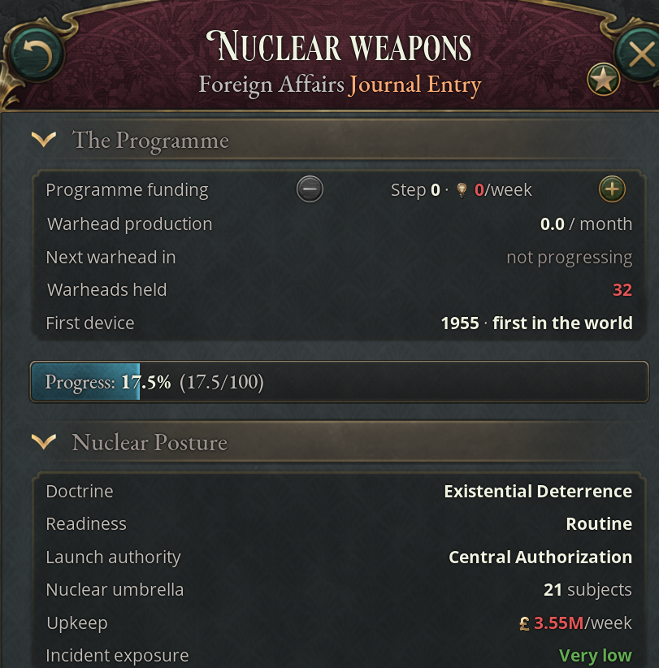
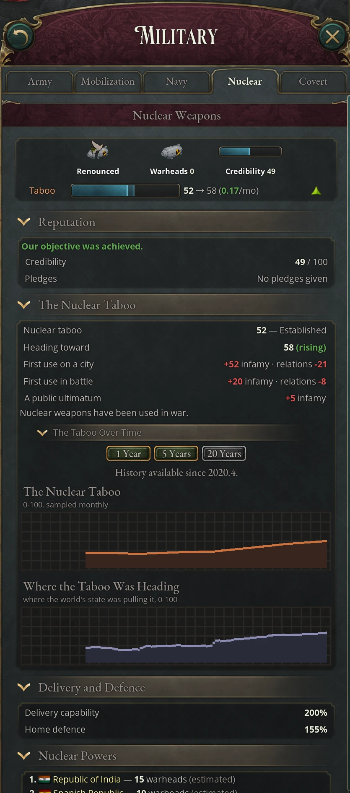

# Nuclear weapons

Once you research the Nuclear Weapons technology, a great power can fund a
weapons program that turns research into warheads. Holding warheads brings a
posture to choose (when you would use them, how ready they stand and who may
launch), a standing bill, the risk of accidents, and crises in which you
threaten others or are threatened. Strikes, civil wars that split an arsenal,
and warheads that go missing follow from the same system. From the world's first
warhead, the [nuclear taboo](#the-nuclear-taboo), a single score for the whole
world, sets what each nuclear act costs and can make holding the bomb a burden.
The Nuclear Weapons game rule controls it and is on by default; with it off the
technologies remain, but no program, stockpile, taboo or nuclear events exist.

## The Nuclear Weapons journal entry

Everything happens in one journal entry, **Nuclear Weapons**. Before the world's
first warhead, it is active for any country with a working program; a country
with the technology but not the standing to build sees it inactive, with a
status line saying what it lacks.
Once the first warhead exists, the entry is active for every country except
decentralized ones, whether or not it has the technology, and its status line
opens with the nuclear taboo's score and band.

| Panel | Shown when | What it holds |
|---|---|---|
| The Programme | You have a program | Funding, production rate, time to the next warhead, warheads held, the year of your first device and whether it was the world's first |
| Progress bar | Always | Progress toward the next warhead |
| Nuclear Posture | You hold warheads | Doctrine, readiness, launch authority, forces, upkeep, incident exposure, interest-group opinions; in the Forces section, your arsenal ceiling and dismantling |
| Nuclear Crisis and Reputation | In a crisis, or once you have a record | The crisis and your moves in it; credibility and pledges |
| The Nuclear Taboo | From the world's first warhead | The taboo's score and band, where it is heading and why, what nuclear acts cost now, your arsenal's burden, and its history |
| Delivery and Defence, Nuclear Powers | Always | Strike and interception ratings; the ten largest arsenals as the world estimates them |

An armed power that loses its rank stops building but keeps its warheads, its
posture, its upkeep and its accidents.

## Building a nuclear arsenal

The program spends weekly innovation on warheads. It is slow to reach the first
device and much faster afterwards.

### Who can run a weapons program

You need the Nuclear Weapons technology and one of these:

- Great Power rank.
- Major Power rank and the Intercontinental Ballistic Missiles technology.
- A Nuclear Program Aid treaty article in which a nuclear power helps you, at any rank.

A Nuclear Disarmament article ends the program, and so does renouncing the bomb
by dismantling your arsenal (see [Reducing or giving up an
arsenal](#reducing-or-giving-up-an-arsenal)). A United Nations member without
a bomb can't run one while the UN is at its Strong tier or higher and the IAEA
exists (see [UN authority tiers](09-united-nations.md#un-authority-tiers)). A
Nuclear Program Freeze holds funding at zero, and so does an arsenal ceiling,
your own or a Nuclear Arms Limitation treaty's, while you hold at least that
many warheads. Losing the rank that qualified you zeroes funding the same week.

### Program funding and warhead production

Funding is a stepper in the program panel. Each step costs 100 weekly
innovation, taken out of your research, and you can add a step only while your
innovation is above 100. A warhead needs 100 progress.

| Stage | Progress per funding step | Example |
|---|---|---|
| First device | 1 a month | 5 steps (500 innovation a week) finish it in 20 months |
| Series production | 10 a month | 5 steps then build a warhead every 2 months |

A Nuclear Program Aid article doubles the rate, covert sabotage slows it, United
Nations inspections slow it (by a quarter at the UN's middle tier of
enforcement, more at the higher tiers), and after any nuclear use every funded
program gets +25%, fading over five years (The Bomb Has Been Used). Events can
bring a laboratory accident, a discovery with civilian uses, or anti-nuclear
protests. Most of the accident's and the discovery's choices cost 5 to 25 points
of progress toward the first device, never taking it below zero.

### The first device and the world's reaction

The first country to finish a device gets "Dawn of the Atomic Age", the Nuclear
Power modifier and a burst of loyalists, and its warhead brings the nuclear taboo
into being at 20. Later powers get "Our Nuclear Arsenal is Complete" and the
same modifier, which raises prestige (+30%), diplomatic play maneuvers, and
leverage generation (+25%) and resistance. Once the taboo rises above 40, The
Burden of the Bomb eats into that prestige and leverage generation (see [What
the nuclear taboo costs](#what-the-nuclear-taboo-costs)).

A later program is noticed at 75 progress on its first device: the great powers,
its rivals and its neighbors get "Nuclear Proliferation Alert". A nuclear power
can answer with a public ultimatum, or with a public denunciation where no
crisis can be opened. A country with a program of its own can crash it or stay
the course. Anyone can push for a non-proliferation treaty, accept the new
reality, or, with the Covert Warfare rule off, sponsor sabotage. Several answers
shave progress off the proliferator.

Other countries see your arsenal only as an estimate, re-observed yearly at
between 60% and 150% of the true count, and exact after a test or a strike. The
Nuclear Powers leaderboard and the AI use these estimates.

## Keeping a nuclear arsenal

From the week your first warhead exists you pay for it, and a human player gets
"A Standing Deterrent" to say so.

### Nuclear deterrent upkeep

Nuclear Deterrent Upkeep is a weekly expense that scales with GDP. The figures
below are shares of GDP a year; each readiness and investment button shows its
exact weekly cost.

| Item | Cost |
|---|---|
| Custody | About 0.01% per warhead, counting at most 50; half at Recessed |
| Heightened readiness | 0.08–0.2%, rising with arsenal size |
| High Alert | 0.25–0.6%, rising with arsenal size |
| Safeguards | About 0.1% per level |
| Hardening | About 0.16% per level |
| Automatic Retaliation | About 0.16% |
| Cap | About 2% |

### Survivability, reliability and crew strain

The posture panel's Forces section tracks three numbers on a 0–100 scale,
updated monthly, and two investment steppers from 0 to 3.

- Survivability is how much of your force would survive a first strike. It climbs toward a ceiling set by technology (25, plus 15 for Radar, 20 for Intercontinental Ballistic Missiles, 25 for Advanced Submarine Technology and 10 for Missile Defense Systems) only while you pay for hardening, and erodes when you stop.
- Command reliability is how well the chain of command holds. Each safeguards level raises it by about 12; strain, buried incidents and enemy sabotage lower it.
- Crew strain rises 5 a month at High Alert, settles around 40 at Heightened, and falls 6 a month at Routine or Recessed.

Safeguards also make an unapproved launch likelier to be halted and cut the
warheads lost when your arsenal changes hands. Survivability decides how hard
you are to coerce: at 50 or more, threats against you carry much less weight.

### Delivery capability and home defense

A strike lands with the attacker's delivery capability minus the target state's
defense, never below 5% and never above 100%.

| Delivery | Bonus | Defense | Bonus |
|---|---|---|---|
| Nuclear Weapons | +100% | Military Aviation | +25% |
| Intercontinental Ballistic Missiles | +50% | Radar | +25% |
| Hypersonic Weapons | +50% | Missile Defense Systems | +50% |
| Orbital Weapon Platforms | +50% | Directed Energy Defenses | +50% |
| Heightened readiness | +5% | Orbital Weapon Platforms | +50% |
| High Alert | +10% | Non-Proliferation Treaty guarantee (members with no bomb and no program) | +5% at the UN's middle tier of enforcement, scaled by the tier |

Technology defends every state. A Military Base defends its own state only, by
+2% per level with a Missile Defense Battery or +3% with Directed Energy Point
Defense, and AI planners aim fewer strikes at defended states. Military bases in
general are in [Military and war](12-military.md).

## Nuclear posture

Posture is three separate choices, set in the posture panel. A button you can't
use says why.

### Nuclear doctrine

Doctrine says when your government may strike first against a country you are at
war with. Retaliation is allowed under every doctrine. You can change doctrine
once every two years, and the first choice is free.

| Doctrine | First use allowed when | Standing effect |
|---|---|---|
| No First Use | Never | +10% infamy decay and relations improvement, −10% play maneuvers |
| Existential Deterrence (default) | The enemy's side means to annex or subjugate you, or holds goals on your incorporated states while you are losing | +5% leverage resistance |
| Flexible First Use | Also when you are losing to them, or they hold goals on any incorporated state | +10% leverage resistance, +5% maneuvers, −5% infamy decay |
| Nuclear Compellence | Also when they defied your public ultimatum, or your threat against them has reached [Confrontation](#crisis-stages-danger-and-pressure) | +15% maneuvers, +10% leverage generation, +10% infamy generation, −10% relations improvement |
| Nuclear Warfighting | In any war | +20% maneuvers, +10% leverage generation, +20% infamy generation, −10% infamy decay, −20% relations improvement |

Losing means a quarter of your land occupied, or under 35% of battles won after
five significant battles. Adopting Compellence or Warfighting costs infamy equal
to a tenth of the [nuclear taboo](#what-the-nuclear-taboo-costs) (5 at a taboo of
50) and 10 relations with every rival. Leaving No First Use is a **repudiation**: −20
credibility, +10 infamy, a ten-year Broken Nuclear Pledge modifier, and your
restraint-minded interest groups disapprove. While the No-First-Strike Pledge
amendment is on your laws (see [Amendments to the mod's
laws](05-politics.md#amendments-to-the-mods-laws)), your doctrine is held at No
First Use, and leaving it strikes the amendment.

### Nuclear readiness levels

Readiness moves one step every two weeks toward the level you order.

| Readiness | What it means |
|---|---|
| Recessed | Warheads stored apart from their delivery systems. Half the custody cost, half the incidents of Routine, less dangerous crises. Nothing can be launched, not even in retaliation, until you are back at Routine, and your threats carry less weight |
| Routine | The default. Cheap and slow; crews recover |
| Heightened | +5% strike success; incidents four times as likely as at Routine |
| High Alert | +10% strike success and +5 play maneuvers; strain builds every month, and with it accidents and false warnings |

Struck while Recessed, you can order the warheads mated; "Our Forces Are Ready"
offers the answer when they reach Routine, if the war goes on. A stand-down
agreed or conceded in a crisis holds you at Routine or below for two years, and
dismantling your arsenal takes you down to Recessed and holds you there until
it ends or you halt it.

### Launch authority

Launch authority decides who may act when a warning is uncertain. It can change
once a year.

| Authority | Needs | Effect |
|---|---|---|
| Central Authorization | Nothing | Only the government orders a launch |
| Conditional Delegation | Radar | Cut-off commanders may fire. In a war, an incident can end in a launch you never approved |
| Launch on Warning | Radar, Intercontinental Ballistic Missiles | A false warning can become a launch under standing orders |
| Automatic Retaliation | Radar, Intercontinental Ballistic Missiles, Mainframe Computers | A strategic first strike on you is answered in full, up to three warheads, with no choice left to you. Threats against you count as if your forces were survivable. Extra upkeep; restraint-minded groups dislike it; an accident at home during a war or an acute crisis can set it off |

The Forces section shows the chance that someone in the chain halts a launch
begun under delegation or launch on warning. Automatic Retaliation never answers
a retaliation, and answers a given attacker at most once in six months.

### How interest groups judge your posture

The At Home section lists each interest group with a view and the approval it
adds: Nuclear Posture: Enthusiastic (+2), Approving (+1), Uneasy (−1) or Opposed
(−2). Opinions are reviewed monthly, and doctrine and readiness count only once
a doctrine has stood for six months.

| Group | Wants | Dislikes |
|---|---|---|
| Armed Forces (officers) | Flexible First Use at Heightened readiness | No First Use, Warfighting, Recessed, Routine when an armed enemy is plausible, High Alert with strain of 50 or more |
| Industrialists (business) | No doctrine preference | High Alert held three months or more; any crisis at Confrontation or beyond |
| Groups favoring Total War over Limited War | Compellence or Warfighting, High Alert | No First Use, Existential Deterrence, Routine or Recessed |
| Groups favoring Limited War over Total War | No First Use (Existential Deterrence less so), Recessed | Flexible First Use, Compellence, Warfighting, High Alert, Launch on Warning, Automatic Retaliation; the arsenal itself, once its burden reaches 33% (−1) or 67% (−2) |

A group that only approves of its preferred Rules of War law, rather than
strongly, holds a mild view (±1). The Armed Forces and the Industrialists also
lean with their leader: a jingoist-led army wants compellence. The objection to
the arsenal itself, listed as "the arsenal itself" among the group's terms,
comes from [the nuclear taboo's burden](#what-the-nuclear-taboo-costs) and
counts at once, whatever your doctrine's tenure.

### The nuclear umbrella and nuclear guarantees

Your direct subjects are under your **nuclear umbrella** while you hold Nuclear
Power, unless you are at war with them or on opposite sides of a play. Anyone
else needs a Nuclear Guarantee treaty article. Either cover spares the country
the war-support drain of facing a nuclear-armed enemy without the bomb, weighs
your arsenal in any crisis against it, lets you open a crisis against a country
in a war or play with it, and lets you retaliate for a strike on it under any
doctrine. You are asked to answer when it is threatened or struck (see
[Guarantors called in](#guarantors-called-in)).

Withdraw Nuclear Umbrella is a diplomatic action on a direct subject: +10
liberty desire and −20 relations at once, then +0.1 liberty desire a week until
you restore it. Subjects of your subjects are covered by their own overlord
only, and power bloc members need a treaty.

Going Recessed while you protect anyone brings "Our Allies Are Alarmed" every
time: −5 credibility, −10 relations with each country you protect, and +5
liberty desire in each covered subject. A protector in storage counts for half
in a crisis.

## Nuclear crises

A nuclear crisis is one pair of countries and one dispute, with a deadline. The
issuer, the country that made the threat, runs it; the other is the target. A
country can be in only one crisis at a time.

### Opening a nuclear crisis

Two diplomatic actions open one:

| Action | Cost | Deadline |
|---|---|---|
| Private Nuclear Warning | −5 relations | 10 weeks |
| Public Nuclear Ultimatum | Infamy equal to a tenth of the nuclear taboo, −20 relations, higher reputation stakes | 8 weeks |

Either action needs an arsenal of your own, both sides free of other crises, no
non-use pledge between you, and one of the disputes below, taken in this order.
After a crisis you can't threaten the same country again for 24 months, except
in a war.

| Dispute | What the target gives up if it concedes |
|---|---|
| A war between you | −35 war support in that war |
| A diplomatic play between you | It backs down, and the play should end in your favor |
| A play or war between the target and a country you cover, when you are not a party to it | The same, on your protégé's behalf |
| A weapons program run by your rival, or by a country you are antagonistic, belligerent or domineering toward | Its program is frozen for 10 years |
| An armed rival at Heightened readiness or higher | It stands down to Routine for 24 months |

### Crisis stages, danger and pressure

A private warning starts at Warning; a public ultimatum starts at Confrontation.
A warning becomes a Confrontation when it goes public, is refused or answered
with a counter-threat, or when either side holds an exercise. A Confrontation
turns Acute when danger reaches 70 or the issuer is at High Alert while the
target is at Heightened or higher. Any crisis turns Acute when the issuer holds
firm, a play becomes a war, or a launch between the two is recalled at the last
moment. A crisis can be settled at any stage, and it lapses after a year.

The crisis panel shows two figures, each broken down in its tooltip.

- Danger (0–100) rises with the stage, time, publicity, readiness, poor command reliability, counter-threats and exercises, and falls with open talks. It is lower when the target has no arsenal and no armed protector. High danger makes incidents likelier.
- Pressure on the target (0–100) is what makes an AI target concede. The issuer's credibility, the danger, a threat that can be carried out, and the issuer's exercises and alerts raise it. The target's ability to answer in kind and an armed protector behind it lower it. The course of the war, the target ruler's temperament and the nuclear taboo shift it either way: up to +8 where the taboo is near 0 and threats are believed, down to −8 near 100 where nobody believes them, with the doubt halved for a public ultimatum. When first threatened, an AI target concedes only rarely below 40. Pressed again later, it never concedes below 50, does so about half the time from 70, and two times in three from 85.

From Confrontation on, the target is pressed every six weeks unless talks are
open.

<!-- screenshot: the Nuclear Crisis panel during a Confrontation, with the pressure breakdown tooltip open -->

### Moves during a crisis

Each side acts through events and the crisis panel's buttons.

| Move | Who | Effect |
|---|---|---|
| Concede | Target | The concession happens at once and the crisis ends |
| Refuse | Target | Confrontation. A refused public ultimatum counts as defiance, which lets a Compellence issuer strike you in a war |
| Counter-threat | Armed target | Confrontation, danger +10, readiness to Heightened |
| Propose a mutual stand-down | Either | Pressure pauses and danger falls 15 while the other side decides. If accepted, both stand down to Routine for 24 months and pledge non-use; the war or play goes on |
| Go public | Issuer | Infamy equal to a tenth of the nuclear taboo, −15 relations, a new 8-week deadline |
| Exercise | Either armed side | Money and 5 strain (and +3 credibility for the issuer); for six weeks danger +10, and pressure +10 if the issuer holds it. It can be mistaken for an attack |
| Back down | Issuer | The crisis ends in a climb-down |

At the deadline the issuer chooses: six more weeks (−3 credibility), hold firm
(the crisis turns Acute, forces go to High Alert, six more weeks), offer a
stand-down, let the deadline lapse (which counts as backing down), or, at war
with the target and with every strike gate open, carry out the threat. A play
under a public ultimatum that turns into a war brings "They Chose War": strike,
fight conventionally (−10 credibility, militarists disapprove) or offer a
stand-down.

### Credibility, bluffs and crisis outcomes

Doctrine is public, so the panel rates every threat: Backed (+10 pressure; your
doctrine permits a strike now, or you hold Compellence or Warfighting),
Uncertain (Flexible First Use, or Existential Deterrence with something at
stake), or A bluff (−25, or −35 under No First Use; your doctrine or Rules of
War law forbids a strike).

| Outcome | Issuer | Target |
|---|---|---|
| The target concedes | +10 credibility (+15 if public), Nuclear Brinkmanship Rewarded, hawks approve | −5 credibility, Yielded to Nuclear Coercion, hawks disapprove |
| The issuer backs down | −5 credibility if private; −15, Nuclear Climb-Down and angry hawks if public | +10 credibility, Faced Down a Nuclear Threat |
| Mutual stand-down | +5 credibility (−5 for trading away a public demand), Mutual Nuclear Restraint, restraint groups approve | +5 credibility, Mutual Nuclear Restraint, restraint groups approve |
| A public crisis runs out its year unsettled | −10 credibility | Nothing |

A public bluff that ends in a climb-down or runs out its year costs 5 more
credibility. The modifiers last five years. A crisis also ends when its war or
play ends, or when nuclear weapons are used between the two. A non-use pledge
from a stand-down blocks strikes on that partner until one side uses Repudiate
Non-Use Pledge (−15 credibility, +5 infamy, −30 relations and a Broken Nuclear
Pledge).

### Guarantors called in

When a country you guarantee or cover is warned or struck, you get "A Promise
Called In":

| Choice | Effect |
|---|---|
| Honor | +5 credibility. Under threat, you back the target. After a strike, you join its war, or open a public crisis against the attacker if there is no war to join |
| Retaliate (after a strike) | +10 credibility; you join the war and, if you are at war with the attacker a day later, strike back then, as retaliation, under any doctrine |
| Abandon | −15 credibility, Abandoned a Nuclear Guarantee for five years, −30 relations with the protégé and −10 with everyone else you protect; a subject gains 10 liberty desire |

If your protégé used the bomb first and its victim answered, you get "Our
Protégé Struck First" instead. Standing by it or answering in kind costs 5
infamy; declining costs no credibility, only 10 relations with the protégé.

## Nuclear strikes

Strikes are diplomatic actions against a country you are at war with, aimed at a
state you pick.

### Strategic and tactical strike actions

| | Nuclear Weapon Industrial Strike | Tactical Nuclear Strike |
|---|---|---|
| Needs | Nuclear Power and a warhead | The same, and the Tactical Nuclear Weapons technology |
| Target | Any enemy state | A state with a Barracks, Naval Administration, Naval Fortification, Naval Logistics Center, Conscription Center or Military Base |
| Rules of War that forbid it | Humanitarian Regulations, Limited War | Limited War |

A strike ordered through these actions or a crisis event also needs your
doctrine to allow it, no non-use pledge with the target, and forces that are not
Recessed. The Rules of War block lifts once you or a country you cover has been
struck, or when an enemy's war goal would annex or subjugate you. Give the
launch order, the government's answer to an unconfirmed early warning, passes
the same tests; only launches nobody ordered skip them (see [Nuclear incidents
and accidents](#nuclear-incidents-and-accidents)).

### What a nuclear strike does

A strategic strike that lands devastates the state, kills a tenth of its people
and leaves Nuclear Strike Aftermath for two and a half years (decaying): −50%
infrastructure, −3 standard of living, +25% mortality and −50% throughput. The
victim loses 12.5 war support and 50 relations with you. A first use also costs
you infamy equal to the [nuclear taboo](#what-the-nuclear-taboo-costs) and
relations with every other country; an answer to a strike on you or on a country
you cover costs neither. The action's confirmation names the figures. A strike
that fails costs 5 infamy.

A tactical strike that lands kills half the soldiers and officers in the state
and a few civilians, and stops unit training there for a while. As a first use
it costs infamy equal to four tenths of the taboo, and relations with every other
country; as an answer it costs neither. A tactical strike that fails costs no
infamy.
It halves every Naval Fortification and Military Base in the state, an odd level
lost on a coin flip, so a level-1 site is destroyed half the time; what survives
keeps its production methods. Barracks, conscription centers and the other naval
buildings survive.

Both sides get a notification of the result. Every use speeds up the world's
funded programs and ends any crisis between the two countries, and one that
lands knocks the nuclear taboo down. The United
Nations records it against you, and its court may indict your ruler (see
[Grounds for UN censure](09-united-nations.md#grounds-for-un-censure)).

### Retaliation and Automatic Retaliation

The victim of a strategic strike gets "A City Erased" with its answer: condemn
the attack, retaliate with one warhead, or launch a full retaliation of three if
it holds more than two. Retaliation costs no infamy, counts for less with the
United Nations than a first strike, knocks the nuclear taboo down half as far,
and the attacker may answer it in turn. A strike you order through the strike
actions in answer to one on you or on a country you cover also costs no infamy
and counts as an answer for the taboo.
Under Automatic Retaliation the answer is made for you; while Recessed you can
only mate the warheads and answer when they are ready.

## Nuclear incidents and accidents

Every armed country rolls once a month for something going wrong. The base
chance is 0.05% a month at Recessed, 0.1% at Routine, 0.4% at Heightened and 1%
at High Alert. Strain and a dangerous crisis raise it, command reliability moves
it up or down, and it never passes 3%. Over ten years without a crisis that is
roughly a 5–10% chance of any incident at Routine, 35–50% at Heightened and 90%
at High Alert.

| Incident | Can happen when | What it is |
|---|---|---|
| A false warning ("Conflicting Indications") | Radar, Heightened or higher, and an armed enemy, rival, crisis opponent or hostile country | An early warning of attack that no second source confirms. Under Launch on Warning, or delegation in a war with the suspected attacker, the chain halts it ("The Order Nobody Passed") or launches; otherwise the government decides |
| The Exercise They Mistook | A crisis at Confrontation or beyond, Heightened or higher | Your opponent reads your exercise as cover for an attack |
| Silence from the Capital | Delegation or Launch on Warning, not Recessed, in a war or an Acute crisis | A commander cut off from the capital; an officer refuses, or the unit fires |
| The Cost of Permanent Alert | High Alert for six months, or strain of 60 or more | Crashes, silo explosions, lost weapons, a contaminated state |
| A Routine Mishap | Always | False alarms, dropped training weapons, storms |

Most incidents cost money, readiness, reliability or reputation. A buried
incident has a 3% chance each month of coming out (Nuclear Cover-Up Exposed: −10
legitimacy, −10% authority, −5% prestige).

When the government decides on a false warning, Give the launch order is a
deliberate strike and is greyed out unless every test for one passes: a war
with the suspected attacker, a doctrine that permits the strike, no non-use
pledge with it, Rules of War that allow it and forces at Routine or higher. A
warning alone never counts as being struck, so under No First Use the order is
open only against a country that has already struck you. Launch on warning,
delegated commanders and a commander cut off from the capital fire without any
of these tests.

Any launch needs a war with the country in question. Outside a war, a launch
nobody halted is recalled at the last moment: +10 infamy, −50 relations with the
target, more strain and less reliability, and an armed target may answer by
opening a crisis. Under No First Use, even an unapproved launch in a war breaks
your pledge.

### The Monopoly Window

A Compellence or Warfighting power at war with an enemy that has no arsenal, no
armed protector and no armed ally in that war, and whose doctrine allows a
strike on it, has an 8% chance a month, at most once a year, of "The Monopoly
Window": its general staff proposes using the bomb while nobody can answer. You
can win conventionally, issue a public ultimatum, or authorize the strike. The
strike obeys the Rules of War like any other: under Limited War or Humanitarian
Regulations it is offered only once their block has lifted (see [Strategic and
tactical strike actions](#strategic-and-tactical-strike-actions)).

## Arsenals in civil wars and annexations

Warheads outlive the government that built them. When an armed country is
annexed by war, diplomacy or a formable nation, its arsenal passes to whoever
holds the most populous state in its old capital's region, and a human recipient
gets "The Arsenal Changes Hands". Every such transfer loses some warheads on the
way: 7% with no safeguards, 2 points less per safeguards level (1% at level 3).
Conditional Delegation or Launch on Warning adds 3 points, and the loss doubles
if the holder was at war. **Secured custody** halves the loss. You have it while
a foreign custodian helps you in a civil war, for twenty years after opening
your depots to inspectors over a stolen warhead, while a Nuclear Security
Assistance article is in force, or as a party to the United Nations' Convention
on the Physical Protection of Nuclear Material. Missing warheads become [loose
warheads](#loose-warheads).

### Who Holds the Button?

When a revolution or secession breaks out in an armed country, the government
chooses in "Who Holds the Button?", whose tooltips show the exact numbers:

- Hold the line: the rebels seize a share matching their share of the population, half again more under delegated authority and 20% less per safeguards level, and some of those go missing.
- Bring them in: readiness goes to Recessed and stays locked there until every civil war of yours is over, so you can't strike, answer a strike or raise readiness. Rebels take half their share under delegated authority, none under central control.
- Take them apart: your stockpile goes to zero and you lose Nuclear Power, nothing is seized or lost, and every country's relations with you rise by 10.

Striking your own civil war, from either side, brings Nuclear Weapons Used on
Our Own People (−50 legitimacy, decaying over twenty years) and a wave of
radicals that your speech and policing laws shrink or enlarge.

### When a revolution wins or loses

A winning revolution takes the state's arsenal, less the warheads lost, as a new
regime: it keeps the old doctrine, investments and warhead progress, restarts at
50 credibility, and is not bound by the old government's pledges. If the
government wins, the rebels' warheads come back. A winning secession keeps what
it seized; a crushed one returns it.

### Deny Them the Bomb

A government losing a revolution while armed (a quarter of its land occupied, or
most battles lost) is asked once per civil war, "Deny Them the Bomb". Taking the
warheads apart in haste loses some on the way; an accepted foreign custodian can
take them apart with none lost; or you keep them, and a winning revolution
inherits them. A secession never asks this, because its winner does not take the
government's arsenal.

### Foreign powers and a divided arsenal

A week after an armed country's civil war breaks out, every armed major power
and armed neighbor gets "A Nuclear Power Divided". It can back either side (+20
relations with it, −20 with the other, +5 war support for that side), offer to
secure the arsenal, or stay out. An accepted offer makes the helper the
government's custodian for the war.

### The Budapest path

A week after a secession wins while holding warheads, every armed great power
gets "A New Nuclear State" and may press it. A month after the first does, the
new state gets "The Budapest Offer". Trading the warheads away dismantles them,
and the pressers sign treaties with you wherever one can be made: the one with
the largest economy a Nuclear Disarmament and a Nuclear Guarantee, every other a
guarantee, all binding for ten years. Relations with each rise by 20. Keeping
them costs 20 relations with each presser, and for ten years the AI is readier
to demand your disarmament.

## Loose warheads

Lost warheads stay in the world. The posture panel's Unaccounted for row counts
those from your arsenal.

### Nuclear terror plots

Once warheads are loose, a plot can come up in the yearly terror events of a
country with the Terrorism and Antiterrorism technology and at least 10%
radicals, a war, or a movement with radicalism of 25 or more. It is real with a
20% chance per loose warhead in the world (at most 80%), using another country's
lost warheads. Your security services seize it first with a 10% chance, plus 5%
per Ministry of Intelligence and Security level and 15% with the Nuclear Weapons
technology (at most 75%). Otherwise it destroys a city in one of your populous
states. Once a device surfaces anywhere, no other can for a year.

### Tracing a stolen warhead

A month later, "Where Did It Come From?" reports the result. Your own nuclear
expertise, a covert network in the country of origin, a seized device and fewer
possible sources make certainty likelier.

| Finding | Your options |
|---|---|
| Confirmed | Hold the origin to account |
| A shortlist of two or three, which may include innocent countries | Name them all in public (−25 relations with each), or ask each privately to open its depots |
| Unknown | Say nothing, or blame a rival anyway |

Blame means negligence, not attack. The origin gets "The Warhead Was Ours" and
can pay compensation (up to a tenth of your GDP), let your inspectors in (twenty
years of secured custody, Custody Inspections at −5 legitimacy, and a 50% chance
of finding one of its missing warheads at once), or deny it (−40 relations, +5
infamy).

### Recovering loose warheads

Recovered warheads are destroyed. Besides the inspection search, three things
find them:

- Covert: Secure Loose Material, an operation against a country with warheads missing: a 3% chance a month once established, 6% when fully operational, and more at a higher priority (see [Cultural hegemony and covert warfare](10-influence.md), which also covers Covert: Nuclear Programme Sabotage).
- A Nuclear Security Assistance article: 6% a month for the country helped.
- The Convention on the Physical Protection of Nuclear Material: 3% a month for each party. It reaches the United Nations Assembly only once warheads have gone missing somewhere.

## The nuclear taboo

The nuclear taboo is one score for the whole world, from 0 to 100, for how
unthinkable nuclear weapons have become. It is born at 20 the week the world's
first warhead is built, and from then on every country's Nuclear Weapons entry
is active and shows it. It climbs slowly on its own, falls when the bomb is used
or brandished, and rises with restraint. The more unthinkable the bomb, the more
it costs to use it, threaten with it and, above 40, simply to hold it. It also
shapes how the AI builds, threatens and strikes (see [How the AI plays nuclear
weapons](#how-the-ai-plays-nuclear-weapons)).

### The taboo panel and its bands

The Nuclear Taboo section of the entry is open by default.

| Row | What it shows |
|---|---|
| Nuclear taboo | The score and its band |
| Heading toward | The target the score is moving to, and whether it is rising, falling or steady. Hover this row or the one above for the target's breakdown, part by part |
| First use on a city, First use on a battlefield | The infamy and the relations with every other country that a strategic or tactical first use would cost now |
| A public ultimatum | The infamy a public ultimatum would cost now |
| Burden of our arsenal | Only while you hold warheads: your burden, and the prestige and leverage it costs |

Below the rows, a line says whether a nuclear weapon has been used in war and,
if so, when the last one fell; The Taboo Over Time holds two charts, the score
and its target, month by month.

The band sets the words of the status line and marks where the taboo's effects
start.

| Band | Score | The status line says | What starts here |
|---|---|---|---|
| Normalised | 0–29 | The bomb is treated as one weapon among others | Below 30, AI rulers drop some of their restraint |
| Fragile | 30–49 | The bomb is feared, but its use is still argued for | Above 40, holding warheads is a burden |
| Established | 50–69 | Using the bomb is widely held to be wrong | Above 50, AI countries lean to No First Use and accept arms control and disarmament more readily |
| Strong | 70–89 | The bomb is seen as unusable, and even holding one draws censure | From 70, the AI strikes first only for survival and may dismantle its arsenal |
| Absolute | 90–100 | The bomb is beyond the pale, and holding one marks a state apart | Every cost keeps rising with the score |

### What moves the nuclear taboo

Each month the taboo moves toward its target by a small part of the gap, never
more than one point, so it closes about half of a gap in two years. The
target is the sum of six parts, which the breakdown lists:

| Part | Range | What sets it |
|---|---|---|
| Base | 20 | Constant |
| Tradition of non-use | 0 to +35 | One point a year, full after 35 years. A first use halves the years counted; an answer to a strike cuts them by a quarter |
| Doctrines | −10 to +10 | The doctrines of the countries that hold warheads, averaged with great powers counting most. No First Use and warheads in storage (Recessed) raise it; Flexible First Use, Compellence, Warfighting and High Alert lower it |
| Restraint | 0 to +15 | Non-use pledges in force (up to +5); countries that gave up an arsenal and have not armed again (up to +10) and countries bound by a Nuclear Arms Limitation treaty, both weighted by rank |
| United Nations | 0 to +12 | The Non-Proliferation Treaty (up to 8) and the Physical Protection convention (up to 4), in proportion to UN authority |
| Ledger | −30 to +10 | The record of what the world has done lately, which halves every four years |

Base and a full tradition make 55. With no use and nothing else moving it, the
target climbs a point a year from 20 to 55 over 35 years, and the score follows
a couple of years behind. Anything above 55 has to come from doctrines,
restraint, the United Nations and the ledger.

A use that lands hits the score at once as well as the ledger. A first use
halves the tradition and takes 15 points off the score and 10 off the ledger for
a strategic strike, 6 and 4 for a tactical one. An answer to a strike counts half
as much and cuts the tradition by a quarter. Other acts move the ledger only.
These lower it:

- Threats: a public ultimatum, and less so a private warning or taking one public.
- Adopting Compellence or Warfighting.
- Repudiating No First Use or breaking a non-use pledge.
- A breakout: a country that gave up an arsenal holding a warhead again.
- Leaving an arms-control treaty (see [The Nuclear Arms Limitation treaty](#the-nuclear-arms-limitation-treaty)).
- Halting a dismantling.
- A condemnation of a nuclear use that fails, or that a veto cuts to a rebuke.

These raise it:

- Adopting No First Use yourself (not when the No-First-Strike Pledge amendment holds you to it).
- A nuclear crisis that ends in a mutual stand-down.
- Giving up an arsenal, by any path, and more for a bigger one: Dismantle the Arsenal, a Nuclear Disarmament article, the Budapest path, or taking the warheads apart in a civil war.
- Each warhead taken apart under a ceiling, yours or a treaty's.
- A condemnation of a nuclear use that carries.
- A loose warhead's terror detonation: no government chose it, and the world closes ranks after it.

Uses count the same whoever makes them. Threats, doctrines, broken pledges,
breakouts, walk-outs and halts count by the country's rank: a great power's
four times a minor power's.

### What the nuclear taboo costs

Every scaled cost is nothing at a taboo of 0 and grows in step with it.

| Act | Cost | At a taboo of 50 |
|---|---|---|
| Strategic first use | Infamy equal to the taboo, and relations with every country but the victim lowered by four tenths of it | 50 infamy, −20 relations |
| Tactical first use | Four tenths of the strategic figures | 20 infamy, −8 relations |
| A public ultimatum, taking a warning public, adopting Compellence or Warfighting | Infamy of a tenth of the taboo | 5 infamy |

A strike that answers one on you or on a country you cover costs no infamy and
no relations at any taboo. At 100 a single first strike on a city costs 100
infamy, enough on its own to reach the Pariah threshold. The panel's cost rows
show today's figures, and a strike's confirmation repeats them before you
launch. The taboo also moves the pressure a threat puts on its target (see
[Crisis stages, danger and pressure](#crisis-stages-danger-and-pressure)).

Above a taboo of 40, holding warheads is a burden in itself. Your burden, shown
as a percentage in the panel, grows with the taboo, from nothing at 40 to full
at 100, and with your arsenal, from about a fifth of full for a single warhead
to all of it at fifty warheads or more. It does two things:

- The Burden of the Bomb lowers prestige by up to 45% and leverage generation by up to 25%. At a taboo of 100, a fifty-warhead arsenal turns Nuclear Power's +30% prestige into −15% and cancels its leverage bonus; five warheads in the same world keep about +17% prestige.
- Interest groups favoring Limited War over Total War object to the arsenal itself: −1 to their view of your posture from a burden of 33%, −2 from 67% (see [How interest groups judge your posture](#how-interest-groups-judge-your-posture)). The ceiling's tooltip says how many warheads would ease them a step.

### Reducing or giving up an arsenal

The exits sit in the Forces section of the posture panel, which is collapsed by
default: an Arsenal row saying whether a ceiling holds you or you are
dismantling, the Arsenal ceiling stepper with a Lift button, and Dismantle the
arsenal with Begin and Halt buttons.

The **arsenal ceiling** is the most warheads you will hold. The minus button
sets one below your stock, or lowers the one you have, by 1 warhead up to 10, by
5 up to 50 and by 25 above that, and the plus button raises it by the same
steps. It goes no lower than 1; below that you dismantle. Warheads above the
ceiling are taken apart, a tenth of the excess a month and at least one, and
each strengthens the taboo a little. While you hold at least as many warheads as
the ceiling, Programme Held stops your program: funding goes to zero and can't
be raised, and the program's status reads "Development is held at our arsenal
ceiling." Raising the ceiling above your stock, or lifting it, costs nothing and
releases the program at once, unless a treaty's ceiling still holds you.

Dismantle the Arsenal needs warheads, peace, no nuclear crisis and no civil
war. It takes 12 months, one more for every 10 warheads above 20, and at most
36. The warheads go at an even pace over that time.
Until it ends, your readiness is ordered down to Recessed and can't be raised,
and the program is held. Recessed forces can't launch, so once there you can't
answer a strike. A war doesn't stop the dismantling; a civil war of your own
pauses it, and it resumes where it left off once every such war is over. Halt
the dismantling at any time: what is taken apart stays gone, your credibility
falls by 10 and the taboo weakens. If the arsenal goes another way meanwhile (a
disarmament treaty, or taking the warheads apart in a civil war), the
dismantling ends without its rewards.

When the last warhead goes, "The Last Warhead" fires. Its option gives The Bomb
Renounced, a prestige bonus of up to +20% in proportion to the taboo (+10% at
50) that fades over 20 years, and raises relations with every country by a
fifth of the taboo (+10 at 50). Restraint-minded interest groups approve and
hawks disapprove. You lose Nuclear Power and take Renounced the Bomb: you count
as a disarmed country, so no program can run, and the status line reads "We
gave up the bomb of our own accord." Only Dismantle the Arsenal brings these
rewards and Renounced the Bomb; every path counts toward the taboo.

Resume the Nuclear Programme is a decision you can take while you hold
Renounced the Bomb. It ends the renunciation and The Bomb Renounced, and costs
infamy of a tenth of the taboo and relations with every country of a fifth of
it. It gives back no warheads. A great power, a major power with Intercontinental
Ballistic Missiles or a country receiving Nuclear Program Aid can then run a
program again; a country without the rank for one is warned that resuming only
ends its renunciation. Once any country that gave up an arsenal, by whatever
path, holds a warhead again, the taboo books a breakout against it.

### The Nuclear Arms Limitation treaty

Nuclear Arms Limitation is a mutual treaty article, available with the Nuclear
Weapons technology, between two countries that each hold warheads or run a
program. You set the ceiling in the draft, from 1 up to a quarter above the
larger of the two arsenals (at least 5). While the treaty is in force:

- Neither party holds more warheads than the ceiling. Those above it are taken apart, a tenth of the excess a month, and each party's program is held at the ceiling from its next monthly review.
- The Arsenal row reads "Held to N warheads by an arms-control treaty" when the treaty binds you tighter than your own ceiling, or you have none.
- Each country it binds adds to the taboo's Restraint part, once however many such treaties it has, weighted by rank.

Leaving costs nothing directly, but it weakens the taboo. When a treaty ends,
whoever ends it, or is renegotiated to a higher ceiling, each party whose lowest
treaty ceiling rises or disappears is booked a walk-out. No walk-out is booked
while another such treaty holds the party to the same ceiling or a lower one,
or when the partner no longer exists. Your own arsenal ceiling never covers a
walk-out. An AI party accepts more readily as the taboo rises above 50 and as
its arsenal burdens it, is very reluctant under a militarist government, and
resists a ceiling that stops it building the arsenal it wants or cuts it deeper
than the other party.

### The United Nations and the taboo

The United Nations can move the taboo, but the taboo works without it. While the
Non-Proliferation Treaty is in force it adds up to 8 to the target, and the
Convention on the Physical Protection of Nuclear Material up to 4, both in
proportion to UN authority (4 and 2 at authority 50).

When the docket takes up a nuclear strike, its appeal can table a condemnation
even while the condemnation topic is on its five-year cooldown, provided the
striker's case gives grounds. That vote is the Assembly's verdict on the use. A
condemnation that carries raises the score 2 points at once and the ledger 3; one
that fails, or that a veto cuts to a rebuke, takes 3 off the ledger. Sanctions or
a court case over the same strike deliver no verdict. See [The UN
docket](09-united-nations.md#the-un-docket) and [UN conventions and
agencies](09-united-nations.md#un-conventions-and-agencies).

### Nuclear taboo events

When the score crosses a band line, every country gets an event: four as it
rises through 30, 50, 70 and 90, and four as it falls back through them. The
score has to pass 2 points beyond the line, the band moves at most one step a
month, and each of the eight events fires at most once in ten years. The options
act on your own country; those that start a real action (a ceiling, dismantling
or No First Use) then move the taboo the usual way. Whether you hold warheads
decides which options you see.

| Option | Events | Offered when | What it does |
|---|---|---|---|
| Cut our arsenal in half | Rising | You hold more than one warhead, aren't dismantling, and have no ceiling already at half your stock or lower | Sets your arsenal ceiling at half your stock |
| Take our arsenal apart | Rising | You could begin Dismantle the Arsenal | Begins it |
| Pledge never to use it first | Rising | You hold warheads and could adopt No First Use now | Adopts it |
| Our deterrent is not negotiable | Rising | You hold warheads and aren't dismantling | Hawks approve, restraint-minded groups disapprove |
| Champion the norm abroad | Rising | You hold none | Champion of the Taboo (+5% prestige, fading over ten years); −5 relations with each great power that holds warheads |
| Keep out of the powers' quarrel | Rising | You hold none | +5 relations with each great power that holds warheads |
| Modernise the arsenal | Falling | You hold warheads and aren't dismantling | +10 command reliability, +5 survivability; restraint-minded groups disapprove |
| Say publicly that nothing has changed | Falling | You hold warheads | Restraint-minded groups approve, hawks disapprove |
| Seek the shelter of a friendly nuclear power | Falling | You hold none, and an armed country is on amicable terms with you | +15 relations with one such country |
| Put more into our own programme | Falling | You hold none and could add a funding step | One more funding step |
| Build shelters and civil defence | Falling | You hold none | Civil Defence, below |

Build shelters and civil defence gives Civil Defence for ten years. It costs a
weekly sum set when you choose it, about 0.26% of your GDP a year, and halves the
war-support drain of facing a nuclear-armed enemy without the bomb (see [War
support from mod systems](12-military.md#war-support-from-mod-systems)). These
events and The Last Warhead are listed in [Nuclear taboo event
list](18-appendix-events.md#nuclear-taboo-event-list).

## Nuclear treaty articles

Six treaty articles deal with nuclear weapons. Each costs its payer influence
upkeep while the treaty is in force.

| Article | Parties | Effect |
|---|---|---|
| Nuclear Disarmament | The disarmed country concedes; the demander pays 200 | Stockpile and progress go to zero, Nuclear Power is lost, and no program runs while it lasts |
| Nuclear Program Freeze | The frozen country concedes; the demander pays 100 | Funding held at zero; warheads and progress kept |
| Nuclear Program Aid | A nuclear power helps a non-nuclear country and pays 500 | The recipient can run a program at any rank, at double the rate. Refused once the IAEA exists and United Nations authority is 60 or more |
| Nuclear Guarantee | An armed guarantor pays 100 | Extended deterrence, as for the umbrella; not for your own subjects |
| Nuclear Security Assistance | An armed country pays 100 to help one holding or missing warheads | Secured custody and a monthly chance to recover missing warheads |
| Nuclear Arms Limitation | Mutual, between two countries that each hold warheads or run a program; both pay 50 | Neither holds more warheads than the agreed ceiling; see [The Nuclear Arms Limitation treaty](#the-nuclear-arms-limitation-treaty) |

Aid can't be combined with a disarmament or freeze of the same country, and a
country whose program is held (at an arsenal ceiling, or while it dismantles)
can't agree to a freeze. The United Nations' non-proliferation treaty and IAEA
are in [The United Nations](09-united-nations.md).

## How the AI plays nuclear weapons

The nuclear taboo feeds every one of these decisions: in a world that treats the
bomb as ordinary the AI builds more, threatens more and strikes first more
readily, and in one that holds it in horror it trims and gives up its arsenal.
It retaliates at any taboo.

- It funds its program toward a target stockpile that grows with rank, innovation, war and a rival that seems to hold more, and shrinks as the taboo rises: about a third larger at 0 than at 40, and half the size at 100. From a taboo of 70, an AI at peace that faces no plausible attacker is far slower to fund a program.
- It reviews its posture every six months and when a crisis opens. Most AIs keep Existential Deterrence; cautious rulers and democracies lean to No First Use, and militarist regimes (fascist, or with a jingoist ruler or a powerful Armed Forces in government) to Compellence or Warfighting. Above a taboo of 50, No First Use gains favor; below 30, Compellence and Warfighting tempt any ruler who is not cautious; from 70 they, and Flexible First Use, lose favor.
- It goes to High Alert in an Acute crisis or a war with an armed enemy, to Heightened in any war or Confrontation, and to Recessed only at peace with nothing to deter and nobody to protect, and then only under a cautious ruler, No First Use or a default.
- It strikes first only when its doctrine allows and its survival is at stake, or when it is losing (Flexible), was defied (Compellence) or is at war (Warfighting) against an enemy with no arsenal and no armed protector. An aggressive ruler losing under Flexible First Use strikes whether or not the enemy can answer; a cautious one strikes first only for survival, unless the taboo is below 30. From a taboo of 70, any AI strikes first only when its enemy means to annex or subjugate it, whatever its doctrine. The lower the taboo, the more readily it takes a strike it is allowed. It keeps a warhead in reserve unless its survival is at stake, waits six months between first uses, and strikes its own rebels only with 40% of its land occupied under Outlawed Dissent or a Secret Police. None of this holds back retaliation.
- It warns countries that threaten a protégé or its survival, and a great power warns a rival that is building a bomb. Coercive warnings need a hawkish doctrine or regime and a target that can't answer. It never makes a public bluff. From a taboo of 70 it issues a public ultimatum only in defense of a country it covers, its survival or its core territory, and otherwise warns privately.
- At each posture review it also weighs its arsenal. While its arsenal burdens it and it holds more than half again the stockpile it wants, it sets a ceiling at what it wants; it lifts that ceiling once it wants more, and in a war lifts any ceiling below what it wants. When the burden reaches 30% or the taboo 70, it may begin dismantling, a one-in-five chance each review, provided it is at peace, outside any nuclear crisis or civil war, faces no plausible attacker, has neither a militarist government nor an aggressive ruler, and is covered by a guarantee or umbrella or is not a great power. It halts a dismantling only when an armed enemy at war with it means to annex or subjugate it. A renouncer takes Resume the Nuclear Programme only with the standing to run a program, below a taboo of 50, and when an armed country is at war with it or is a rival antagonistic toward it.
- An armed AI proposes Nuclear Arms Limitation when the taboo is 50 or more or its arsenal burdens it, at a ceiling of three quarters of the larger arsenal.
- It usually declines to answer for a protégé that struck first, never withdraws a nuclear umbrella, and demands disarmament from rivals and hostile countries. It accepts a Nuclear Disarmament demand more readily when the taboo is above 50 or its own arsenal burdens it.
