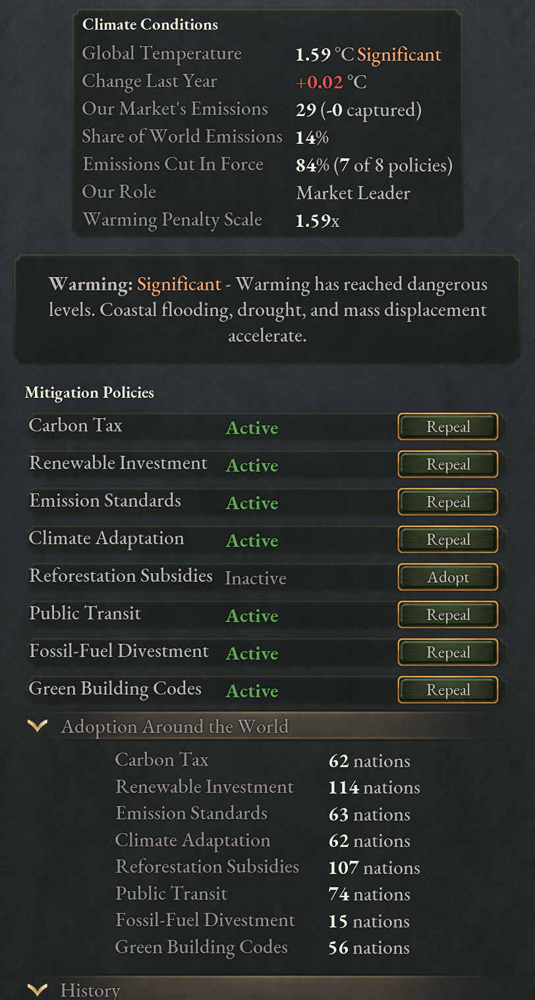

# Climate and pollution

Burning coal and oil warms the world in this mod. Every market's emissions add
to one global total, the total sets a global temperature anomaly, and the
anomaly drives penalties that every country shares. The Global Warming journal
entry tracks it and holds the climate policies you can adopt. The Global Warming
game rule (on by default) controls all of this; with it off, the world never
warms. State pollution, the Environmental Movement and the pollution scandal
event work under either setting.

## How emissions become warming

Emissions belong to a market, not a country. Each year a market emits in
proportion to the coal and oil consumed anywhere in it, cut by the emission
reductions of its market leader and reduced by the carbon captured by Synthetic
Fuel Works and Carbon Conversion Works in the market. (The mod renames the base
game's coal good Energy and Carbon Minerals; this chapter calls it coal for
short.) The year's emissions of every market are added to the world's cumulative
total, and the temperature anomaly is that total divided by 10,000: a market
that emits 1,000 a year warms the world by 0.1 °C a year.

Warming does not wear off. The anomaly falls only in a year when the world as a
whole captures more carbon than it emits. Cutting your emissions slows the rise;
it does not undo what is already there.

Only the market leader's reductions count, and they apply to the whole market.
The leader's Greenhouse Gas Emissions modifier comes mainly from the three
market-wide climate policies, the Ministry of the Environment (−5% per level)
and the Environmental Sustainability power bloc principle (−5% to −25% by tier).
A member's own ministry does nothing for the market's emissions. The cuts add
together, but however far they go they only bring a market's emissions down to
zero; only carbon capture takes a market below it.

## The Global Warming journal entry

The entry is listed, grayed out, for every country from the start of the game,
with a line saying that it opens once the world has warmed by 0.1 °C and its
climate policies at 0.5 °C. It activates for everyone once the anomaly reaches
0.1 °C and then stays active: it never completes and never goes away, even if
the world cools again. The temperature bar at its top runs to 4 °C, but the
penalties keep growing past that.

The same panels appear as a Climate tab in the Market panel, and a change made
in one shows in the other. It is grayed until the journal entry is active; hover
it for what is still missing. The tab ends with an Open Journal Entry button.

The tab is on the Market panel for every market. On your own market, whether
you lead it or joined it, it is the journal entry. On another market, a line
names the market's leader, and the parts about the market show that market: in
the overview, the leader's role and any Enforce Emissions Reduction treaty that
binds it, the market's emissions and carbon captured, and its share and
emissions-cut pies; below, the leader's Mitigation Policies, with every Adopt and
Repeal grayed, since only that leader can change them. The temperature, Top
Emitters, the history charts and How Global Warming Works stay your own view.
Use it to check what a market you want to bind with Enforce Emissions Reduction
emits and which policies it already runs.

The anomaly sets the warming tier, which the entry shows as a thermometer icon
with the tier's name beneath it:

| Anomaly | Tier |
|---|---|
| Below 0.1 °C | Negligible |
| 0.1–0.5 °C | Slight |
| 0.5–1.0 °C | Moderate |
| 1.0–2.0 °C | Significant |
| 2.0–3.0 °C | Severe |
| 3.0–4.0 °C | Catastrophic |
| 4.0 °C and above | Apocalyptic |

### The Climate Warming modifier

Each month the entry gives every country the Climate Warming modifier, with
every value multiplied by the current anomaly. At 1 °C it is:

- +5% mortality and −1 standard of living in every state;
- −10% farm throughput and −2.5% throughput for every building;
- +5% construction goods used by buildings;
- +1% migration quota, as climate refugees move;
- 25% worse floods, droughts, extreme winds and torrential rains, and 50% worse
heatwaves and wildfires, in both impact and duration;
- 15% milder frost and hailstorms;
- 25% weaker pollinator surges and 10% weaker moderate rainfall, the two
harvest conditions that help.

At 2 °C every line doubles, and at 3 °C it triples. The Penalty figure at the
top of the entry shows the current multiplier; hover it for the modifier's
lines.

## The climate dashboard

The journal entry opens with an overview that is always shown. The sections
below it start open, except How Global Warming Works. While the entry is active
it has no status line: the overview carries the tier and the readings.

<!-- screenshot: the Global Warming journal entry as it is now: the overview (tier, Market Leader, Penalty, the Temperature bar with its red stretch and threshold line, the emissions table, the two pies) and Mitigation Policies -->

The overview's first row is icons with a word under each: the warming tier
(hover it for what the tier means), Market Leader or Market Member (whether you
set the market-wide policies), and Penalty with the Climate Warming modifier's
current multiplier. A Treaty-Bound icon joins them while an Enforce Emissions
Reduction treaty binds you.

Below them is the Temperature bar, from 0 to 4 °C, with a headline such as
"1.61 → 1.82 °C (+0.02/yr)": the anomaly now, the anomaly in ten years if every
year warms as much as the last, and last year's change. The bar shows the same
projection. While the world warms, the solid fill ends at today's reading and a
red stretch runs on to the projection: red is warming to come. While it cools,
the solid fill ends at the projection and a green stretch runs on to today's
reading: green is warming set to be lost. A thin line marks where the next tier
begins; hover it for the tier and how many years away it is at last year's
rate. Until the first yearly figures arrive in January, the headline shows the
anomaly with "(no rate yet)".

Under the bar, a table gives the year's figures: Our Market's Emissions, Carbon
Captured, World Emissions and Warming Last Year. Hover a row for what it counts.
They update each January; before the first January of a game, a line says when
they arrive.

Two pies close the overview. Our Share is your market's share of world
emissions. Emissions Cut is how far your market's emissions are held below what
its coal and oil use would otherwise produce; hover it for how many of the eight
policies you run. The cut changes the moment a policy is adopted or repealed.

| Section | Starts | Shows |
|---|---|---|
| Mitigation Policies | Open | The eight policies, under Market-Wide and National. Each row has the policy's icon, lit while the policy is in force, its name (hover it for what the policy does), a green check while it is in force, and one control: Adopt while the policy is not in force, Repeal while it is. A grayed control's tooltip lists the conditions and which of them you meet. When one reason grays out every Adopt or every Repeal, a line above the rows says so once: warming below 0.5 °C, an emissions-reduction treaty (only Climate Adaptation can then be repealed), or, for a market member, "Set by our market leader for the whole market" over the market-wide rows. Adoption Around the World, under the rows, counts the nations running each policy. |
| Top Emitters | Open | The five markets that emit the most, largest first, each named by its leader. Each row shows the leader's flag, the market's annual emissions, its share of world emissions and its cumulative emissions. A treaty icon marks a leader bound by Enforce Emissions Reduction, and your own market's row says "Our market". Hover a row for the market's members and its emissions cut, hover "+N more markets" for every market that emits, and a line gives your market's place when it is not in the five. The figures change each January; the order is redrawn each month. |
| History | Open | Charts of global temperature and of your market's share of world emissions. Both step once a year, when the emissions figures update. |
| How Global Warming Works | Collapsed | The explanations: warming, the warming penalty, emissions and the mitigation policies. |

Top Emitters tells you whom to bind. A market leader sets the market-wide
policies for every member, so Enforce Emissions Reduction on a leader high in
the list cuts the most. A market that captures as much carbon as it emits is not
listed. The cumulative figure belongs to the leader, not the market: it counts
the years that country led a market, carries over if it leads another later,
and a new leader starts from its own total.

## Climate policies

There are eight policies. Three are market-wide: only a market leader can adopt
or repeal them, and they then apply to every country in its market, which sees
them in force under "Set by our market leader for the whole market". The other five are national, open to every
country. Every policy needs the anomaly to have reached 0.5 °C, except
Fossil-Fuel Divestment, which needs 1.0 °C.

Members always follow their leader's market-wide policies. A country that joins
another market takes the ones its new leader has and drops the ones the leader
lacks, and each month every member is brought into line with its leader the
same way. A country bound by an [Enforce Emissions
Reduction](#enforce-emissions-reduction) treaty is the exception: it keeps its
policies when it joins a market and when its leader repeals them.

Most policies carry an Authority Cost for as long as they are in force, and you
can only adopt one while you produce more authority than that cost. Emission
Standards charges its cost to every country in the market, members included.

| Policy | Scope | Authority | Effects |
|---|---|---|---|
| Carbon Tax | Market | none | Emissions −20%; coal and oil output −10%; taxes on coal mining and oil extraction doubled, manufacturing taxes +10%. |
| Renewable Investment | Market | none | Emissions −15%; Renewable Energy Plants +10% throughput but need subsidies; conventional power plants −10% throughput; power buildings built 25% faster. |
| Emission Standards | Market | 200 | Emissions −10%; generated pollution −25%; −5% throughput for every building. |
| Climate Adaptation | National | 250 | Mortality −2.5% and standard of living +0.5 in every state. |
| Reforestation Subsidies | National | 100 | Farm throughput +5%; droughts and floods 25% weaker and shorter. |
| Public Transit | National | 150 | Personal Transportation output +10%; oil input −5%; infrastructure built 10% faster; pops' automobiles add less infrastructure. |
| Fossil-Fuel Divestment | National | 200 | Taxes on coal mining and oil extraction +25%; coal and oil input −5%. |
| Green Building Codes | National | 100 | Construction goods input +5%; electricity input −2.5%. |

Only the three market-wide policies cut the emissions figure directly. The
national ones trim oil, coal and electricity use at the margin, protect your
people from the damage, and calm the Environmental Movement ([The Environmental
Movement](#the-environmental-movement)). Climate Adaptation is the one that pays
off even if nobody else acts.

If you lead a market that burns a large share of the world's coal and oil, the
market-wide policies are where your choice matters. If you are a member, you can
only protect yourself: the leader decides your market's emissions.

## How the AI adopts climate policy

Each AI country weighs each policy separately, from its own conditions. For
every policy it keeps a score, its will, and compares it with that policy's
threshold in the table below. Every policy's will starts from a shared core: 20
points per degree of warming (at most 100), 15 more with the Ministry of the
Environment established, and 8 more if an environmentalist leads an interest
group in government. Five signals then push it up or down, weighted by who each
policy costs or helps:

- laissez-faire economics, against every policy;
- industrialists in government, against the policies that burden industry;
- the Environmental Movement's support, for every policy;
- standard of living against the world average: wealth favors most policies
but counts against Climate Adaptation and Reforestation Subsidies;
- how far the market is a net exporter of coal and oil, strongly against the
Carbon Tax and Fossil-Fuel Divestment.

The AI adopts a policy once the will reaches the threshold, if it has the
authority, and repeals it only once the will falls 15 points below the
threshold, or while its authority is negative. Between the two it leaves the
policy alone, so an election doesn't flip policies back and forth.

| Policy | Threshold |
|---|---|
| Climate Adaptation | 25 |
| Reforestation Subsidies | 30 |
| Renewable Investment | 35 |
| Public Transit | 40 |
| Green Building Codes, Emission Standards | 45 |
| Carbon Tax | 55 |
| Fossil-Fuel Divestment | 70 |

In practice most countries take up Climate Adaptation around 1.25 °C if they
have the authority, countries with an environment ministry move early, and
Fossil-Fuel Divestment is rare below 3 °C. A laissez-faire oil exporter may
never divest.

## Enforce Emissions Reduction

Enforce Emissions Reduction is a treaty article that forces a market leader to
run every climate policy except Climate Adaptation. It appears once the world
has warmed past 0.1 °C and can be signed from 0.5 °C, with the Intergovernmental
Organizations technology, against a country that leads its own market. Any
country can demand it. It can be a war goal, and it can be requested or offered
in a treaty.

On entry into force, the bound country adopts the three market-wide policies for
its whole market and the other four national policies for itself. While the
treaty holds, it can't repeal them, and it also suffers −20% power plant
throughput, −10% coal mining and oil extraction throughput and +300 Authority
Cost on top of the policies' own costs. The demanding side gains +2% prestige
and pays the article's upkeep. If the bound country loses one of the policies
anyway, the treaty freezes. Treaty mechanics are in
[Diplomacy](08-diplomacy.md); while a United Nations exists, it also negotiates
climate accords ([The United Nations](09-united-nations.md)).

## Climate events

Two kinds of event come with warming. Threshold events fire once for every
country as the world crosses 0.5, 1, 2, 3 and 4 °C, and recovery events once if
it falls back below a mark it had passed. Each month every country also has a
small chance of one recurring event whose conditions it meets. Most need a level
of warming, and one, a pollution scandal at large coal mines or oil rigs, fires
even with the Global Warming rule off, and less often than the others. Their
choices trade money, authority and interest group approval against radicals,
mortality and throughput, and four have an extra option for a Ministry of the
Environment or of Consumer Protection funded to level 3. The Tide Comes In can
leave you with Coastal Flooding or Coastal Population Relocation; while either
lasts, a Settlement Authority on Managed Retreat can move people off your coasts
([Resettlement programs](07-states.md#resettlement-programs)). Both lists are in
[Climate event list](18-appendix-events.md#climate-event-list).

## State pollution

The mod adds a Generated Pollution modifier that scales how much pollution a
state's buildings produce, recalculated monthly. It is lowered by:

| Source | Generated Pollution |
|---|---|
| Pollution Control decree (needs Pollution Control) | −50% |
| Emission Standards policy | −25% |
| Ministry of the Environment | −5% per level |
| Biotechnology company, while prosperous | −20% |
| Electric Vehicles technology | −5% |

Each level of the Ministry of the Environment also cuts emissions by 5% and
raises the National Park level cap by one. Each level costs 1% mining and
logging throughput, 2% oil extraction throughput and 5% more construction goods.

Heavy pollution hurts more than in the base game. As a state region's pollution
rises toward its maximum, it adds up to +5% mortality, −3 standard of living and
−5% working-age population on top of the base-game penalty, and wipes out
tourism output. It also damps new pollution by up to 90%, so a region that is
already choked fills up more slowly.

### The Environmental Movement

The Environmental Movement is a political movement that forms once you research
Pollution Control, if you have not established the Ministry of the Environment.
Its support comes from polluted states, from academics and literate middle-class
pops, and from warming, rising at 0.5, 1.0, 1.5 and 2 °C; the Environmental
Movement technology doubles it. Each climate policy you have in force lowers its
radicalism, each one you could adopt but haven't raises it, and so does each
unfunded level of the ministry. It disbands once the Ministry of the Environment
is established and funded to its maximum. Its support also pushes AI countries
toward climate policies.
